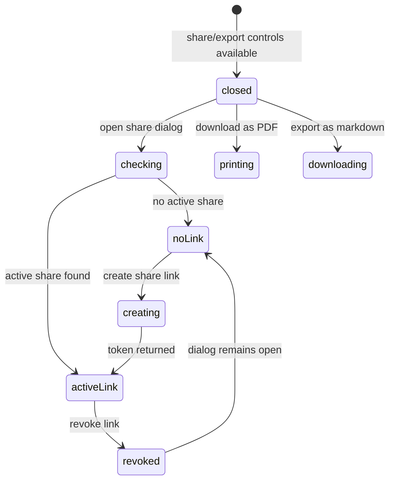

# Sharing and exporting

## Summary

Great Minds can create/revoke bearer-link shares for a creator's saved research [session](../glossary.md#research-sessions) or personal [reference](../glossary.md#content-and-the-library), and can export the current session through the browser print dialog or as downloaded Markdown. Share links are live views, not frozen snapshots: each recipient load resolves the current session sidecar or current reference metadata/body and, when enabled, all current anchored personal-reference notes. Revocation makes future token resolution return not found but cannot retract content already loaded/copied.

Session Markdown export is a point-in-time server file; PDF export prints current client-rendered state. Their included content differs: Markdown includes source labels and all persisted BTW text but no session origin, while print includes visible origin/current prose and omits the Thinking evidence section; collapsed BTW cards can be omitted from print.

## The simple case

A saved session header shows a Share icon. The owner opens it, sees **Share session** and **anyone with this link can read it**, chooses **create share link**, then copies the displayed `/s/{token}` URL. Reopening the dialog returns that active link. Choosing **revoke link** immediately invalidates it; creating again mints a different token.

A personal reference has the same dialog. Before creation, **include your notes** is checked by default. With it on, the public view receives the article and every anchored personal note for that reference (across the creator's vaults), with note questions/answers but without note evidence. With it off, Great Minds excludes notes and strips hidden paragraph anchors.

For local export, the session Download menu offers **download as PDF** and **export as markdown**. PDF opens the browser print dialog with a light, thread-only layout. Markdown fetches the durable session sidecar and downloads `{slugified first question}.md`.

## The interaction, event by event

### Arrive

#### Share controls

The session Share icon appears as soon as a session id exists—after pending acceptance, including while its reply is still running. It remains for loaded completed/failed sessions. There is no share control before first-session acceptance, in the Sessions list, or for a BTW/doc-note card itself.

A reference Share button appears in the personal full reader. Vault articles/sources have no owner share action in this surface. Sharing requires ordinary browser-session authentication; delegated API-key authentication is rejected.

Opening either modal resets local state and requests the creator's entire share list, newest first. Great Minds searches that list for the first non-revoked share with matching subject kind/id. There is no central share-management screen, pagination, or visible revoked history.

While loading, the dialog says **loading…**. A loading error appears inline. After an error, **create share link** remains available; creating is server-idempotent and may recover the existing link that list failed to find.

Without an active share, a reference dialog shows checked **include your notes**; session dialog has no inclusion options. The create/cancel footer remains. The browser UI exposes no expiration choice, so new shares have no expiry and remain valid until revoked or their subject becomes unavailable.

With an active share, the dialog shows a middle-ellipsized same-origin URL (full URL in title), **copy share link**, **revoke link**, and **done**. References also say **includes your notes** or **article only**. Existing annotation inclusion cannot be edited in the dialog; revoke/recreate is the only visible path to change it.

#### Export controls

The Download icon/menu appears whenever the session UI is no longer idle, including a first optimistic/running turn before it has a session id. **download as PDF** is always enabled because it prints current DOM. **export as markdown** is disabled until the session id exists.

There are no corresponding export controls for full vault documents or references. Normal browser print/save remains outside this product control.

### Leave without acting

Closing/cancelling a share dialog before creation changes nothing and resets checkbox, loaded share, messages, and copy state. Reopening reloads durable status. Merely viewing/copy-selecting the displayed code does not rotate the token.

Leaving the Download menu without choosing an item creates no file and does not change session state.

The share dialog's Cancel/Done remains available during create/revoke. Closing does not abort those requests. A creation can therefore finish after the modal reset, leaving a durable active link the owner did not see until reopening; revocation can likewise finish after close.

### Begin

#### Creating a share

**create share link** disables and becomes **creating…**. Great Minds verifies that the caller owns the subject:

- session: database creator matches and the creator can still read its vault/session;
- reference: account user owns the reference row.

If an active share already exists for creator/kind/subject, the server returns its existing token. For references, a different requested annotation flag updates that same active row/token. The normal dialog does not invoke this update because it hides the checkbox once a link exists.

Otherwise Great Minds creates a share id plus 32 random bytes encoded as a 43-character base64url token. The token is the secret credential in `/s/{token}`. It is stored in plaintext in the shares table. The create response sets the dialog's active link and briefly shows **link created** for 1.5 seconds; it does not copy or open the link automatically.

`include_annotations` defaults true. For sessions the flag is stored but does not change the session-share payload. For references it controls both annotation inclusion and whether hidden `^pN` body anchors are retained.

#### Copying and revoking

Copy uses `navigator.clipboard.writeText(full link)`. A successful copy swaps the icon to a check and shows **copied** for 1.5 seconds. Clipboard rejection has no catch/error state.

**revoke link** has no confirmation. It disables and becomes **revoking…**, then stamps `revoked_at`, clears the visible link, resets annotation choice true, and leaves the dialog ready to create again. The revoked row/token remain durable; public resolution treats unknown, revoked, and expired tokens identically as not found.

Only the creator can revoke; another account receives not found rather than existence disclosure. Recreate after revoke mints a fresh token, leaving the old one invalid.

#### Exporting PDF

**download as PDF** calls `window.print()`. It does not directly generate/download a PDF; the owner chooses a print destination such as Save as PDF in the browser dialog.

Print CSS hides everything except `#session-print`, forces a light palette, unclips nested app shells for multipage flow, uses 16 mm page margins, restores standard footnote definitions, and hides footnote popover/margin affordances. Session header controls, selection tip, follow-up bar, evidence Thinking blocks, save-as-source actions, and side panels do not print.

#### Exporting Markdown

**export as markdown** fetches the server-rendered `sessions/{id}.md`, creates a `text/markdown` Blob, clicks a temporary download link, and immediately revokes the object URL. Filename is the first question lowercased, nonalphanumeric runs converted to hyphens, trimmed to 60 characters, with `.md`; if no usable slug it is `session.md`.

The browser shows no pending, success, or error state. Fetch/decode/download failure is an unhandled async rejection.

### While in progress

#### What a live share contains

A share row stores identity/policy/token, not frozen content. Every public resolution reads current target state.

A session share returns:

- title/creation time from the session overview;
- current server Markdown sidecar;
- each latest main exchange in original turn position;
- main Thinking source labels as blockquotes;
- main questions and answers;
- each latest BTW thread after its parent answer, with a quote shortened after 60 characters and side questions/answers.

It omits session origin metadata, detailed evidence attributes/ranges/titles, BTW evidence, stored reply errors, and local UI state. Creating a share while a reply is pending can expose an empty pending answer; later recipient reloads see final/follow-up/BTW changes. Future accepted session turns are automatically shared without another owner confirmation.

A reference share returns current reference title/origin/author/published and current stored Markdown body. Rename is reflected on next recipient load. With annotations enabled, it also queries every creator-owned session across all vaults whose origin has this personal path, personal scope, and a nonnull anchor. It includes anchor quote/context/block offset, session creation time, and every main exchange's clean question/answer. It strips evidence/thinking and excludes unanchored conversations/session BTW events.

Unreadable annotation sessions are silently skipped. New notes/turns after link creation appear on later recipient loads. With annotations disabled, `annotations` is empty and Great Minds removes trailing block anchors from the shared Markdown.

The public recipient route needs no account and is intentionally out of scope here. Its responses use `X-Robots-Tag: noindex` and `Referrer-Policy: no-referrer`, but anyone who obtains/forwards the bearer URL can read while valid.

#### What each session export contains

Server Markdown is regenerated whenever session events append. It deduplicates pending/final versions by exchange id and BTW versions by parent exchange id plus quote. A running/failed-no-final export can therefore contain a question with empty answer and no failure label.

The PDF instead captures current client DOM at print time. It includes origin heading/quote and current visible questions/answers/interruption text. Main evidence is explicitly print-hidden. Session BTW cards print only while rendered/open; closing one before print removes it from DOM and from the PDF. A failed reply's client-retained partial text can appear in PDF even when server Markdown has only the empty pending event.

Both exports can be initiated while generation is running. There is no “wait for completion” warning or consistency lock; later turns/tokens are not added to an already downloaded/printed file.

### Finish

Share creation finishes with a durable active token and local link display. Closing/reopening re-lists and finds it. Sequential repeated creates return the same active token. The database has no subject-level unique constraint, so concurrent create races could produce multiple active links; the per-subject dialog only surfaces the first active result it finds, potentially stranding another valid token from revocation UI.

Revocation finishes future access immediately at resolution time. It does not delete the subject/share record, notify recipients, rotate embedded/cached copies, or close content already loaded in another browser. Recreate starts a new active link.

If the reference/session is deleted/unreadable—or a session creator loses required vault membership—resolution returns not found even when the share row remains active. The dialog can still list the stale link because list status does not resolve the subject content.

Print finishes according to browser dialog choice; Great Minds receives no saved/cancelled result. Markdown finishes when the browser accepts the synthetic download. Neither creates a server export history/audit event.

## Context and state variants

| Variant | At arrival | Changed while active |
| --- | --- | --- |
| Account role and access | Session creator/reference owner can share; session creator must still be able to read its vault. Export requires access to current session. Public token bypasses account auth. | Losing vault membership can break session share/export resolution; reference share remains account-based. Only creator can revoke. |
| Vault state | Session share/export can be pending/complete/failed and evidence points to current vault content. Reference share body is account-scoped; its notes span vaults. | Vault source changes do not rewrite prior answers but future session turns/notes and link targets can change. |
| Target state | Subject can have no active link, one ordinary active link, revoked history, stale missing subject, or concurrent duplicate active links. | New turns/renames/notes become visible through same token. Revoke affects future loads only. |
| Entry context | Session header share/download; personal reference header share; direct public token resolution. | Modal state is local. Export stays on session; public link is copied rather than navigated. |
| Input and viewport | Keyboard/pointer dialog/menu/checkbox/copy controls converge. Browser print UI varies by platform. | Narrow view ellipsizes link/dialog; full token remains copy target/title. |

## Cancel and interrupt

| Event | Before work begins | While work is in progress |
| --- | --- | --- |
| Escape, Cancel, or Stop | Escape/Cancel closes dialog/menu with no new request. Browser print cancellation creates no file. | Create/revoke requests are not aborted by closing. Markdown fetch has no cancel. Public share has no owner-side “stop viewing”; revoke blocks future loads. |
| Navigation to another Great Minds page | Closes local dialog/menu. Existing link unchanged. | Requests/download fetch can finish without visible state. Print dialog behavior is browser-owned. |
| Browser Back or Forward | Restores underlying session/reference route, not modal state. | Durable share/revoke remains. Export leaves no route entry. |
| Page reload | Reopening dialog reloads active status; print/download state disappears. | Settles uncertain create/revoke by list. Running session may have advanced before next share/export. |
| Tab or window closed | No effect before action. | Accepted create/revoke/server read can finish; browser download/print likely aborts. Existing bearer link remains. |
| Network lost | Existing displayed link can still be copied locally if loaded. | List/create/revoke/Markdown fail; errors show only in dialog, while Markdown has none. Recipient access depends on server connectivity. |
| Request failure or timeout | Dialog lists/creates with inline error; export has no error UI. | Server may have committed before response loss. Reopen/list converges share state; revoke uncertainty likewise. |
| Authentication session expires | Share/export calls attempt normal refresh; loaded link text remains local. | Failed refresh clears auth/vault. Public recipient link still works if active. |
| The target changes in another tab | Same-account tab can create/revoke/rename/append session. | Current dialog does not live-update; recipient resolution/download fetch sees server timing. Multiple tabs can race share creation. |
| The target changes through another member | Other members cannot mutate private session/reference/share row but can change vault sources/membership. | Membership loss can invalidate session share; source changes affect link targets/future answers, not stored existing prose. |
| Browser autofill, paste, drop, or another input channel writes into the interaction | No text input accepts writes; checkbox/copy/menu are explicit. | Clipboard is write-only from action. File/drop has no export behavior. |
| The window loses focus | Modal/menu usually remains; browser print takes focus. | Requests continue. Copy/created timers expire after 1.5 seconds regardless of focus. |

## Interactions with other systems

**Permissions and roles.** Share creation requires session auth and creator ownership; revoke is creator-only. Session content also retains membership dependency. Public token resolution is unauthenticated by design.

**Validation and error display.** Subject kind/id and ownership are validated. Dialog shows parsed API details; clipboard and Markdown-export errors are unhandled. Unknown/revoked/expired are deliberately indistinguishable publicly.

**Unsaved work and history.** Active/revoked share rows are durable. Dialog/copy status is local. PDF/Markdown are unmanaged point-in-time copies outside Great Minds; no export audit/history exists.

**Optimistic changes and rollback.** Dialog waits for server response before showing link/removal. Closing can hide in-flight completion. There is no way to retract recipient copies; revoke is access control, not rollback.

**Offline and reconnection.** No offline create/revoke/export queue. Reopen/list discovers committed share state. Existing downloaded files remain offline by definition.

**Notifications.** Modal labels/messages, copied check, print dialog, and browser download are feedback. Recipients/owner receive no share access, change, expiry, or revoke notifications.

**URL and navigation state.** Share URLs are `/s/{plaintext bearer token}` at current origin. Dialog is not route state. Export filename derives from first question, not session id/title metadata.

**Multi-tab and multi-user behavior.** Same-account tabs can race; no live dialog synchronization or subject uniqueness constraint prevents multiple active tokens. Anyone with token acts as recipient regardless account.

**Accessibility and keyboard use.** Modal/buttons/checkbox/copy control are named; status messages have no explicit live-region semantics. Ellipsized code, clipboard errors, browser print, and menu focus need verification.

**External side effects.** Sharing writes/list/revokes token rows and public resolution reads private content/annotations. PDF invokes browser printing; Markdown downloads a Blob. No model/compile calls occur directly.

## Edge cases

- Session Share appears during a running reply; the live token can reveal empty then completed/future content on reload.
- Session include-annotations field is stored true but has no payload effect or UI choice.
- Reference **include your notes** means all anchored personal-origin note sessions across all vaults, not only notes created under the currently active vault.
- Reference annotations omit evidence but can still contain model/user prose that reveals sensitive context.
- Existing link's annotation setting is display-only; changing it requires revoke/new token in UI, though server API can update same token.
- Share list failure still permits Create; server can return an existing token while UI says **link created**.
- Closing during Create can leave an unseen active link; closing during Revoke can leave outcome uncertain.
- Clipboard denial/rejection produces no message; the UI can remain on copy icon without explanation.
- Tokens never expire through current UI and are stored plaintext server-side.
- Sequential create is idempotent, but concurrent create can mint multiple active links because no database uniqueness protects subject/creator.
- Revoked link cannot be restored; recreation rotates token. Already loaded/copied content remains.
- Session share/Markdown export include source labels/search terms and BTW text without a content preview/redaction option.
- PDF hides main evidence while Markdown includes source labels; exports are not equivalent.
- PDF content depends on local BTW expansion. Markdown includes persisted BTWs regardless expansion.
- PDF can include client-only partial failed text that Markdown/share omit because it never became a final session event.
- Markdown filename collapses non-ASCII-only first questions to `session.md` and can collide with prior downloads.
- Markdown export while pending can contain empty answers and never records reply error/interrupted wording.
- Session share becomes inaccessible if creator loses vault membership; reference share does not depend on active vault membership.
- Active share can outlive a now-missing subject row/file and still appear in the owner's dialog list.

## Open questions and verification

- Make “live share” explicit and preview exactly what will be exposed, especially future session turns, source labels, BTW text, and cross-vault reference notes.
- Consider immutable snapshots or a “freeze now” option. Current bearer link silently expands as private work continues.
- Add expiration, central active-link management, access audit, and database uniqueness for one active creator/subject share.
- Hash/token-protect stored bearer secrets rather than retaining plaintext when only lookup is required.
- Disable modal close during create/revoke or abort/guard state so owners cannot unknowingly create a live link.
- Handle clipboard and Markdown export errors with visible retry/status; add pending state for export.
- Clarify PDF vs Markdown differences and ensure PDF includes/excludes BTW/evidence intentionally, independent of local disclosure state.
- Prevent or warn on sharing/exporting a running/failed-pending session; offer a completion-consistent snapshot.
- Verify print pagination, links, code blocks, footnotes, dark→light palette, collapsed BTW behavior, and browser-specific Save as PDF output.
- Verify keyboard/screen-reader modal/menu/status behavior and link copy on denied clipboard permissions.
- Decide whether losing vault membership should invalidate an existing session share or preserve the creator's already-shared session snapshot.

Verified against Great Minds commit `c8c9e57`.
