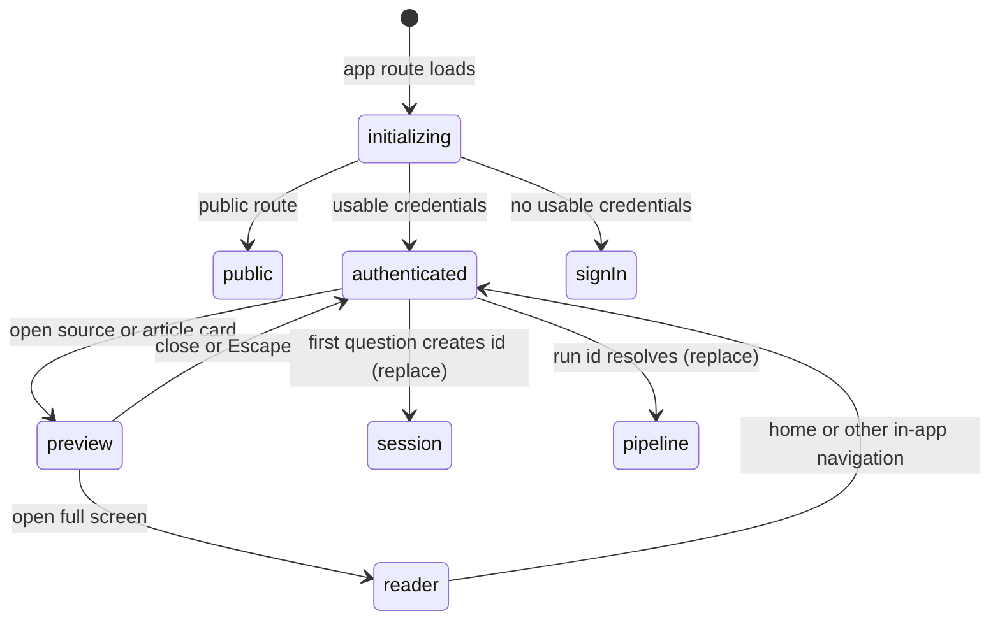

# Navigation and page state

## Summary

Great Minds is a client-rendered single-page web app whose routes identify the current surface while browser storage supplies the account, theme, and [active vault](access-and-vault-context.md). Some user state belongs in the URL and survives reload or sharing—a session identifier, document path, pipeline run, library type, tag, or search. Other state is deliberately local—an open preview panel, an unsent question, selected follow-up excerpts, dropdowns, and popovers. This foundation owns which state lives where, what Back and Forward restore, and how previews hand off to full pages.

## The simple case

A signed-in owner arrives at `/`. Home shows the active vault, query input, and source controls. The owner can navigate to `/library`, `/health`, `/sessions`, or `/settings`; choose a saved session at `/sessions/{id}`; read vault content at `/doc/{path}`; read personal content at `/refs/{path}`; or observe a durable run at `/pipeline/runs/{id}`.

Library type, text query, and tag are query-string state. Reloading `/library?type=articles&q=capital&tag=economics` reconstructs those filters. Opening an item first uses a local preview panel without changing that URL. Choosing full screen moves to the reader route.

Submitting the first research question creates a durable session and replaces the current history entry with `/sessions/{id}`. Reload then reconstructs the session from its stored events and any running reply snapshot. The transient pre-session home state is not placed behind the new session in browser history.

## The interaction, event by event

### Arrive

Server-side rendering and prerendering are disabled. The browser first initializes authentication, theme, active-vault state, and the shared query client. Authenticated route content remains absent until the auth gate is ready. If credentials are unavailable, the app replaces the route with `/login`; if an authenticated account visits the ordinary public layout, it is replaced with home.

The principal scoped routes are:

| Route | User-facing state it owns |
| --- | --- |
| `/` | idle home, optional one-time `q` and `origin` launch parameters |
| `/sessions` | saved-session list; its text filter is local, not in the URL |
| `/sessions/{id}` | one durable research session and its running/completed replies |
| `/library` | vault library or personal Reading room; `type`, `q`, and `tag` are URL state |
| `/doc/{path}` | one vault source or article, plus optional block hash |
| `/refs/{path}` | one personal reference, plus optional block hash |
| `/pipeline` | resolver for a launch payload, URL ingest, or the single active run |
| `/pipeline/runs/{id}` | one durable ingest or compile run |
| `/health` | the current vault's health report |
| `/settings` and `/vaults/…` | excluded administration surfaces |

The global app shell places the settings menu at the lower-left corner on every ordinary route. The public share route omits that utility even when the browser is signed in.

### Leave without acting

Ordinary in-app navigation changes the route but does not mutate vault content or create a session. Local state owned by the departing component is destroyed: open previews, unsent reader questions, session-list filters, selection popovers, and unsubmitted forms do not follow to the next page.

Closing a preview panel is the short path for content inspection. Escape, the narrow-screen backdrop, or the panel close control clears the selected card. The underlying page, scroll container, filters, and query results remain mounted. Because panel selection is not URL state, closing it does not add or consume a browser-history entry.

### Begin

A route-level task begins when a control calls in-app navigation or follows a normal anchor. Great Minds generally uses history replacement when the prior URL is only a launch shim:

- the first reply replaces `/?q=…` or idle `/` with `/sessions/{id}` after the server creates the session;
- `/pipeline?url=…`, upload state handed to `/pipeline`, and bare `/pipeline` replace themselves with `/pipeline/runs/{id}` once the run is known;
- library filter and debounced search changes replace the current `/library` entry to preserve focus and scroll rather than creating one entry per keystroke.

A tag chip is an ordinary link to `/library?tag={tag}`. Type choices update the `type` parameter, with **All** represented by removing it. Clearing a tag removes only `tag`. Library text input is trimmed and written to `q` after 300 ms; an empty value removes `q`.

Opening an article or source row selects a local card and starts its lazy preview request. Wiki links in rendered Markdown navigate directly to `/doc/wiki/…`; raw-source links open a local panel, preserving an optional `#^pN` chunk anchor as a one-chunk range.

### While in progress

The preview layout depends on width. Below 1200 px, the panel is fixed over the page with a dimmed close backdrop; from the medium breakpoint it is 370 px wide, while the narrowest view uses the full width. At 1200 px and above it docks as a second column and reduces the underlying content area. Escape always closes an open panel.

Panel requests are keyed by active vault, item path, and evidence ranges. Changing cards replaces the local selection and loads the new content. Maximizing closes the panel and navigates to the full reader. A one-chunk evidence card carries its block hash into the reader, which waits for the body to render and scrolls the matching element into view.

On `/sessions/{id}`, route identity owns which stored session loads. The session component reconstructs exchanges from events and reconnects to pending durable replies. The same component renders idle home when there is no session identifier, then changes to the active thread layout as soon as a question begins.

The bare `/pipeline` route resolves only one active job. If no active job exists, it shows **No active job**; an explicit run route never depends on this resolver and can reopen completed, failed, or cancelled history directly.

### Finish

A full reader, session, or pipeline route is reloadable because its durable target is encoded in the path. A route does not encode the active vault, so reload resolves it against the currently stored vault. This is convenient for short URLs but means a cross-tab vault switch can change or invalidate what the same `/doc`, `/sessions`, or `/pipeline/runs` URL means.

Library URL state is restorable and linkable. Local panel state, scroll position inside custom containers, unsent form content, session-list filter text, and transient progress used only to launch an upload are not contractual reload state.

The theme is separate browser state. It defaults to dark when no recognized value is stored, applies before ordinary interaction, persists as `light` or `dark`, and synchronizes across tabs. Theme changes do not alter routes or durable product records.

## Context and state variants

| Variant | At arrival | Changed while active |
| --- | --- | --- |
| Account role and access | Auth gates determine whether an authenticated route renders. The route alone conveys no membership. | A failed refresh replaces protected content with sign-in. Role changes affect the next data request but do not rewrite the path. |
| Vault state | The current stored vault scopes `/`, `/library`, `/health`, `/sessions/{id}`, `/doc/{path}`, and `/pipeline/runs/{id}`. | A vault switch can make the current route point at missing or forbidden content because the vault is not in the URL. |
| Target state | Durable identifiers and paths reload. Missing documents render **Document not found**; missing sessions and runs use their page error states. | Deletion, archive, or completion appears on refetch. Local previews can become stale until reopened. |
| Entry context | Direct URL, in-app navigation, raw citation preview, wiki link, origin link, and launch query can reach related content through different history shapes. | Replacing a launch route avoids returning to an auto-submitting or half-resolved shim with Back. Normal links remain separate history entries. |
| Input and viewport | Keyboard and pointer route controls have the same destinations. Viewport determines whether a preview overlays or docks. | Resizing an open panel changes presentation without changing its selected card or adding history. Escape closes it at every size. |

## Cancel and interrupt

| Event | Before work begins | While work is in progress |
| --- | --- | --- |
| Escape, Cancel, or Stop | Escape closes open dropdowns, popovers, or previews and can clear a reader's local query field. It does not navigate home globally. | Escape closes a preview but does not cancel its underlying durable source, session, or run. Feature-specific Stop is separate. |
| Navigation to another Great Minds page | The destination loads with shared account, theme, vault, and query cache; departing local state is discarded. | Durable replies and runs continue. Pending page-local requests may abort through component query cleanup, but mutations need feature-specific guards. |
| Browser Back or Forward | Restores route and query-string history, not older active-vault, theme, panel, or draft state. | A replaced launch URL is skipped. Back from a full reader returns to the prior route but cannot reconstruct an unrecorded preview. |
| Page reload | Reload reconstructs route-owned durable targets and URL filters after app initialization. | Local panel, drafts, popovers, list filter, and launch-only state disappear. Durable session/reply/run state reconnects. |
| Tab or window closed | Route remains in browser history but local component state ends. | Server-accepted work continues; reopening a durable route can recover it. Launch state carried only in navigation history may be lost. |
| Network lost | Route changes can occur client-side, but required data enters loading/error behavior. | Cached page shells may remain. Lazy previews and target loads fail; no offline router-to-content fallback is promised. |
| Request failure or timeout | The destination's own error, empty, or not-found state appears. | Preview failures do not change the route. Mutations and streams define whether they remain, retry, or redirect. |
| Authentication session expires | Public share remains public; protected route content needs refresh. | Failed refresh clears context and the app replaces the current protected route with `/login`. The former route can remain in browser history. |
| The target changes in another tab | The URL is unchanged; query data can be stale until refetch. | Deletion or vault switch can turn the open route into not found/forbidden. Theme and active-vault storage changes synchronize immediately. |
| The target changes through another member | No route change is pushed. | Shared content changes appear at a later refetch; local panels do not merge remote edits. |
| Browser autofill, paste, drop, or another input channel writes into the interaction | Pasted URLs, dropped files, and autofill use their feature's form; they do not bypass route ownership. | Upload launch state may be carried in the browser history entry for `/pipeline`; it is not a shareable URL. |
| The window loses focus | Current route and local state remain. Focus-controlled menus may close. | Streams, timers, and server work continue. There is no global refetch-on-focus guarantee documented by the app. |

## Interactions with other systems

**Permissions and roles.** Routes are presentation boundaries, not authorization. Every protected read or mutation must still pass server authentication and vault access checks.

**Validation and error display.** Route parameters are decoded by the browser and validated again by the server. Readers deliberately collapse non-success responses to **Document not found**, while other pages expose richer errors.

**Unsaved work and history.** Browser history preserves route and query state only. Great Minds has no global unsaved-changes interception when a route destroys a local draft.

**Optimistic changes and rollback.** Preview opening and active-vault selection are local optimistic state. Failed panel data leaves the underlying route intact. Route launch replacements are not rolled back if later content fails.

**Offline and reconnection.** The router can display a cached shell offline, but routes depend on API-backed state. Reconnection is handled by individual queries and streams, not a route-level queue.

**Notifications.** Navigation itself uses changed page chrome rather than toasts. Missing, error, terminal pipeline, and empty states are rendered inside destinations.

**URL and navigation state.** This document owns the distinction: durable target IDs and library filters belong in the URL; account, active vault, theme, and most drafts live in storage or component state.

**Multi-tab and multi-user behavior.** Same-origin tabs synchronize theme, credentials, and active vault through storage events. Routes themselves are tab-local and do not receive collaborative navigation or content pushes.

**Accessibility and keyboard use.** Route controls are buttons or anchors with accessible names. Preview uses an `aside` named **article preview**, its backdrop is named **close article panel**, and Escape provides a consistent close path.

**External side effects.** Pure navigation performs reads and lazy fetches. A launch URL such as `/?q=…`, `/pipeline?url=…`, or upload navigation state can intentionally begin a mutation after arrival; the owning feature documents those side effects.

## Edge cases

- The app can show a blank authenticated route briefly while authentication initializes; loading feedback belongs to child data once the gate opens.
- Library search uses history replacement after a 300 ms debounce, so Back does not walk through each intermediate term.
- Session-list filter text is not in the URL and disappears on reload, unlike the library search query.
- An idle-home question supplied as `q` starts automatically on a microtask after the component is created. Replacing the route with the resulting session prevents Back from immediately starting it again.
- Bare `/pipeline` is a resolver, not the canonical run URL. It can only choose automatically when exactly one active job is returned.
- A raw citation fragment of exactly `^pN` opens one indexed chunk. Other fragments are treated as full-document raw references.
- Wiki links navigate to a reader; raw links open a panel. External HTTP(S) links and same-document hashes keep ordinary browser behavior.
- On narrow and medium widths, clicking the preview backdrop closes the panel. On wide docked layouts there is no backdrop because the underlying page remains directly usable.
- A reader block hash scroll waits until the body has mounted; an absent block anchor leaves the reader at its current scroll position without an error.
- Public share pages suppress internal app navigation while allowing external links; that recipient behavior is outside this repository's scope.

## Open questions and verification

- Verify focus return after closing an article preview with Escape, the backdrop, and the close button at each responsive layout. The panel closes, but explicit trigger-focus restoration is not apparent.
- Verify browser scroll restoration for Back from full reader to library and session pages; the app preserves library scroll during filter replacement but does not define all route-return cases.
- Asking from a personal `/refs/…` reader passes only `q` and `origin` to home. The session constructor hard-codes that launch origin as vault-scoped, so the saved origin link and query context can resolve the `refs/…` path against the wrong storage scope. This appears to be a bug rather than a documentation choice.
- Verify what bare `/pipeline` should show if durable drift leaves more than one active run. It currently treats any count other than exactly one as **No active job**.
- Verify the stale-route experience when another tab switches the active vault while this tab is on a session, document, health, or run route. The current route is not forced home.
- Readers collapse every non-success response into not found, hiding distinctions such as forbidden, invalid path, and transient server failure. Decide whether that is intentional user-facing simplification.

Verified against Great Minds commit `c8c9e57`.
