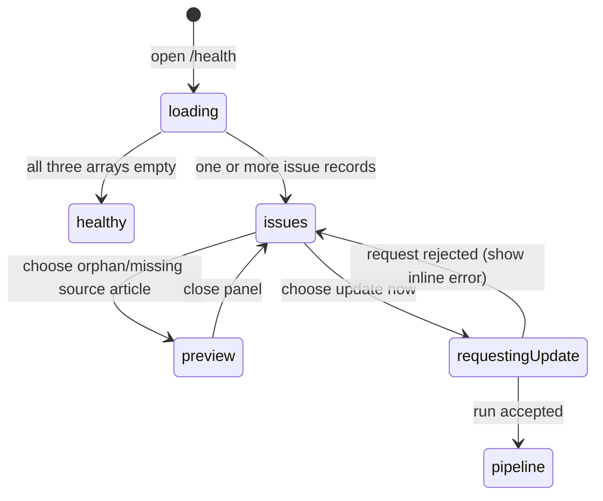

# Reviewing vault health

## Summary

Health is a read-only diagnostic view of the active vault's compiled wiki, with one handoff to a manual compile. It reports three issue families: non-archived topics whose rendered content no longer matches compiled topic state (**needs update**), live articles with no incoming article link (**orphan articles**), and intended directed topic connections absent from article Markdown (**missing connections**). The same report drives attention counts on Home and Library. The owner can preview implicated source articles, browse Library, add sources, and choose **update now** when drift exists.

Health does not inspect source-file/storage consistency, search-index freshness, failed pipelines, citation validity, or personal references. A report request failure currently looks identical to a clean report: loading ends and the page says **Nothing needs attention — the wiki is healthy.**

## The simple case

The owner follows the gold attention count from Home or Library to `/health`. Skeletons become one or more sections.

**needs update** says how many articles drifted and offers **update now**. **orphan articles** lists article titles/dates; choosing one opens a preview. **missing connections** shows `source title → target title`; choosing it previews the source article that should contain the missing link.

The owner chooses **update now**. It briefly says **compiling…** while a run is created/coalesced, then navigates to `/pipeline/runs/{id}`. The compile follows [compiling the vault](../sources/compile-the-vault.md). Returning to Health refetches according to query-cache lifecycle and shows the new diagnostic state.

## The interaction, event by event

### Arrive

`/health` uses the active vault and requires membership. Its fixed page header shows **health** and Home. There are no query parameters, tabs, date filters, refresh button, severity levels, issue acknowledgements, or report timestamp.

While the report loads, the page shows two groups of skeleton rows. Home and Library independently request the same report under the same vault/query-cache key to compute a badge. Their displayed badge count is:

`dirty topic ids + orphan article rows + missing connection rows`.

The value is a sum of issue records, not deduplicated content. One article can contribute an orphan plus several missing connections, and the badge calls the result **items need attention**. The badge is hidden at zero and links to Health.

The server computes current health directly from topic/article/link tables:

- **needs update** includes every non-archived topic with a nonnull compiled hash whose rendered hash is missing/different;
- **orphan articles** includes each live non-index wiki article with no incoming explicit backlink from any article;
- **missing connections** includes each directed topic-link pair whose source/target topics are rendered and whose source article lacks an explicit backlink to the target article.

Orphans sort alphabetically by article title. Missing connections sort by source slug then target slug. The dirty response contains ids only and has no specified display order; the UI shows only its count.

The server does not paginate any of the three arrays. Large issue sets all arrive/render together.

### Leave without acting

Opening, reading, previewing, or leaving Health changes no source, topic, article, link, or run. There is no “mark reviewed” state.

Closing a preview clears only local panel state. Leaving and returning can use cached report data, then refetch according to query staleness; the URL carries no local issue selection or scroll state.

### Begin

When all arrays are empty, the page says **Nothing needs attention — the wiki is healthy.** It says this for an empty vault as well as a fully linked/current wiki.

When dirty topic ids exist, Health shows:

- heading **needs update**;
- **update now**;
- `{N} article(s) drifted from the current topic registry and will be refreshed on the next update.`

The diagnostic actually counts topics and does not join to ensure each has a current article, so “articles” can overstate what exists for non-rendered/needs-revision topic states.

**update now** is available to every member who can see Health; it has no role condition and the server manual-compile endpoint is member-wide. It is disabled only while this page's short compile-create request is pending. An already active pipeline does not disable it, so the request may coalesce with an undispatched intent or queue behind dispatched work.

Choosing it uses the normal compile request. Missing model configuration or another request error returns to the issue view; the button re-enables and raw response text (often JSON) appears under needs update. If no dirty topics exist, Health provides no update button even when orphan/missing-connection issues exist.

### While in progress

An orphan row shows title and update month/day. Choosing it opens the full article in the local side panel. A missing-connection row shows source title and `→ target title`; choosing anywhere on the row previews `wiki/{source slug}.md`, not the target. This lets the owner inspect where the link should have appeared but offers no edit/fix control.

Panel loading uses skeletons; load/error behavior follows [reading content](../library/read-content.md). **open full screen** navigates to the source article. Preview selection is local, overlays/docks by viewport, and does not change report results.

“Orphan” considers explicit incoming article links only. Being related by shared ideas, being a conceptual root, linking outward, or receiving traffic/notes does not prevent the label. “Missing connection” compares intended `topic_links` to exact compiled backlinks; it does not judge whether prose semantically mentions the target without a recognized wiki link.

When the manual compile request succeeds, the mutation invalidates the active-job query and Health immediately navigates to the run. It does not optimistically remove dirty ids or refetch Health first. The button's **compiling…** label covers only request acceptance, not the actual pipeline duration.

The owner can also use **browse the library →** or the embedded owner-only add-sources control. The ingestion control reflects the cached active-pipeline boolean and selected storage mode. File/URL behavior belongs to [adding files](../sources/add-files.md) and [adding a URL](../sources/add-a-url.md).

### Finish

Health review has no explicit finish state. A clean report, inspected issue, closed preview, Library navigation, source ingest, or compile navigation ends the immediate task.

After a successful compile, returning/remounting Health normally requests current data because the query is stale, but the compile completion does not explicitly invalidate the `health-count` key. A still-mounted Health page in another tab receives no push update. Source deletion likewise does not invalidate Health.

A failed report request is not represented in `HealthView`. Once query loading becomes false, getters fall back to `0`/empty arrays and Health renders the clean message, Library/Home suppress their badge, and no retry appears. Nonmember, network, server, and decode failure can therefore falsely communicate health.

Orphan/missing sections have no direct remediation or acknowledgement. A later compile may change them, but **update now** is unavailable unless at least one dirty topic also exists. Adding sources or navigating elsewhere are the only visible actions.

## Context and state variants

| Variant | At arrival | Changed while active |
| --- | --- | --- |
| Account role and access | Any member can read report/preview and currently request compile. Only active-vault owner sees add-sources control. | Losing membership makes later reads/preview/update fail; cached report can remain until routing/refetch. |
| Vault state | Empty vault, ready wiki, active compile, drifted topics, or stale links all load same report shape. | Compile/ingest/deletion in another surface changes next report; no live subscription updates open Health. |
| Target state | Issue records identify topic ids, article rows, or source→target pairs. Referenced article can be deleted/archived before preview. | Preview can become not found; compile can retire/rename/relink issues before refetch. |
| Entry context | Home/Library badge, direct URL, Home navigation, and browser history converge on `/health`. | Preview remains local; update pushes canonical pipeline route; Library/source links navigate normally. |
| Input and viewport | Rows/buttons support pointer/keyboard; one vertical report adapts width. | Panel docks/overlays by viewport; issue semantics do not change. |

## Cancel and interrupt

| Event | Before work begins | While work is in progress |
| --- | --- | --- |
| Escape, Cancel, or Stop | Escape closes preview; passive report has no Cancel/Stop. | Compile-create has no cancel on Health. Once navigated, pipeline owns cooperative **cancel**. |
| Navigation to another Great Minds page | Leaves cached report without mutation. | Report/panel reads can abort or cache; accepted compile runs independently. |
| Browser Back or Forward | Restores Health route and cached/refetched report, not preview state. | Back during compile request can leave page; the callback has no explicit mounted-page guard, so late-navigation behavior requires verification. |
| Page reload | Refetches active-vault report; closes preview and loses scroll. | Accepted compile is discoverable through active pipeline; request outcome otherwise depends on timing. |
| Tab or window closed | No effect on read-only report. | Accepted compile continues; no completion notification. |
| Network lost | Cached report may show; fresh failure can falsely say healthy. | Preview/update fail. Compile accepted before loss continues; inline request error can be raw. |
| Request failure or timeout | Report failure is masked as clean with no retry. | Update failure re-enables and shows only under dirty section; panel failure says not found. |
| Authentication session expires | Requests attempt normal refresh. | Failed refresh clears active vault/auth and leaves page through protected routing; compile already accepted continues. |
| The target changes in another tab | Current diagnostics can be stale. | No live merge; next refetch sees changed articles/links/hashes. Another tab can start/cancel compile. |
| The target changes through another member | Shared compile/content work can change all issue categories. | Any member can currently trigger/cancel compile; this tab's report remains stale until refetch. |
| Browser autofill, paste, drop, or another input channel writes into the interaction | Report has no text inputs. Owner add-sources control accepts file drop/URL as separate task. | No effect on current report rows; accepted ingest/compile changes future report. |
| The window loses focus | Report/panel stay open. | Reads/mutation/workflow continue. Refocus behavior follows query-cache defaults, with no explicit health refresh notice. |

## Interactions with other systems

**Permissions and roles.** Report/preview and manual compile are member-wide; ingestion control is owner-only. Viewer-triggered compile remains a broader authorization concern from the compile feature.

**Validation and error display.** Report schema requires all three arrays. Query failure is discarded by the view and rendered as healthy; compile error is raw inline text only when dirty section exists.

**Unsaved work and history.** Report is a current computed snapshot, not saved audit history. Preview/scroll are local; pipeline run is durable after update acceptance.

**Optimistic changes and rollback.** Health never optimistically clears issues. Starting compile only changes button text until navigation. There is no issue acknowledgement/rollback state.

**Offline and reconnection.** No offline health guarantee or report timestamp exists. Cached data can mask connectivity; compile run reconnects on its own page.

**Notifications.** Attention badges, sections, clean copy, inline compile error, and pipeline navigation are feedback. Report failure/refresh and issue resolution have no notification.

**URL and navigation state.** Health has no query state. Preview is local. Update navigates to stable run URL; browse/add-source actions leave the report.

**Multi-tab and multi-user behavior.** Health is shared vault state read without push. Badge/report cache keys are shared within one tab, while tabs independently refetch.

**Accessibility and keyboard use.** Issue rows and update/library controls are keyboard operable; badge is named **open vault health**. Dynamic counts, masked errors, panel focus, and arrow-only relation semantics need verification.

**External side effects.** Report runs database reads only. Preview reads storage. **update now** creates/coalesces a compile intent/run and can invoke model/embedding/storage work; add-sources has its own side effects.

## Edge cases

- Report fetch failure says the wiki is healthy and hides Home/Library attention badges.
- Empty vault also says healthy because all three issue arrays are empty.
- Badge count is issue-record count, not unique article/topic count, and can count one article repeatedly.
- Dirty count labels ids as articles without verifying each topic has a live article.
- Dirty ids are not listed, so the owner cannot see which articles will update before starting compile.
- Orphan status ignores related-topic similarity and legitimate root/navigation roles; only incoming backlinks count.
- Missing connection requires a recognized source→target backlink. An unlinked textual mention remains missing.
- Missing row opens the source article only; target is neither link nor preview action.
- Update button exists only for dirty count, not orphan-only/missing-only reports.
- Update remains available during another active pipeline and can queue/coalesce work.
- **compiling…** means “creating the run,” not ongoing compilation.
- Health cache is not explicitly invalidated at compile completion or source deletion.
- Issue arrays have no pagination/collapse, so a large report can produce a very long page.
- Related/doc-preview failure does not alter the report and appears as **Not found** in panel.
- The add-sources circle can say/view an active pipeline independently of Health issue freshness.

## Open questions and verification

- Great Minds commit `817d93f` fixes fresh report failure with concise **Health unavailable**/**retry** state and actionable unknown indicators on Home and Library. A “checked at” timestamp and stale-cache disclosure remain open.
- Define whether badge means unique affected content or raw issue count; change **items** wording or deduplicate.
- Make dirty diagnostics list resolvable article/topic names and distinguish topics with no current article.
- Provide action or explanation for orphan-only/missing-only states; currently **update now** is absent even though attention is requested.
- Revisit orphan semantics: intentional roots and idea-related articles may not be defects merely because they have no incoming Markdown link.
- Invalidate/refetch Health after compile completion, source deletion, proposal review, and relevant ingest, or expose a manual refresh.
- Post-baseline role decision: **update now** is owner-only. Great Minds commit `45ac124` hides it from editors/viewers and rejects their direct compile requests.
- Guard Health's late compile-success navigation after unmount and improve raw JSON error copy.
- Verify panel behavior for stale/deleted issue paths and keyboard/screen-reader interpretation of `source → target` rows.
- Load-test unpaginated reports and decide whether grouping/collapse/pagination is needed.

Verified against Great Minds commit `c8c9e57`.
