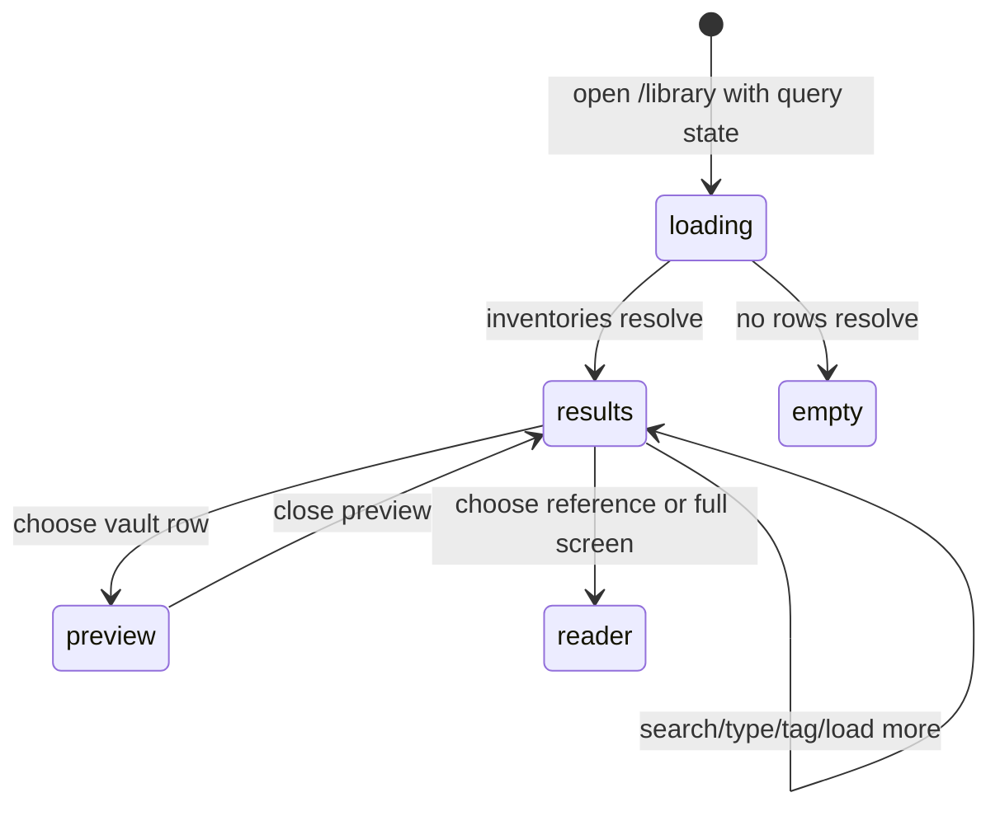

# Browsing, searching, and filtering the library

## Summary

The Library combines three inventories: live vault [articles](../glossary.md#content-and-the-library), vault [sources](../glossary.md#content-and-the-library), and account-scoped Reading room [references](../glossary.md#content-and-the-library). The owner can switch among **all**, **articles**, dynamic source-type chips, and **reading room**; narrow vault rows by debounced title/metadata search and an exact case-insensitive tag; load each inventory in independent pages of 50; and open vault rows in a preview panel or references in their full reader. Type, tag, and committed search live in `/library` query parameters, while panel selection and partially typed search are local.

Library search is metadata search, not the full-body hybrid retrieval used by research replies. Article search matches title/précis; source search matches title/author; Reading room has no search. Several count chips deliberately ignore source search, and vault-list request errors currently fall through to empty/no-match presentation rather than an error state.

## The simple case

The owner opens `/library`. **all** is active. The header shows a count, the chip row shows **all**, **articles**, one chip per source type, and **reading room**, and the page shows separate **articles** and **sources** sections.

The owner types `organizing` into **Search library…**. Rows remain while typing; after 300 milliseconds Great Minds trims the value, replaces the URL with `?q=organizing`, and requests matching live articles and sources. Article titles/précis and source titles/authors are matched case-insensitively. The input keeps focus and the page does not scroll.

Choosing a source-type chip preserves search/tag but shows only that source type. Choosing a tag from a reader arrives at `/library?tag={tag}`, shows a removable **tag: … ×** chip, and exact-matches article/source tag arrays without regard to case. Choosing a row opens its full body in a side panel; **open full screen** navigates to `/doc/{path}`.

## The interaction, event by event

### Arrive

The route accepts three independent query parameters:

- `type`: omitted/`all`, `articles`, `reading-room`, or an exact source-type value;
- `tag`: one exact tag value;
- `q`: committed metadata search text.

The default is **all**. Articles and source facets begin loading for every vault-library view. Source rows load unless type is Articles or Reading room. Reading-room references begin loading account-wide even before that chip is selected so its count is available.

The chip row is ordered:

1. a removable **tag: {value} ×** chip when tag is active;
2. **all · {count}**;
3. **articles · {count}**;
4. source-type chips returned by the server, ordered by descending count;
5. **reading room · {count}**.

Article inventory includes only non-archived articles and excludes the internal wiki index. It sorts alphabetically by title, case-insensitively. Sources sort newest update first. References sort newest creation first. All mode does not merge these into one chronology: it renders Articles and Sources as separate sections.

The header's vault-health badge is independent of filtering and links to Health when anything needs attention. The adjacent numeric header detail is hidden at zero. It uses Reading room total in that view; otherwise it combines article and source totals under the current search/tag logic rather than simply counting currently rendered rows.

Initial vault loading with no rows shows four skeleton rows. If cached/earlier rows exist while another query loads, Great Minds keeps those available instead of replacing the whole shelf with skeletons.

### Leave without acting

Opening Library and leaving without selecting/searching mutates no content and records no read history. The active vault and its cached query data remain governed by [access and vault context](../foundations/access-and-vault-context.md).

A partially typed search that has not survived the 300-millisecond debounce is local. Leaving cancels its timer, so it need not reach the URL. Once committed, the query parameter remains in that history entry.

Closing a preview, pressing Escape, clicking its close control, or leaving the route clears only local panel selection. It does not clear type, tag, or search.

### Begin

Typing updates the visible search field immediately. After 300 milliseconds without another change, Great Minds trims it. Nonempty text sets `q`; empty text removes `q`. It replaces the current history entry with `keepFocus` and `noScroll`, so each keystroke batch does not add a Back step.

Changing a type chip similarly replaces the route while preserving other query parameters. Choosing **all** removes `type`; another value writes it. Clearing the tag removes only `tag`. Within Library, Back therefore does not normally walk through prior search/type/tag refinements.

Tag entry normally comes from a tag link in a full reader. That link is exactly `/library?tag={encoded tag}` and therefore starts a new Library entry without retaining a previous Library search/type. Once present, type/search changes preserve the tag.

Vault search is case-insensitive substring metadata matching:

- articles: title or précis;
- sources: title or author.

It does not search full body, path, URL, origin, source type, genre, tags, or source précis. SQL wildcard characters `%` and `_` in the user's value are not escaped and therefore behave as wildcards rather than literal characters.

Tag matching is exact against one tag array element and case-insensitive. It composes with search and type. Source type matching is exact against the stored type returned by facet chips.

### While in progress

Changing search/tag creates new keyed article/source/facet queries. Superseded requests can continue, but their results remain under old keys rather than replacing the current filter. Cached combinations may appear immediately and then refresh.

Search is hidden in Reading room, but `q` is not removed. Reading-room rows ignore it; switching back to a vault type restores the same committed search. An active tag hides all references because references carry no tags, sets the Reading room chip/header count to zero, but keeps the external-article form visible.

Counts have different scopes:

- Article total respects current search and tag.
- Source result total respects current source type, search, and tag.
- Source-type facet counts ignore search and source-type selection but respect tag.
- **all** uses article total plus the sum of those search-agnostic source facets.
- Header count combines article total with the current source-list total when loaded, with facet total as fallback; in a source-type view it can therefore include matching articles that are not rendered.
- Reading room count is all account references unless a tag is active, when it is zero.

This can make a source-type chip advertise more items than the current search displays, and make **all** larger than its search results. It is current behavior rather than loading drift.

With an active tag, Great Minds looks among already fetched matching articles for one whose title or slug exactly equals the tag (case-insensitively). When found, it moves that article into a leading highlighted **synthesis** section and removes it from ordinary article rows. This pin can appear in All, Articles, or even a source-type view. If the exact article lies beyond fetched pages, the pin appears only after loading the page that contains it.

Article rows show title, up to two lines of précis, and update month/day. Source/reference rows show title or a path-derived fallback, author/origin when present, and update month/day. Missing dates render blank. Source action controls belong to [managing content](manage-content.md).

Choosing an article/source row opens its full current document in the local preview panel. Choosing the active row again does not toggle it closed; close/Escape does. Panel selection is not in the URL. Loading uses skeleton lines, and panel failure collapses to **Not found**. **open full screen** navigates to `/doc/{path}`. Choosing a reference goes directly to `/refs/{path}` instead of previewing.

Each family pages independently in groups of 50:

- All has **load more articles** and **load more sources** separately.
- Articles/source-type views use **load more**.
- Reading room uses its own **load more**.

A load button disables and says **loading…** during its request. Changing filter keys starts again at offset zero; cached old pages remain associated with their former filter.

### Finish

A filter interaction finishes when its committed URL and current query results agree. There is no explicit “apply” or result announcement. Empty vault results show one of:

- **No library items match your search** when the local input is nonempty;
- **No library items carry this tag** when tag is active and search is empty;
- **No library items yet**, plus **add sources from home to build your library**, with neither.

The Reading room has its own empty state: **Your reading room is empty** and **open an external article to keep it here**. Under an active tag this same empty copy appears even when hidden references exist, because the shelf receives an intentionally empty row array.

Vault article/source/facet query errors have no surfaced error property in this view. Once loading ends with no usable rows, they can be presented as one of the empty/no-match states. A failed load-more similarly leaves prior rows/button without a visible request error. Reading-room loading is different: it displays its returned error text in red.

Opening content finishes browsing by either keeping Library underneath a local panel or navigating to the full reader. Full-reader behavior is in [reading content](read-content.md). Search/type/tag remain in the Library URL for return navigation unless the full-reader entry came from another route.

## Context and state variants

| Variant | At arrival | Changed while active |
| --- | --- | --- |
| Account role and access | Any vault member can list/preview vault content; Reading room is the signed-in account's private inventory. Owner/editor roles add source actions only. | Losing membership makes vault requests fail/mask as empty; personal references remain available if authentication survives. |
| Vault state | Empty, newly ingested, ready, compiling, or stale vaults can be browsed. Lists reflect current registry rows, not pipeline intent. | Compile/ingest in another surface can change later refetches; open lists have no push subscription. |
| Target state | Rows can be live, newly registered with null metadata, missing storage behind a registry row, or absent under filters. Archived articles are omitted. | Deletion closes matching preview after local success; enrichment/compile appears on query refetch/remount. |
| Entry context | Direct URL, home count, health/library links, reader tag links, and Back can supply query state. | In-library refinements replace history; row full-screen navigation pushes a reader entry. |
| Input and viewport | Keyboard/pointer chips, text input, row buttons, and load-more controls share behavior. Wide preview docks; narrower preview overlays. | Resizing changes panel/layout only. Search preserves focus/no-scroll when committing. |

## Cancel and interrupt

| Event | Before work begins | While work is in progress |
| --- | --- | --- |
| Escape, Cancel, or Stop | No task begins from passive browse. Escape closes a preview; it does not clear filters/search. | There is no search Stop. Continued typing supersedes the debounce/query key; load requests have no visible cancel. |
| Navigation to another Great Minds page | Leaves current query parameters in that history entry. | Debounce timer is cleared; vault list requests may finish into cache. Panel/reference reads wired to signals can abort. |
| Browser Back or Forward | Reopens route-level filter state, not each replaced in-library refinement. | Leaving stops current presentation. Back after row/full-screen returns to retained Library query entry. |
| Page reload | Reconstructs type/tag/committed q and starts at first pages. Panel and partially typed text are lost. | Loaded extra pages are not route state; reload returns to the first 50 of each family. |
| Tab or window closed | No content mutation. | Local panel/search draft disappears; server reads/cache work has no durable user side effect. |
| Network lost | Cached rows may remain. Fresh route can show skeleton then a misleading empty state. | Debounced/list/load-more requests fail; Reading room shows error, vault shelf does not. |
| Request failure or timeout | Vault failures can appear as no rows; reference failure is explicit. | Prior infinite pages remain; no vault-list retry/error control is rendered. Browser/query refetch policy may retry independently. |
| Authentication session expires | Requests attempt normal refresh. | Refresh failure clears credentials and active vault; protected routing leaves Library. |
| The target changes in another tab | Current rows can be stale until refetch. | Deletes/enrichment/compile are not live-pushed. A later row open can fail or load changed content. |
| The target changes through another member | Shared vault rows can change; personal references cannot be changed by another member account. | Next query/refetch sees shared changes. No conflict is merged into open preview. |
| Browser autofill, paste, drop, or another input channel writes into the interaction | Paste/autofill writes search. File drop has no library-shelf behavior. | Debounce treats all text input the same; Reading room hides search but preserves q. |
| The window loses focus | Filters/panel remain. | Debounce and requests continue. Refocus may trigger query-library refetch according to cache staleness, not a product-specific merge. |

## Interactions with other systems

**Permissions and roles.** Vault lists/previews require membership; source mutation affordances branch on fetched role. Reading room queries bypass active vault and remain account-scoped.

**Validation and error display.** Query schemas cap pages server-side and exact-match type/tag. Invalid arbitrary `type` values are treated as source types rather than normalized, and vault request errors are not visibly distinguished from empty results.

**Unsaved work and history.** Committed q/type/tag are route state. Search draft, panel, loaded-page offsets, disclosures, and query errors are client/cache state.

**Optimistic changes and rollback.** Browsing/filtering is read-only. Source actions have their own confirmation/refresh rules; preview selection is local and closes without mutation.

**Offline and reconnection.** There is no offline inventory guarantee. Cached query rows can remain, but no explicit offline badge or manual reconnect exists.

**Notifications.** Counts, skeletons, empty copy, load labels, and Reading-room errors are the only list status. Results are not announced as a live count and vault errors lack alerts.

**URL and navigation state.** `/library?type=…&tag=…&q=…` owns filters. Replacement preserves focus/scroll and suppresses Back history for each refinement. Preview is not encoded.

**Multi-tab and multi-user behavior.** Vault content is shared and references personal; neither list uses push updates. Cache/refetch boundaries decide freshness.

**Accessibility and keyboard use.** Chips use a single-select toggle group, rows/buttons are keyboard controls, and search has placeholder but needs label verification. Dynamic results/counts and icon-only health/action controls need screen-reader checks.

**External side effects.** Listing/searching reads database metadata and storage only when preview/full reader opens. It does not invoke models, compile, or web fetch (except the separate external-reference form).

## Edge cases

- Search input is hidden—not cleared—in Reading room; returning to vault content restores q.
- `%` and `_` behave as SQL wildcards in search rather than literals.
- Article/source search cannot find a body phrase, path, source origin, URL, tag, genre, or source précis unless it also appears in the supported metadata fields.
- Source facets ignore search, so their counts can stay unchanged while only one row matches.
- All count also incorporates those search-agnostic source facets and can exceed visible search results.
- A source-type header count can include article matches even though the view renders only sources (plus any synthesis pin).
- Active tag sets Reading room count/rows to zero and then uses “Your reading room is empty,” even when references exist.
- Tag synthesis pin depends on fetched pages; loading more can move an article from its prior row into the top synthesis section.
- Invalid `type` values can create a blank shelf: articles may prevent the shared empty state, while neither the Articles nor source section renders those article rows.
- Unknown tag values are accepted and simply return no vault rows.
- A source with null title falls back to path; a newly staged hash-path source can therefore look opaque before enrichment.
- Article/source list errors can masquerade as legitimate empty/no-match states. Reading room errors do not.
- Load-more failures have no inline error or explicit retry label; the same button remains the only action.
- Loaded pages are lost on reload even though the filters survive.
- Clicking an already previewed row keeps the panel open; it is not a toggle.
- Switching active vault preserves the query parameters and selected panel path; the panel can attempt that same path in the new vault and show different content/not found.
- Archived articles and the internal wiki index never appear in ordinary results, even when a search/tag would otherwise match.

## Open questions and verification

- Add explicit error/retry states for article, source, facet, and load-more queries; never present network/permission/server failures as “no items.”
- Normalize or reject unknown `type` values. Verify the blank-view failure when articles exist but an invalid source type has no rows.
- Clarify count scope in copy/labels. Search-agnostic facets, All count, and mixed header count currently describe different populations.
- Escape SQL wildcards if search is intended to be literal substring matching, or document wildcard syntax to users.
- Replace the active-tag Reading room empty copy with “references do not have tags” and retain the actual total somewhere.
- Verify the synthesis-pin behavior beyond 50 matching articles and decide whether an exact title/slug match should be queried directly rather than page-dependent.
- Verify keyboard/screen-reader names for search, toggle state/count updates, row preview, load-more state, and panel close/full-screen.
- Verify cache/refetch behavior after compile, ingest, another-tab deletion, and active-vault switch; no universal live invalidation exists.
- Decide whether Reading room should support its own title/origin/author search instead of hiding the retained vault q.

Verified against Great Minds commit `c8c9e57`.
