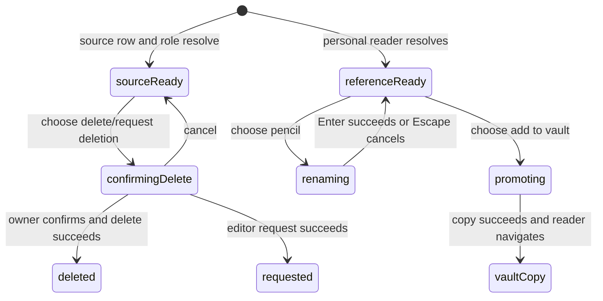

# Managing content

## Summary

Great Minds exposes three content-management actions in the scoped journey: the vault owner can permanently delete a source from a Library row; an editor variant can request that deletion through a proposal; and the signed-in account can rename or copy a personal Reading room reference into the active vault. Source deletion removes the source body, registry/search data, extracted ideas/anchors, and topic memberships but deliberately does not queue a compile or rewrite existing articles. Reference rename changes only account metadata. Reference promotion copies the stored Markdown into a new shared vault source and queues a compile while leaving the personal original intact.

Personal-reference deletion exists as a server capability but has no authenticated-web control/client action at the pinned commit.

## The simple case

In Library, the owner hovers or focuses a source row and chooses the trash control named **delete source**. A confirmation explains that the source/search entries disappear now while compiled wiki pages remain until a future compile. The owner confirms; the action says **working…**; Great Minds removes the source, closes its open preview, and refreshes source rows/counts. There is no undo and no compile starts automatically.

In a personal reference reader, the owner can choose the pencil beside its title, edit inline, and press Enter. Great Minds trims the title and updates account metadata without changing the body/path. The owner can also choose **add to {vault}**. Great Minds copies the exact personal Markdown to `raw/docs/…`, registers it as a source, creates/coalesces a compile intent, and navigates to the vault copy. The reference remains in Reading room.

## The interaction, event by event

### Arrive

#### Source actions

Library fetches the current user's role separately from article/source rows. A source row then receives one trailing action:

- owner: hidden-until-hover/focus trash button named **delete source**;
- editor: hidden-until-hover/focus file-remove button named **request deletion**;
- viewer, unresolved role, or role-query failure: no action.

The action exists only on source rows in Library, not on article rows, Reading room rows, a source preview panel, or the full source reader. Its confirmation target shows title when available and path as secondary text; without title it shows path alone.

Owner confirmation copy is:

- **Delete this source?**
- **This removes the source and search entries now. Existing compiled wiki pages will stay as-is until a future compile.**
- **delete source** / **cancel**.

The editor variant says **Request source deletion?**, explains owner review, and offers **request deletion** / **cancel**.

#### Reference actions

A personal reference full reader shows a pencil next to the H1, provided the document resolved as a reference. Its top action row can show **add to {active vault name}** once vault details identify a selected active vault. Share is separate.

Rename and promotion belong to the signed-in reference owner. Promotion's current server boundary requires only membership in the target vault, not editor/owner role. Thus even a viewer with a personal reference can directly add a shared source despite the general contribution model.

There is no reference delete button in the Reading room row/header. The browser API module likewise exposes list/create/promote/rename but not the existing server DELETE route.

### Leave without acting

Closing/Escape/**cancel** on a source confirmation performs no request and retains the row. Merely exposing the hover/focus action has no side effect.

Escape during reference rename discards the local draft and any inline error. Navigating away before Enter loses it. Clicking elsewhere does not save or cancel; the inline title input remains until Enter, Escape, or route/document change.

Leaving before choosing promotion changes nothing. The personal reference remains account-scoped and absent from the vault.

### Begin

#### Deleting a source

Confirming owner deletion marks that path busy. The confirmation stays open, buttons disable, and its primary label becomes **working…**. Other source rows remain usable.

The server validates a nested `raw/…/*.md` path, requires vault ownership, and looks up the exact source row. In one database transaction it:

1. finds idea ids extracted from that source;
2. removes those ideas' topic memberships;
3. removes exact-path search chunks;
4. deletes the source row, cascading its ideas and anchors.

After the transaction commits, Great Minds deletes the stored source file. It does not delete articles, topics, sessions, personal references, or source copies at other paths/vaults. It creates no compile intent.

On browser success, Library closes the preview when it showed that path, invalidates source pages and facets, closes the dialog, and lets the refreshed row disappear. It does not invalidate article lists or Health in this action.

#### Requesting source deletion

An editor confirm checks that the source exists and whether a pending proposal already targets its destination. With no conflict, Great Minds creates a `source_deletion` proposal and staged request document. The shared source remains fully readable/searchable.

Repeating the same deletion request while a deletion proposal is pending returns the existing proposal id (idempotent). A different pending proposal at that path causes conflict. The browser discards the server detail and shows generic **Failed to request source deletion** on failure.

Success closes the dialog and shows **Deletion request submitted.** above the source shelf. The row/action remain and there is no link to the proposal. Owner review occurs in the excluded administration surface. Approval eventually performs the same source deletion (missing is accepted); rejection leaves the source. Neither branch queues a compile for deletion.

#### Renaming a reference

Choosing the pencil replaces the H1 with a full-width **reference title** input, initialized from the loaded server title, then focuses/selects it. Enter trims the value; whitespace-only becomes null (clear title). If the result appears unchanged, rename mode simply closes.

A changed value updates only the account's reference metadata row and `updated_at`. It does not modify stored Markdown/frontmatter, URL, body/file hash, path, creation time, author/date, existing share identity, or vault sources previously promoted from it.

The reader applies returned title as a local override and exits rename. It does not update/invalidate the reference query or Reading room list cache directly. Sessions anchored to the reference resolve origin title from current metadata on their next read, so they reflect the rename.

#### Promoting a reference

Choosing **add to {vault}** disables the button and changes it to **adding…**. There is no confirmation/title/destination editor. The request explicitly pins the vault id selected at click time rather than using `vaultPath` later.

The server reads the caller's personal file and derives `raw/docs/{reference basename}`. If that destination already has the same body hash, it returns the existing source without rewrite/compile. If it has different content, Great Minds adds an eight-character hash of reference URL/body to the basename and checks again. Same-body content there is reused; different content at both paths returns a collision error.

For a new destination, Great Minds copies the exact stored personal Markdown (including URL/origin frontmatter and block anchors), registers a source, and creates/coalesces a compile intent. The original personal row/file is untouched. The browser then navigates to `/doc/{vault source path}`.

Personal title, author, publication date, and later rename live in the user-document row, not the copied Markdown. Promotion therefore does not carry those metadata fields into the fresh source registry; title/author/date can be null until compile enrichment. Renaming before promotion does not change the copied bytes.

### While in progress

Source delete/request dialogs prevent another confirm for that row while `actionPath` matches. There is no cancel-after-submit, progress beyond **working…**, or timeout copy. Network failure can leave the durable result uncertain.

Source database deletion commits before storage deletion. If storage deletion fails, the request errors after registry/search/idea data is gone. The Library catch sets **Failed to delete source** but does not refresh on failure, so a stale cached row can remain until later refetch while its reader no longer resolves normally.

Rename keeps the editable value and shows the returned detail below the input on failure. It can be retried with Enter. There is no pending label/disabled state, so repeated Enter can start overlapping rename requests; last database update to complete wins, while returned local override order can race.

Promotion uses a mutation pending state and shows a right-aligned error under the button on failure. Repeating is safe when the prior request committed because destination/body checks converge. The mutation has no abort/lifecycle guard: navigating away can still allow a late successful `goto` to the promoted vault source.

A newly promoted source can appear/read before its queued compile enriches it. The compile runs independently and follows [compiling the vault](../sources/compile-the-vault.md). Deletion intentionally waits for some separately triggered future compile to reconcile articles/topics.

### Finish

Owner delete success is permanent and silent apart from row disappearance. There is no toast, undo, trash, source-history entry, or automatic article repair. Existing article prose/citations can continue referencing the deleted path and show not found until a future compile changes them.

Editor request success retains the source and persistent shelf notice for this component instance. Starting another source action clears the prior notice/error. Reload/filter navigation clears local notice but not the proposal.

Rename success changes the current H1 immediately. Clearing produces the reader's existing null-title behavior: a blank H1 rather than path fallback. After a clear, starting rename again before document query data refreshes can preload the old server-prop title because local `null` override is treated as fallback in draft initialization/comparison.

Promotion success always leaves Reading room's original. The new vault source is a separate shared object with its own future metadata/deletion lifecycle. Browser Back can return to the personal reference; re-promoting returns the same-body destination without another compile intent and navigates again.

There is no way in this UI to delete the personal original. Calling the server endpoint elsewhere would remove its row/file but not any promoted vault copy, session, or public snapshot already created.

## Context and state variants

| Variant | At arrival | Changed while active |
| --- | --- | --- |
| Account role and access | Scoped owner deletes sources directly and can rename own reference/promote to owned vault. Editors request source deletion; viewers lack row action but can currently promote a personal reference through member-wide route. | Role loss can reject confirm; accepted deletion/copy remains. Personal rename depends only on account ownership. |
| Vault state | Source can be live, missing, already under proposal, or open in preview. Target promotion path can be empty/same-body/different-body. | Concurrent compile/read continues against changing source state. Promotion queues compile; deletion does not. |
| Target state | Reference title can be value/null; source metadata can be null. Existing copies/proposals make operations idempotent or conflicting. | Another tab can rename/delete/promote/request first; this request sees current server state at its boundary. |
| Entry context | Source action begins only from Library row. Rename/promote begins only from personal full reader. | Success can stay in Library, update local H1, or navigate personal→vault reader. |
| Input and viewport | Keyboard can focus hidden row action and use dialog; Enter/Escape controls title input. Pointer supports hover/action. | Narrow dialogs/input wrap but durable behavior is unchanged. |

## Cancel and interrupt

| Event | Before work begins | While work is in progress |
| --- | --- | --- |
| Escape, Cancel, or Stop | Dialog Cancel/Escape closes without mutation; rename Escape cancels. Promotion has no confirmation. | No Stop after request starts. Dialog controls are disabled while busy; rename/promotion requests are not aborted by Escape. |
| Navigation to another Great Minds page | Discards open dialog/rename draft/notice with no side effect. | Requests may finish. Promotion can late-navigate; deletion/rename result becomes visible on later refetch. |
| Browser Back or Forward | Restores route, not local dialog/rename/notice state. | A committed mutation persists. Back after promotion can return to personal original. |
| Page reload | Closes dialogs, clears draft/local override/notices, and refetches durable state. | Resolves uncertain success: deleted row absent, current title visible, promoted copy discoverable. |
| Tab or window closed | Nothing changes before confirm. | Browser loses feedback; server may complete accepted request. Compile from promotion continues. |
| Network lost | Dialog/draft remains until submit. | Request can report failure after commit. Delete has no idempotent success on repeat (missing becomes 404); promotion does converge by body. |
| Request failure or timeout | No mutation before submit. | Delete/request use generic messages; rename/promotion retain actionable input/button. Partial DB/storage delete can appear failed after effective removal. |
| Authentication session expires | Request tries standard refresh. | Failed refresh clears context; accepted server effects can remain. Personal content still exists unless mutation completed. |
| The target changes in another tab | Current row/title can be stale. | Delete repeats can become not found; rename races last-write; promotion converges or collides; proposal repeats return existing. |
| The target changes through another member | Shared source/proposal/destination can change; personal reference cannot be altered by another account. | Concurrent owner delete can make editor request fail; shared destination can force reuse/suffix/collision. |
| Browser autofill, paste, drop, or another input channel writes into the interaction | Paste/autofill can replace rename text. No file/drop input participates. | Rename sends trimmed current draft; other mutations have no editable body. |
| The window loses focus | Dialog/draft remains. | Requests and queued compile continue. No background notification appears. |

## Interactions with other systems

**Permissions and roles.** Direct source deletion is owner-only; editor deletion uses proposals; viewer cannot request. Reference rename is account-owner-only. Reference promotion is currently any-member direct ingest, wider than normal contribution boundaries.

**Validation and error display.** Safe source/reference paths reject traversal. Delete/request browser errors discard server detail; rename/promotion preserve parsed detail. Promotion collision and missing personal file are explicit.

**Unsaved work and history.** Dialog/rename draft/notices/local title override are unsaved. Source/reference/proposal/copy/compile-intent state is durable. There is no source version/undo history.

**Optimistic changes and rollback.** No row/title is changed before server success. Delete's DB/storage steps are not one transaction and have no rollback. Promotion is retry-convergent by path/body.

**Offline and reconnection.** No offline mutation queue exists. Reload/refetch is the only way to settle uncertain outcomes; compile intent/workflow is durable after promotion.

**Notifications.** Busy labels, inline notice/error, row disappearance, local H1 update, and navigation communicate outcomes. No toast/email/owner notification is created by deletion request from this surface.

**URL and navigation state.** Paths determine mutation identity but dialogs/drafts are not route state. Promotion changes scope/route from `/refs/…` to `/doc/raw/docs/…`.

**Multi-tab and multi-user behavior.** Shared source/proposal/copy writes can race; personal rename is same-account only. No live merge updates current components.

**Accessibility and keyboard use.** Row actions are opacity-hidden but focus-visible and named; confirmation has title/description/cancel/action. Pencil is named. Rename has no visible Save/Cancel controls beyond Enter/Escape and needs discoverability testing.

**External side effects.** Deletion removes DB graph/search/storage but no compile. Proposal writes staged admin content. Rename updates one metadata row. Promotion copies storage/registry, creates an intent, and triggers later provider work.

## Edge cases

- Source deletion creates no compile intent even though its dialog says articles wait for a future compile.
- Existing wiki articles/citations can continue to link to a now-missing source.
- DB deletion can succeed while storage deletion fails; UI can show failure for an effectively removed source and leave an orphan file.
- Delete request against the same pending deletion is idempotent; a different pending proposal at that path conflicts, but UI shows only a generic failure.
- Role-query failure hides source actions without explaining why.
- Clearing a reference title results in a blank full-reader H1; Reading room still has a path-derived row fallback.
- After clearing, reopening rename before reload can prefill the old title because local null override is not used as the draft source.
- Rename updates `updated_at` but Reading room still sorts by creation time, so the row does not move to the front.
- Rename does not update stored Markdown/body hash and is not copied by later promotion.
- Existing anchored-session origin titles resolve the renamed reference title dynamically on next session/document read.
- Promotion copies URL/origin/body but loses user-row title/author/published metadata until source enrichment.
- Same-body source at the expected/suffixed destination is reused even if its provenance differs.
- Promotion destination collision uses the personal reference basename, then URL/body hash; a second different body at the suffixed path is a hard error.
- Promoted source deletion leaves personal reference; re-promotion can recreate it and queue compile.
- Personal reference deletion is unavailable in the authenticated UI despite the server route.
- A promotion request can finish and navigate after the owner intentionally left the reader.

## Open questions and verification

- Add a personal-reference delete affordance with explicit consequences for promoted copies, sessions, notes, and shares—or remove/document the unused server capability.
- Post-baseline role decision: direct reference promotion is owner-only; editors use existing proposal contribution paths and viewers are read-only. Great Minds commit `45ac124` hides the action and rejects non-owner requests.
- Post-baseline product decision: source deletion deliberately does not queue or offer a compile. It changes the source corpus now while articles remain the last published snapshot until an owner separately starts a compile. Great Minds `24a6ec0` retains the explicit confirmation warning; a visible controlled deletion left both compiled articles unchanged and created no compile intent.
- Post-baseline B-32 fix: Great Minds `24a6ec0` commits an object-cleanup outbox in the same transaction as source graph removal, attempts the idempotent object delete immediately, and retries unfinished cleanup at startup and every minute. Library refetches after both success and uncertain failure. In a visible forced-storage-failure check, the row disappeared without a false error while the outbox remained pending; removing the obstruction let reconciliation mark cleanup complete.
- Preserve/display personal title/author/published provenance when promoting, especially after an explicit rename.
- Fix null-title fallback and the stale draft initialization after clearing a title; invalidate/update Reading room and document query caches on rename.
- Surface proposal conflict/not-found details and a link/status for an already-submitted deletion request.
- Add visible rename Save/Cancel/pending state and serialize overlapping Enter submissions.
- Guard promotion's late navigation when the reader unmounts and verify uncertain network retries.

Verified against Great Minds commit `c8c9e57`.
