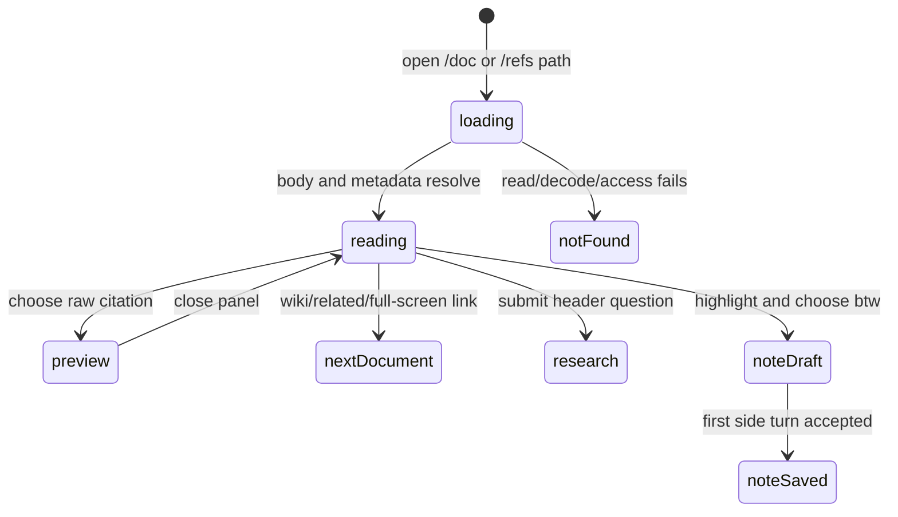

# Reading content

## Summary

Great Minds reads vault articles/sources at `/doc/{path}` and personal references at `/refs/{path}` in one full-page Markdown reader. The reader shows type-specific metadata/actions, reconstructs hidden `^pN` block anchors for citation links, previews raw-source citations without leaving the page, navigates wiki links directly, displays up to five related live articles, and lets the owner ask a new document-origin question or create persistent BTW notes anchored to selected text. Vault reads use the currently active vault; personal bodies use account scope, but their research/note sessions still use an active vault for evidence and persistence.

Network, authorization, schema, and registry failures all currently collapse to **Document not found.** Wiki tags are returned by the server but dropped by the browser's full-document schema, so article tags filter Library yet do not appear in the article header.

## The simple case

The owner chooses a Library row, previews it, and selects **open full screen**, or follows a direct reader link. A loading skeleton becomes a header and rendered Markdown body. An article shows title/précis; a source can show title/précis, author/date/genre, tags, origin link, and extra metadata; a personal reference shows its title, origin link, author/date, rename/share, and **add to {vault}**.

The fixed header has Home and **Ask about this article…**. Entering a question navigates to home with the question and document path, auto-starting a research session grounded in that origin. Within the body, wiki links navigate to another article, raw links open the full source or cited `^pN` passage in a side panel, and external/`#` links keep browser behavior.

The owner can highlight at least five characters inside one Markdown block and choose **btw**. An inline note opens below that block. Its first submitted question creates an anchored private session; later reloads show the selected phrase as a clickable highlight and include the note in a header **notes · conversations** panel.

## The interaction, event by event

### Arrive

A vault route accepts safe Markdown paths under `wiki/` or nested `raw/`. It interprets them inside the active vault and requires membership. A personal route resolves an account-owned `refs/…` path independently of vault membership for the body itself. Both route groups use generic browser titles (**Document | Great Minds** or **Reference | Great Minds**) rather than the loaded title.

The page header shows a Home button, a truncated uppercase display label from title/path on medium widths and above, and a one-line query field named **ask about this article**. There is no Library Back/breadcrumb control; browser Back or Home are the main exits.

While the body loads, Great Minds shows title/metadata/body skeletons. Successful storage is not sufficient by itself: a vault file must also have a matching article/source registry row. A stored file without registry metadata is an internal mismatch rather than an anonymous document.

Full header behavior varies by object:

| Object | Header and actions |
| --- | --- |
| Live vault article | Required title, précis when present. Backend tags currently disappear before rendering. |
| Vault source | Stored/derived title, précis, author, publication date, genre, clickable tags, URL/origin, and **more metadata** excluding internal `topic_id` when present. |
| Archived article | Article metadata plus **archived article** notice and successor slug link, or explicit no-successor copy. No related footer. |
| Personal reference | Nullable title with rename pencil, external origin link, author/published, **add to {active vault}**, and Share. |

A source/reference whose title is null does not use the reader's path-derived label in its H1. The label appears in chrome, but the document H1 can be blank; Library rows had a fallback that this header omits.

Source tags link to a fresh `/library?tag={tag}` route. They do not preserve a prior Library type/search. **more metadata** renders remaining derived key/value pairs; arrays become comma-separated text, objects JSON, and null/empty values use an em dash.

The reader also starts loading sessions the owner created from this document path. Saved anchored sessions are **notes**; unanchored document-origin sessions are **conversations**. This loading/error state is not shown. Existing inline notes begin collapsed.

### Leave without acting

Reading does not mark content read, update recency, create history, or call a model. Scrolling, hovering/pinning a footnote, opening metadata, opening the note/conversation panel, and closing a citation preview are local presentation only.

The query draft is local. Escape clears and blurs it; blank Enter/**QUERY** does nothing. Navigating/reloading discards it without warning.

Selecting text but dismissing the popover creates no note. An empty note draft is local and disappears when its blank reply field blurs. Leaving destroys note observers and drafts but does not cancel a side reply whose first turn was accepted.

### Begin

#### Asking about the document

Typing nonblank text enables **QUERY**. Enter/button trims the question, calls navigation to `/?q={question}&origin={current path}`, and clears the reader field immediately. Home consumes the query and starts a main research session; success later replaces the route with `/sessions/{id}`.

For vault articles/sources, the initial query reads the origin path before general retrieval and stores an unanchored document origin. Returning to the document later lists this session under **conversations**; choosing **open** goes to the full session.

For personal references, the current reader passes only the `refs/…` path. It does not pass personal origin scope; home reconstructs it as vault scope. The model therefore attempts to read that path from the vault, the saved session origin points back through `/doc/`, and the personal reference may not ground the answer. This is a current scope-loss defect.

#### Creating an anchored note

Text selection uses the same block-local rule as answer selections: trim at least five characters and keep the range inside one top-level rendered block. Mouse-up positions a popover above it. This reader popover offers **btw** only. Scrolling or outside mouse-down dismisses it; selection-collapse alone has no dedicated listener here.

Choosing **btw** creates a local expanded note with selected quote, full block context, and Markdown source offset. It clears the native selection and focuses **reply…**. The first nonblank Enter creates a new session whose origin includes path, correct `vault`/`personal` scope, quote, paragraph, and offset. The server supplies that context to a concise BTW-mode reply while storing only the clean question.

Once accepted, the anchored session is durable and excluded from the main Sessions list. It remains discoverable through this document and direct session route. Later turns continue that session with its prior note history. Note generation/evidence display follows [BTW thread](../research/btw-threads.md) compact behavior.

### While in progress

The body strips visible trailing `^pN` markers from stored Markdown and maps each marker back to its rendered top-level block as DOM id `^pN`. Opening `/doc/{path}#^p7` waits for body rendering, decodes the hash, and scrolls the exact block to the top. Missing hashes fail silently; malformed percent encoding can throw during decoding and needs verification.

Markdown link behavior is target-based:

- `wiki/…` navigates to `/doc/{wiki path}` (including any hash);
- `raw/…#^pN` opens that exact vault search chunk in a citation side panel;
- other `raw/…` fragments/full links open the full raw document panel;
- `http://`/`https://` and `#…` are not intercepted;
- other relative link forms use ordinary browser-relative navigation.

A citation panel shows loading skeletons, **cited passage** with paragraph number for an exact chunk, or the full source. **open full screen** closes the panel and navigates to the document, preserving one exact chunk as `#^pN`. Wide screens dock the panel; narrower screens overlay it. Docking disables margin-footnote layout so footnotes use popover presentation.

For personal readers, raw-link interception tries to resolve the raw path as another personal reference and normally yields **Not found**; wiki links still navigate to the active vault. This mixed-scope behavior is not explained in the UI.

Footnotes use right-margin notes only at 1200 pixels or wider, with a fine pointer and no docked panel. Hover exposes a note; choosing the reference pins/unpins it; Escape clears margin notes. Otherwise footnotes use popovers. Their links retain the same interception rules.

Live wiki articles load up to five **related** live articles derived from at least two shared ideas, ordered by similarity then title. Each footer item shows title/précis and navigates full-screen. Outgoing/incoming citation links are not shown in this footer. Related-query failure is silent.

An archived route is resolved only through retained archived topic/article storage when the originally requested wiki file is absent. Its banner links to `/doc/wiki/{successor slug}.md` when a successor exists. The visible link text is the slug, not resolved title. Asking, selecting, and note creation remain available; related content is hidden.

A currently running document note streams in place. Multiple notes can run independently. Leaving aborts only browser tails. Unlike the session-page restorer, reloading the document does not mark saved pending turns as streaming or reconnect their reply ids: it renders the empty pending turn as **reply interrupted** until the session is opened/reloaded after final persistence. The parent session route can reconnect.

Persisted exact anchors become clickable highlighted `<mark>` segments; selecting them wins over toggle, and a link inside retains navigation. Header's closed **⊹ N notes · M conversations** disclosure lists saved notes and conversations. **jump** expands a resolvable note and scrolls to its mark; conversation **open** navigates to its session.

If a persisted note's block resolves but quote does not, Great Minds renders a pure margin dot and no clickable mark. The header removes **jump**. Because the inline card is closed and the dot is noninteractive, that note can become unreachable from the reader despite remaining durable. A missing block similarly removes inline placement/jump.

### Finish

A read finishes by remaining on a stable rendered document, navigating through a link, opening research, or saving an anchored note. There is no read-complete state.

Document-load failure—invalid path, not found, nonmember, network failure, registry mismatch surfaced through HTTP, or client schema mismatch—renders the same **Document not found.** copy with no retry or diagnostic. Personal failures use that same wording rather than **Reference not found**.

A note's first accepted turn adds a new saved note count after its `sessionId` is known; the draft itself is excluded from the count. Completion restores **reply…** and allows **open session**. Note-list loading does not automatically refetch while the document stays open, but locally created notes remain in state.

A successful personal-reference promotion navigates to the new `/doc/raw/docs/…` vault copy; rename/promotion/delete rules are in [managing content](manage-content.md), and share behavior is in [sharing and export](../cross-cutting/share-and-export.md).

## Context and state variants

| Variant | At arrival | Changed while active |
| --- | --- | --- |
| Account role and access | Any member reads vault documents; personal reference body belongs to account. Owner/editor status affects promotion/manage actions, not passive read. | Losing membership makes next vault/body/link/thread request fail; personal body can remain but active-vault research context can fail. |
| Vault state | Path resolves against active vault; personal body does not, but notes/query evidence do. Compiling vault can rewrite metadata/articles. | Active-vault switch refetches vault body/related links but does not recreate `DocThreads`, leaving old-vault thread state attached to the new body. |
| Target state | Target can be live, archived, missing, metadata-null, storage/registry mismatched, or personal. | Deletion/supersession/rename/compile appears on refetch/path change; open body has no live replacement subscription. |
| Entry context | Library panel, citation full screen, wiki/related link, origin link, tag return, direct URL, and block hash all converge on reader. | Path change recreates note manager/panel/popover; hash-only change scrolls after render. |
| Input and viewport | Keyboard query, pointer/keyboard links, pointer text selection, footnote interactions, and disclosures coexist. | ≥1200px fine-pointer uses margin footnotes unless panel docked; panels overlay/dock by viewport. |

## Cancel and interrupt

| Event | Before work begins | While work is in progress |
| --- | --- | --- |
| Escape, Cancel, or Stop | Escape clears/blurs query, closes panel/popover according to focus, or cancels rename; passive read has no Stop. | No Stop for accepted query/note. Escape can close presentation but generation continues. |
| Navigation to another Great Minds page | Discards query, selection, popover, open metadata/panel, and empty note draft. | Aborts document/note browser observers; accepted session/reply generation continues. Late query navigation is already the transition. |
| Browser Back or Forward | Restores prior route/hash; local panel/disclosure state is not history state. | Leaves observation only. Returning reloads document/notes but does not reconnect pending note replies inline. |
| Page reload | Refetches body/metadata/threads; loses local selection/panel/query/drafts and expansion. | Accepted note session remains. Pending document-note turn appears interrupted rather than resumed in this reader. |
| Tab or window closed | No effect on passive content. | Accepted generation continues; unsaved query/draft disappears; no notification. |
| Network lost | Cached body may remain; fresh reader can become **Document not found.** | Panels/links/threads fail; note tail retries while mounted. Body/list errors have poor differentiation. |
| Request failure or timeout | Main body becomes not found; related/thread failures disappear silently. | Note failure shows interruption in its card; query navigation failure has already cleared its input. |
| Authentication session expires | Body requests use normal refresh. | Failed refresh clears auth/vault and ends protected reads/observation; accepted generation can settle server-side. |
| The target changes in another tab | Current body/metadata can stay stale. | Deletion breaks later panel/link/refetch; rename/compile appears later. Personal rename in another tab is not live-merged. |
| The target changes through another member | Shared vault target can be deleted/compiled; personal reference cannot. | Current render remains until refetch. Related paths and citations can resolve to changed/deleted content. |
| Browser autofill, paste, drop, or another input channel writes into the interaction | Paste/autofill enters query; native selection creates a popover only through mouse-up. File drop has no reader ingest behavior. | Query field leaves on submit; note input is hidden during that note's reply. |
| The window loses focus | Query/body remain; popover may persist unless an outside event/scroll occurs. | Reads/replies continue. Completion focus returns to note input only when no other element owns focus. |

## Interactions with other systems

**Permissions and roles.** Vault reads require membership; references are account-private. Document-origin sessions are creator-private but vault-scoped for evidence. Personal note sessions use selected vault plus personal origin scope.

**Validation and error display.** Safe vault paths reject traversal, absolute/backslash, non-Markdown, and wrong prefixes. The UI erases distinctions among invalid/not-found/forbidden/network/schema/registry failures.

**Unsaved work and history.** Query drafts, panel, popover, footnote pins, metadata disclosures, note expansion, and empty note drafts are local. Accepted queries/notes become append-only sessions; body/files/metadata are durable content.

**Optimistic changes and rollback.** Query navigation clears text before route success. A note draft/turn appears optimistically; first-create failure remains local and retryable as a fresh anchored first turn, while reload drops it.

**Offline and reconnection.** No offline document guarantee exists. Main sessions reconnect by route; inline document-note restoration currently does not reconnect pending replies.

**Notifications.** Skeleton, not-found copy, inline note state, panel loading, archive banner, and onboarding tip are visible feedback. Related/thread failures and background reply completion have no notification.

**URL and navigation state.** Scope/path/hash identify body and exact block. Panels, selected text, footnotes, and thread expansion are local. Header Query constructs home `q`/`origin`; personal scope is currently lost.

**Multi-tab and multi-user behavior.** Shared content can become stale; personal references cannot be changed by other accounts. Same-account tabs can create sessions/notes independently with no live merge.

**Accessibility and keyboard use.** Semantic article/Markdown, named query, disclosures, buttons, and links are present. Selection-only BTW discovery, highlighted `<mark>` toggles, pure margin dots, dynamic footnotes, and silent errors need manual verification.

**External side effects.** Passive read loads storage/metadata/links/sessions. Query/note creation invokes retrieval/model/cost persistence. External origin links leave Great Minds; reference promotion/share/rename have separate mutations.

## Edge cases

- A source/reference with null title renders a blank H1 even though chrome/Library can derive a name from path.
- Wiki tags exist server-side but the browser wiki schema drops them, so article headers never show tag chips.
- Source type and explicit provenance fields (including parent session/exchange) are not shown in the header; only selected metadata/derived extras are.
- Personal Query loses `origin_scope=personal`, can fail to read the reference as context, and later links **from {title}** to `/doc/refs/…`.
- Personal anchored BTW creation does carry correct personal scope, so the two research entry actions disagree from the same page.
- The onboarding tip uses the same browser-global `onboarding-hint-seen` flag as session answer selection. Dismissing either suppresses the other.
- Selection-collapse alone does not explicitly clear the reader popover; outside mouse-down or scrolling does.
- A raw citation from a personal reference is resolved as a personal path and commonly shows **Not found**.
- Unrecognized relative Markdown links are not routed by scope and can navigate relative to the current browser URL.
- Exact block hash has no visible fallback when marker/block is absent; malformed percent escapes can disrupt the scroll effect.
- Archived successor text is a slug, not the successor article title.
- Related content is at most five and exists only for live wiki articles with at least two shared ideas; errors/empty are indistinguishable.
- Document note load failure is stored internally as **failed to load notes** but never rendered.
- Reloading while a document note runs shows its pending empty event as interrupted and does not tail the durable reply from this surface.
- An unresolvable saved note can remain in the header count/list with no jump/open action and no interactive gutter mark.
- Switching active vault without changing path leaves old `DocThreads` loaded while body/related content refetch against the new vault.
- A file that exists in storage without its registry row can produce an internal error, but the page only says not found.
- Opening a panel forces footnotes from margin mode to popovers at wide desktop size.

## Open questions and verification

- Preserve personal origin scope through header Query and session display/navigation. This is a P1 grounding/provenance defect.
- Fix full-reader title fallback and wiki tag schema so reader metadata agrees with Library rows/filters.
- Render differentiated error/retry states for not found, forbidden, offline/network, malformed response, and registry mismatch; surface related/thread failures.
- Recreate/clear document-thread state when active vault changes, including personal-reference notes that are vault-scoped.
- Resume pending document-note reply ids on reload or show a truthful “still running—open session” state instead of **reply interrupted**.
- Give unresolvable notes an **open session** fallback; pure dots/header rows currently strand durable conversations.
- Verify anchor/hash mapping, repeated quotes, footnotes, rich Markdown, links inside highlights, archive paths, and panel maximize behavior.
- Verify selection/BTW creation with keyboard and assistive technology, margin/popover footnotes, dynamic note counts, and reduced-motion behavior.
- Decide whether personal raw/wiki links should resolve against vault, personal scope, or explicit link metadata rather than mixed prefix rules.
- Show document provenance (especially promoted session/reference sources) or provide a link back to origin/session.

Verified against Great Minds commit `c8c9e57`.
