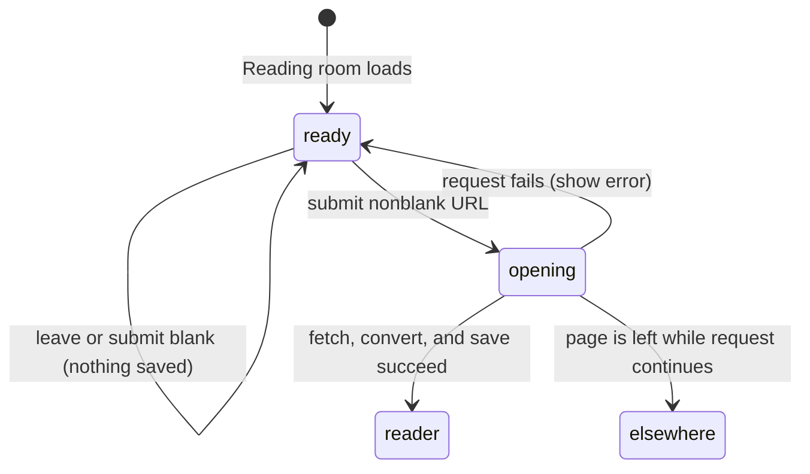

# Opening an external article

## Summary

Opening an external article turns a public web page into a durable personal [reference](../glossary.md#content-and-the-library). The owner meets the form on the Reading room shelf of the [library](../glossary.md#content-and-the-library): choose **Reading room**, paste or type an article URL, and press **open**. Great Minds fetches readable HTML or plain text, stores a cleaned Markdown copy for this account, refreshes the shelf, and opens the new reference in the full reader. The action is available to any signed-in account and is independent of the [active vault](../foundations/access-and-vault-context.md).

## The simple case

The owner opens **Library**, chooses **Reading room**, and pastes an `https://` article URL into **Paste an article URL**. The **open** button becomes available as soon as the field contains a non-whitespace character.

After the owner submits, the field and button are disabled and the button reads **opening…**. Great Minds downloads the page, extracts its main article text and available title, author, and publication date, and saves the result in the owner's personal reading room.

When the request succeeds, the browser leaves the shelf for `/refs/{path}`. The reader shows the saved copy; returning to the reading room shows the new reference at the front of its newest-first list. Nothing is added to the vault, indexed for vault search, or queued for compilation merely by opening the article.

## The interaction, event by event

### Arrive

The user arrives by opening `/library` and choosing the **Reading room** filter. The form appears above the personal-reference shelf with an empty text field and a disabled **open** button. The field requests URL-oriented mobile input and browser URL autocomplete, but it is otherwise a normal text field. It does not require the active vault to be populated and it does not use the library's vault-content search box.

The shelf starts loading the account's references at the same time. Existing references do not prefill the form. An active tag filter makes the reference rows disappear because references have no tags, but the URL form remains available.

### Leave without acting

Leaving the page, changing the library filter, or submitting with only whitespace creates no reference and makes no remote request. The submit handler trims the field before deciding whether to open it, and the button is disabled for an empty or whitespace-only value.

Text typed into the field is [client state](../glossary.md#page-and-interface-state). It is not written to the URL, local storage, or the server. Leaving Reading room and returning creates a fresh empty field.

### Begin

Clicking **open** or pressing Enter submits the trimmed text. The form does not require the user to type a scheme: Great Minds treats a value without `http://` or `https://` as an HTTPS URL. The same request path handles pasted, autofilled, and typed text.

The field becomes disabled, the submit button becomes disabled, and the button label changes to **opening…**. This prevents a second submission through this form while the first request is pending. Great Minds first looks for an existing personal reference with the exact normalized URL. If one exists, it returns that reference without fetching the remote page again.

For a new URL, Great Minds performs a public-internet fetch with redirects enabled and a 30-second timeout. Only HTML and plain text responses are accepted. The response body is capped at 25 MiB. A non-success HTTP response, unsupported content type, blocked private address, timeout, oversized response, connection failure, or conversion failure ends on the form's error path.

> Technical note: Public-address validation happens when each network socket is opened, including redirect hops. Literal private IPs and DNS answers outside public unicast ranges are refused unless the server is explicitly running with its private-fetch test escape hatch.

### While in progress

The form shows no progress bar, elapsed time, cancel control, or explanation of the current fetch/conversion stage. The pending label is the only visible progress signal. Existing reading-room rows remain usable, and the rest of Great Minds navigation remains available.

The browser request itself is not wired to a user-facing abort controller. Navigating away does not send a Great Minds cancellation command. If the server has already accepted and continues the fetch, the personal reference can still be stored after the form has disappeared.

For HTML, Great Minds extracts the main article and compacts repeated blank lines and trailing whitespace. It records a title, author, and publication date when extraction finds them. For plain text, it stores the response as the body and leaves those three fields empty.

The stored path begins with `refs/` and is based on the final segment of the submitted URL's path, normalized to a lowercase URL-safe slug. A blank path becomes `refs/doc.md`. If another URL already owns that path, Great Minds appends the first eight hexadecimal characters of a hash of the URL, preserving both references rather than overwriting one.

### Finish

On success, Great Minds stores the Markdown copy and its metadata for the signed-in account. The reading-room query is invalidated so the next shelf view includes the result. The browser then navigates directly to the personal reader at `/refs/{file_path}`.

Submitting an exact URL that already exists finishes the same way but reuses the existing reference identifier and path. It does not refresh the remote content or move the reference's original creation time; from the form, the visible result is simply that the existing reader opens.

On failure, the user remains in Reading room. The field and button become available again, the entered URL remains in the field, and the server's detail is shown under the form when one is available. Examples include **Unsupported URL content-type: application/pdf** and a fetch failure containing the remote HTTP status. No reader navigation occurs through the failure path.

Saving a reference is account-scoped only. It does not create a vault source, search-index row, compile intent, or pipeline run. Adding the saved reference to a vault is a separate [content-management task](../library/manage-content.md).

## Context and state variants

| Variant | At arrival | Changed while active |
| --- | --- | --- |
| Account role and access | Any signed-in account can use its own reading room; vault owner status does not change reference creation. | Losing usable authentication makes the request fail or redirects later navigation to sign-in; changing a vault role has no effect on the personal reference. |
| Vault state | Empty, populated, and actively compiling vaults all permit the personal URL form because the result is not vault content. | Switching vaults or starting background work does not alter the in-flight personal fetch. |
| Target state | A new normalized URL is fetched and saved; an exact existing URL is returned without another fetch. | If another tab creates the same URL first, uniqueness converges on the existing personal reference; a path collision from a different URL receives a hash suffix. |
| Entry context | The form appears after the user chooses Reading room on `/library`; a tag filter may hide rows but not the form. | Changing the type filter navigates within the library and destroys the form's local field state. |
| Input and viewport | Typing, paste, autocomplete, and Enter use the same trimmed value; the pointer can use **open**. | The field is disabled once submitted, so later typing, paste, or autofill has no effect until the request settles. Narrow layout changes the available width but not the durable result. |

## Cancel and interrupt

| Event | Before work begins | While work is in progress |
| --- | --- | --- |
| Escape, Cancel, or Stop | There is no Cancel or Stop control. Escape has no form-specific behavior; typed text remains while the page remains mounted. | There is no supported abort action. Escape does not cancel the server fetch or conversion. |
| Navigation to another Great Minds page | The form is discarded and nothing is recorded. | Navigation removes the pending UI, but no cancellation request is sent. The unresolved success handler may still navigate to the reader when it finishes. |
| Browser Back or Forward | Leaving discards the unsaved field; returning creates a fresh field. | The current page is left. Accepted server work may finish, and a late client success may compete with the history navigation. |
| Page reload | The field returns empty and nothing is recorded. | The browser abandons its pending page request. The server may still save the reference; a later Reading room reload reveals it if it completed. |
| Tab or window closed | Nothing is recorded. | The page cannot display success or failure. Server work already underway may still produce the account-scoped reference. |
| Network lost | No effect until the user submits or the shelf refetches. | The browser request rejects and the form shows an error after the failure is observed. A server-side remote fetch that already completed may still have saved the reference. |
| Request failure or timeout | No effect before submission. | The form re-enables, preserves the entered URL, and shows the returned detail or **Failed to open external article**. No deliberate rollback is needed when saving never completed. |
| Authentication session expires | The visible form does not change before a request. | The browser tries one token refresh and one request retry. If refresh fails, credentials are cleared; the request fails and authenticated routing sends the user to sign-in. |
| The target changes in another tab | A newly created duplicate will be reused when this tab submits. | Concurrent creation of the same normalized URL converges on one record; the late request opens the resulting reference. Deletion in another tab can make the subsequent reader load fail. |
| The target changes through another member | No other member can change this account-scoped target. | No effect. Personal references are isolated by account, even when users share a vault. |
| Browser autofill, paste, drop, or another input channel writes into the interaction | Paste and URL autofill populate the normal text field and enable **open**. The form has no file-drop behavior. | The disabled field rejects changes until the request settles. |
| The window loses focus | The draft remains. Native focus styling disappears; no request begins automatically. | The fetch and conversion continue. Returning to the window shows the current pending, success-navigation, or error state. |

After an interruption that leaves the page, Great Minds provides no dedicated “recently opened in the background” notice. The reference is discoverable by returning to Reading room if it was saved.

## Interactions with other systems

**Permissions and roles.** Reference creation requires a signed-in account but no active-vault membership check. Storage and lookup are isolated to that account; another user receives not found for the path.

**Validation and error display.** The client trims and rejects blank input. URL scheme normalization, public-address restrictions, HTTP success, content type, size, timeout, conversion, and storage are enforced at the server boundary; the returned detail appears under the form.

**Unsaved work and history.** The URL draft has no persistence or unsaved-changes warning. A successful reference is durable, but opening an existing URL does not create a new version or refresh history.

**Optimistic changes and rollback.** The shelf does not add an optimistic row. It refreshes only after success, so a failed request has no row to roll back.

**Offline and reconnection.** There is no offline queue or automatic retry. The user can resubmit after connectivity returns; exact-URL reuse prevents a successful first attempt from becoming a duplicate.

**Notifications.** Success is communicated by navigation to the reader, not a toast. Failure is inline below the form. Background completion after navigation has no notification.

**URL and navigation state.** The Reading room selection is represented by the library `type` query parameter. The draft URL is not. Success navigates to the saved `refs/…` path.

**Multi-tab and multi-user behavior.** Another tab can create or delete the same account's reference; the next query or reader load reveals the durable result. Different accounts cannot see one another's reading rooms.

**Accessibility and keyboard use.** The field has the accessible name **External article URL**, the form submits with Enter, disabled state is native, and the button exposes its pending text. The interface does not announce intermediate fetch stages or provide an explicit cancel action.

**External side effects.** A new reference makes one outbound HTTP fetch, follows redirects, parses remote content, writes account storage, and writes reference metadata. It does not contact the language model, add vault search data, or start a compile.

## Edge cases

- A value such as `example.com/article` is normalized to HTTPS; malformed text still reaches URL parsing and returns an inline error rather than client-side URL syntax guidance.
- An exact normalized URL is idempotent. Differences in query strings, fragments, host spelling, or trailing slash are distinct unless the submitted strings normalize to the same URL.
- A remote redirect does not make the original submitted URL reusable under the redirect destination; duplicate lookup begins from the normalized submitted URL.
- HTML extraction can return no title, author, or publication date. The reference still saves and the reader falls back to a path-derived display name where needed.
- Plain text is accepted even without a title. PDF and other binary content types are rejected rather than converted on this path.
- Two different URLs ending in the same path segment do not overwrite each other; the later path receives an eight-character hash suffix.
- The 25 MiB limit applies while reading the response body, so a server that omits or lies about `Content-Length` is still bounded.
- A missing storage file makes a later reader request return not found even if metadata still exists.
- The reading-room list is newest-first and paginated in groups of 50; opening an existing duplicate does not create a new newest item.

## Open questions and verification

- Verify the exact browser-visible error for malformed text, DNS refusal, timeout, oversized content, and a redirect to a private address; source and tests establish the failure paths but not every browser string.
- Verify focus placement when the user switches to Reading room and after a failed request; the form itself does not request autofocus.
- Verify extraction quality on representative news, blog, paywalled, script-heavy, and plain-text pages. The conversion library's output is content-dependent.
- Navigating elsewhere while **opening…** may be worth treating as a bug: the request has no page-lifecycle cancellation or mounted-page guard, and its late success handler can call `goto` after the user deliberately left.
- Verify whether a reload or tab close after the request reaches the API commonly leaves a saved reference without visible confirmation; the durable result is timing-dependent.

Verified against Great Minds commit `c8c9e57`.
