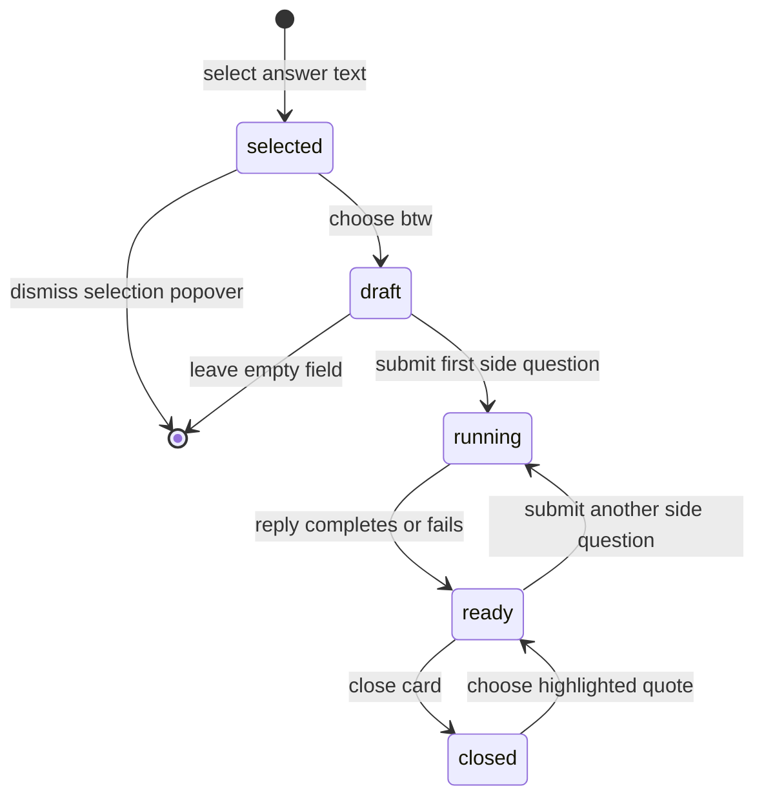

# BTW threads

## Summary

A [BTW thread](../glossary.md#research-sessions) is a concise side conversation anchored to selected text in a completed main answer. It preserves the selected quote, its containing answer block, and its place in the Markdown source; opens directly below that block; and keeps its turns outside the session's main conversation history. The first side question receives the full main conversation plus the selected passage, while later turns receive that same main history and the prior BTW turns. Accepted BTW turns use durable reply snapshots, survive navigation, and update the session without creating a new main exchange.

## The simple case

The owner highlights at least five characters inside one block of a completed answer and chooses **btw** from the selection popover. The quote gains a BTW highlight, an open card appears directly below its answer block, and the card's **reply…** field receives focus.

The owner types a short side question and presses Enter. The clean question appears after **you ·**; the input disappears; and the card shows **thinking…**, then **reading…** when evidence arrives, then a compact streamed Markdown answer. Evidence badges sit above the side answer. Great Minds asks the model to answer a BTW directly in two or three short paragraphs with relevant citations, though generated length remains nondeterministic.

When the answer finishes, the reply field returns and normally regains focus. The owner can continue the same thread without adding its turns to the main follow-up history. Closing the card leaves the quote highlighted; choosing the highlighted quote opens it again. Reloading reconstructs accepted turns at the same anchor.

## The interaction, event by event

### Arrive

BTW creation is available only from a non-streaming main answer. The owner selects text inside one rendered top-level block. Great Minds trims the selection, requires at least five characters, and ignores a selection that crosses the boundary of that block. The selection popover offers **+ follow up** and **btw**.

Choosing **btw** creates a local empty thread anchored by three values:

- the selected quote;
- the complete visible text of its containing block, used as model context;
- the block's source offset, used to place the thread after the same Markdown block.

The popover and native selection clear. Great Minds highlights the first exact occurrence of the quote in that block, inserts an open BTW card below it, and focuses **reply…** without scrolling the page. The card header shows **btw** and a one-line quote shortened after 58 characters.

Existing accepted threads arrive as highlighted marks in the answer. Session threads open by default on first render. The owner can use the card header or highlighted quote to close or reopen a thread. Selecting text takes precedence over click-to-toggle, and a link inside highlighted text keeps its normal navigation behavior.

### Leave without acting

An empty draft has no server side effect. If its reply input loses focus while it has no turns and no trimmed text, Great Minds removes the draft and its highlight. There is no separate Cancel or Delete button.

Typing without submitting keeps the draft locally when focus moves away. Closing, navigating, reloading, or destroying the session discards that text and any thread whose first turn was never accepted. No unsaved-changes warning appears.

After a turn has been submitted, the thread cannot be dismissed or deleted through this interface. Closing it only collapses its presentation; its anchor, turns, evidence, and generated answers remain part of the session.

### Begin

Pressing Enter in **reply…** trims the field. Blank text does nothing. A nonblank submit immediately appends an optimistic side turn, clears the field, hides the input, and begins an independent running reply. The main session remains in its current phase; starting a BTW does not create a main-line question or hide the main follow-up bar.

For the first BTW turn, the model receives:

1. every main question and answer in the current session;
2. `Passage:` followed by the full containing block;
3. `Highlighted: "…"` when the selected quote differs from that full block;
4. the clean side question.

The displayed and stored BTW turn contains only the clean question. The passage wrapper exists only in model context.

For a later side turn, the new model question is the clean text alone. Its history contains the current main conversation, then the first BTW question with the passage/selection wrapper, then every prior side answer and later side question in order.

Server acceptance appends a pending BTW version containing the anchor, all settled prior turns, and the new empty-answer turn. The reply identifier makes that side turn reconnectable. The session's updated time changes at pending acceptance, so BTW activity can move the parent session to the top of the recent-sessions list.

> Technical note: BTW persistence is latest-version append-only state. Pending and final versions repeat the parent exchange id and selected quote; readers choose the newest version of that logical thread.

### While in progress

The BTW card displays all evidence sources from the current turn as a compact row of badges. Before answer text:

- it says **thinking…** when no source badge exists;
- it says **reading…** after evidence appears;
- pending badges pulse.

Article, raw-source, search, filter, and connection evidence is descriptive in this card. It does not open the session evidence panel. The side answer then renders as compact Markdown with a blinking cursor. Unlike the main answer's stable-block renderer, the compact BTW answer is rendered from the current complete snapshot on each update.

The input remains hidden while any turn in that thread is streaming, so turns within one BTW thread are sequential. Other activity is not locked: the owner can open another BTW thread, submit a main follow-up when the bar is present, navigate evidence, or collapse this card while its reply continues.

A collapsed running thread keeps generating. Reopening it shows the latest local snapshot. Leaving the route aborts browser observation of every running BTW but does not cancel accepted server generation.

Each BTW reply uses the same versioned durable snapshot and reconnecting stream as a main reply. Search, reads, answer text, terminal status, and sanitized failure are preserved in the reply record. Completion appends a final BTW version with only settled evidence and the completed answer.

### Finish

When generation completes, the cursor disappears and **reply…** returns. Great Minds focuses it if no other element currently owns focus. The thread remains open unless the owner closed it. A new turn continues the same side history.

If the terminal reply fails with no answer, the card shows **reply interrupted — {error}** when a stored error exists, otherwise **reply interrupted — ask again below**. The reply field returns, and the owner can ask another side question.

If a failed snapshot contains partial text, the card renders that text without an interruption label. As with main replies, the stored failure is hidden by the nonempty-answer branch.

If the initial create request fails before pending acceptance, the optimistic turn remains locally as interrupted with no detailed error, and its cleared text is not restored to the input. Reloading removes that unaccepted local thread. If the owner continues it before reloading, the failed local turn is included as an empty-answer prior turn in the next pending thread version.

On reload after acceptance, Great Minds reconstructs the latest BTW version under its parent exchange. If the newest stored side turn has a reply identifier and no final answer, it tails the durable reply again. Main session phase remains independent of BTW recovery.

## Context and state variants

| Variant | At arrival | Changed while active |
| --- | --- | --- |
| Account role and access | The session creator can create, read, and continue its BTW threads. Another vault member, including the vault owner of someone else's session, receives not found. | Losing vault membership blocks persistence, reconnect, and reload; an already accepted detached reply can still settle. |
| Vault state | A ready, empty, or concurrently compiling vault can receive a BTW. Available indexed content determines evidence. | Ingest or compile can change what a running side reply finds; accepted thread text and prior evidence remain durable. |
| Target state | A completed answer can have no thread, an empty local draft, accepted turns, a running last turn, or an unresolvable old anchor. | Draft becomes durable only when the first turn is accepted. Pending and final versions replace one logical thread on replay. |
| Entry context | A main session answer supplies its parent exchange and main conversation. Document-reader annotation conversations use related UI but are separate document-origin sessions. | Navigating away loses drafts and aborts observation; returning reconstructs accepted session BTW threads. |
| Input and viewport | Pointer selection opens the action popover; keyboard/pointer can type and press Enter. The card is inline at every viewport width. | Narrow width truncates the header quote and wraps evidence; it does not change anchor or history. |

## Cancel and interrupt

| Event | Before work begins | While work is in progress |
| --- | --- | --- |
| Escape, Cancel, or Stop | There is no Cancel/Delete control. An empty draft disappears when its blank input blurs; Escape alone is not an explicit thread command. | There is no Stop. Escape may close other page UI but does not stop the side reply. |
| Navigation to another Great Minds page | Discards unsubmitted text and an unaccepted draft without warning. | Aborts this browser tail; accepted generation and session persistence continue. |
| Browser Back or Forward | Leaves or re-enters the session. Local drafts and open/closed state are not history state. | Leaving stops observation only. Returning reloads the latest accepted BTW version and resumes an empty-answer pending turn. |
| Page reload | Removes empty/unaccepted drafts and restores accepted threads open by default. | Restores the pending event, tails its reply identifier, and eventually receives terminal state. |
| Tab or window closed | Loses local draft text. | Accepted reply continues; no notification is delivered to the closed tab. |
| Network lost | Unsubmitted text stays only in the mounted input. First submission can fail and lose its text. | The tail retries ordinary disconnects while the page remains; the latest snapshot stays visible. |
| Request failure or timeout | Pre-acceptance failure leaves a local interrupted turn, no inline request detail, and no restored input. | Terminal generation failure is durable. A transport failure can make the local turn interrupted while the server continues. |
| Authentication session expires | Submission tries the normal one-time refresh; failure leaves no accepted turn. | Tail refresh failure ends observation but not detached generation. Reload requires a valid session. |
| The target changes in another tab | A same-account tab may add another version or thread; this tab does not live-merge session events. | Independent tails can observe the same reply. Reload resolves durable versions by timestamp. |
| The target changes through another member | Other members cannot access this personal session but can change shared vault sources. | Shared-content changes can affect later side evidence without changing already stored turns. |
| Browser autofill, paste, drop, or another input channel writes into the interaction | Paste/autofill becomes ordinary reply text; drop has no special behavior. Native selection creates a draft only after **btw** is chosen. | The input is absent in that thread during generation, so it cannot accept another turn. |
| The window loses focus | Draft text and accepted thread UI remain. A new empty draft may be dismissed if focus loss causes its input to blur. | Reply and tail continue. On completion Great Minds does not steal focus from another active element. |

## Interactions with other systems

**Permissions and roles.** BTW threads inherit the parent session's creator-only access and vault membership boundary. They do not mutate vault documents.

**Validation and error display.** Selection requires five trimmed characters within one block; questions require nonblank trimmed text. Pre-acceptance request errors have no useful visible detail, while durable no-answer failures show the stored sanitized error.

**Unsaved work and history.** Selection drafts and input text are local. Accepted pending/final thread versions are append-only session events. Side turns are excluded from future main-line history but included in later turns of that same BTW.

**Optimistic changes and rollback.** Draft creation and each question appear immediately. Pre-acceptance failure does not roll back the optimistic side turn or restore its text, even though reload later drops it.

**Offline and reconnection.** There is no offline queue. Accepted side replies reconnect by reply identifier; unaccepted drafts do not.

**Notifications.** Highlight, **thinking…**, **reading…**, evidence badges, cursor, and interruption text are the only status signals. There is no toast, sound, or completion badge on a collapsed thread.

**URL and navigation state.** A session BTW has no route or query parameter of its own. Its parent session URL, answer source offset, and selected quote locate it; expansion is local.

**Multi-tab and multi-user behavior.** Same-account tabs can create concurrent versions without live event merging. Event replay treats parent exchange id plus quote as the logical BTW identity.

**Accessibility and keyboard use.** Header disclosure and reply input are keyboard-operable, and Enter submits. Creation depends on discovering a selection-positioned popover; anchor marks need manual keyboard and screen-reader verification.

**External side effects.** Accepted turns call the model and retrieval tools, write reply snapshots and BTW session versions, update session recency, rebuild session Markdown, and record model cost. Drafting/highlighting is local only.

## Edge cases

- Selecting the entire block omits the separate `Highlighted:` line because quote and context are equal.
- Quote placement uses the first exact occurrence inside the recorded block. Repeated identical text inside one block can highlight a different occurrence than the one the owner selected.
- A quote spanning inline emphasis or links can produce several visual mark segments that highlight together on hover.
- Overlapping BTW quotes become nested highlights and can look darker where they overlap.
- A highlighted link navigates rather than opening or closing the thread; non-link highlighted text toggles it.
- Closing an empty draft does not delete it directly; blur dismissal removes it only when its input is also blank.
- Multiple BTW replies can run at once in different threads. A main follow-up can also run concurrently because BTW does not change main session phase.
- Evidence badges inside BTW are not source-preview controls, even for article/raw cards that are interactive in the main Thinking section.
- A BTW failure with partial prose looks completed because its error is not shown.
- The session's Markdown export includes the latest BTW version after its parent answer, shortens the anchor after 60 characters, and quotes side turns. Main exchange promotion does not include the BTW conversation.
- If the recorded block no longer resolves, no inline card or fallback dot appears in a research session answer; the durable event still exists. Main answers are normally immutable, so this primarily affects parser/legacy drift.
- Two threads with the same selected quote in different blocks of the same parent exchange are distinct locally but collide during replay because logical identity omits block offset.

## Open questions and verification

- Verify keyboard-only discovery, activation, closing, and reopening of a BTW anchor. Selection-positioned controls and clickable `<mark>` content may not expose sufficient semantics.
- Pre-acceptance failure clears the typed question, leaves an undismissable interrupted turn locally, and can persist that empty failed turn if the owner continues. This should be treated as a recoverability bug.
- Post-baseline B-10 fix: Great Minds `a918301` first marked failed partial BTW turns. Commit `acbcb62` reduces that treatment to **Answer interrupted. This response may be incomplete. Try again** after the retained fragment. The ordinary reply field remains available, while **Try again** reruns the saved failed turn in place. A visible seeded snapshot confirmed the compact row inside the expanded card without a second generic error message.
- Replay keys a BTW by parent exchange id plus quote, not block offset. Confirm that identical selected text in two different blocks collapses to one thread after reload and fix the identity if so.
- Verify exact anchor recovery across rich Markdown, repeated quotes, inline links, overlapping threads, and older saved answers whose parser offsets differ.
- Verify whether compact evidence should open the same source preview as main answer evidence; current badges look related but are noninteractive.
- Verify collapsed-running feedback. A closed BTW has no spinner or completion marker outside its highlighted quote.

Verified against Great Minds commit `c8c9e57`.
