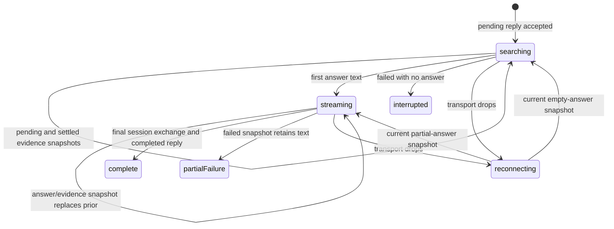

# Streamed answer and evidence

## Summary

After a question is accepted, Great Minds exposes the running [reply](../foundations/research-session-model.md) as two coordinated surfaces: a **traversing knowledge base…** evidence section and a Markdown answer that appears from durable snapshots. The evidence section shows what kind of search, filter, document read, or connection lookup occurred and lets the owner inspect settled vault passages without leaving the session. The answer replaces itself as snapshots advance, renders completed Markdown blocks stably, and becomes a durable final exchange on completion. Leaving the page stops only observation, not accepted generation.

## The simple case

The question appears at the top of its exchange. While Great Minds is finding material and no answer text exists, the evidence section is open and pulses with **traversing knowledge base…**. Pending cards pulse as searches and reads begin; settled cards become stable.

The owner can open a settled article, raw source, or connection card. A side panel shows the full document, exactly the chunk ranges Great Minds read, or the article links it explored. Search and filter badges remain descriptive rather than opening a document.

When answer text begins, the evidence section stops its active label and collapses to a summary such as **2 searches, 1 article read, 3 sources read** unless the owner chose an explicit open/closed state. The answer streams as formatted Markdown with a blinking cursor. Internal source citations open vault content; external links retain ordinary browser behavior.

At completion, the cursor disappears, evidence contains only settled cards, the answer is selectable, and follow-up and save-as-source actions appear. The session route can later replay the same final evidence and answer.

## The interaction, event by event

### Arrive

The owner arrives in this feature when [asking a question](ask-a-question.md) has created a running reply, or when a saved session reload detects an empty-answer exchange with a reply identifier. The main question field is disabled. The exchange has a quoted question, no answer or a partial answer, and a thinking block backed by the reply's current evidence snapshot.

Before any answer text, the Thinking section renders even when no cards exist. It is open by default and its trigger reads **traversing knowledge base…**. The trigger is also a disclosure control: the owner may close it while research continues or reopen it later.

A reply snapshot can contain five evidence-card kinds:

- **article**: a synthesized vault article read in full or in ranges;
- **raw**: a vault source read in full or in ranges;
- **search**: a whole-vault, one-document, or optional web search description;
- **query**: a structured metadata filter or article-list operation summarized as filters;
- **links**: outgoing/incoming article connections explored from one article.

### Leave without acting

The owner can watch without opening any evidence. Doing so does not alter the reply, evidence order, or final answer. Closing the Thinking disclosure changes only local presentation; it does not reduce what Great Minds reads or what the session stores.

Leaving before completion aborts the current browser tail and any open panel request. It does not send Stop, delete the pending exchange, or cancel the server's detached generation. Returning to the durable session route reconnects from the latest stored snapshot.

### Begin

Evidence begins with a pending source snapshot when Great Minds starts a tool call that has a user-facing descriptor. Pending cards pulse. Pending article, raw, or link cards are not clickable; search and filter cards are descriptive at every stage.

When a tool settles, its pending slot is removed, replaced, or resolved. Article and raw reads for the same path merge into one card: additional chunk ranges accumulate, and any full-document read marks the combined card full. Duplicate connection cards for the same path collapse. The server flushes every evidence transition immediately to the durable reply.

Answer display begins with the first snapshot whose answer string is nonempty. The client phase becomes streaming. Unless the owner explicitly toggled the disclosure, Thinking collapses and its trigger changes from the active phrase to a count of settled operations. Pending cards do not contribute to that summary.

### While in progress

The browser receives a complete answer string and complete evidence array with each new version. It replaces the current exchange state rather than appending raw SSE token fragments. A dropped connection can therefore resume from one snapshot without duplicated text.

For visual stability, Great Minds splits streaming Markdown at the latest blank-line boundary outside a fenced code block. Completed blocks are parsed and keyed independently; only the unfinished tail is reparsed on each snapshot. A blinking gold cursor follows the tail. This lets headings, paragraphs, lists, links, and code settle as complete blocks instead of repeatedly rebuilding the whole answer.

Text selection actions are disabled while `streaming` is true. The browser can still select text natively, but Great Minds does not open the follow-up/BTW selection popover until the reply is terminal. Footnotes and citations render from the current parsed trees and can move as the unfinished tail changes.

Settled card behavior is:

- An article or raw card toggles the side panel. Choosing the active card again closes it.
- A range-limited card loads only the chunk ranges Great Minds read and labels them `¶N` or `¶N–M` with **what the agent read**.
- A full card loads the stored document body and labels it **wiki article · full document** or **raw source · full document**.
- A links card lists **cites →** and **cited by ←** groups. Choosing a linked article updates navigation or the panel according to its path.
- **open full screen** leaves the panel for `/doc/{path}`; one exact cited chunk carries a `#^pN` block hash.

The panel shows loading skeletons while content loads and **Not found** when no panel content resolves. Its responsive overlay/docked behavior is owned by [navigation and page state](../foundations/navigation-and-page-state.md).

Answer links have universal behavior based on target:

- `wiki/…` navigates to the full vault reader;
- `raw/…` opens a source preview, preserving an exact `^pN` chunk anchor when present;
- `http://` and `https://` remain external links;
- `#…` remains an in-answer anchor.

The reply tail retries ordinary stream disconnects after increasing delays up to 10 seconds. During a disconnect the last snapshot remains visible; there is no separate reconnecting banner. An explicit HTTP error opening the tail is not retried by the tail loop.

### Finish

On completion, the server removes pending evidence, appends the final exchange to the session, and marks the reply completed. The browser receives a terminal snapshot, sets the phase to done, removes the blinking cursor, and stops the tail.

The Thinking disclosure now summarizes settled evidence. Its counts distinguish knowledge-base searches, web searches, structured filters, articles read, raw sources read, and connections explored. The owner can continue opening its cards after completion.

The answer becomes eligible for text-selection actions, [follow-up](follow-up.md), [BTW threads](btw-threads.md), and [saving as a source](save-an-answer-as-a-source.md). On the first completed exchange, a dismissible tip explains that highlighting answer text can create a follow-up or BTW thread. Dismissing it stores one browser-wide onboarding flag.

If a terminal failed snapshot contains no answer, the exchange displays **reply interrupted**, followed by the stored error when available or **ask again below**. The session phase is done, so follow-up controls appear. The pending session event remains durable.

If a terminal failed snapshot contains partial answer text, the current answer branch continues to render that text. The exchange's stored error is not displayed by that branch. This makes the partial result visually indistinguishable from a clean completion except for any indirect absence or timing of evidence.

A non-HTTP tail exception that escapes retry also marks the client exchange non-streaming and phase done. When no answer exists, the interruption message falls back to **ask again below**; the durable reply can still settle independently and appear after reload.

## Context and state variants

| Variant | At arrival | Changed while active |
| --- | --- | --- |
| Account role and access | The session owner and vault member can tail the reply and open shared evidence. Other members cannot read the private session. | Losing membership blocks reconnect and evidence fetches. Generation already accepted can continue on the server. |
| Vault state | Available indexed sources, live articles, metadata, links, and optional web-search configuration shape evidence. | Concurrent ingest/compile can change later tool results, but settled cards preserve what this reply used. |
| Target state | A running reply can have no text, partial text, pending cards, or settled cards. A terminal reply is completed or failed. | Versioned snapshots replace prior state. Completion removes pending cards; failure can retain partial text/evidence. |
| Entry context | Fresh submission and reload both tail the same durable reply. A document-origin turn can read its origin first. | Navigation away stops the client tail only. Reentry receives current state rather than event history. |
| Input and viewport | Pointer/keyboard disclosure and cards are equivalent. Wide view docks evidence; smaller view overlays it. | Selection actions remain disabled while streaming regardless of input. Resizing does not alter evidence or answer. |

## Cancel and interrupt

| Event | Before work begins | While work is in progress |
| --- | --- | --- |
| Escape, Cancel, or Stop | Before a reply is accepted, submission owns rollback. This feature has no separate start control. | There is no Stop. Escape closes an open preview or popover, not generation or the reply tail. |
| Navigation to another Great Minds page | No effect on a historical completed reply. | Destroys the observer and panel; server generation continues. The session route can reconnect later. |
| Browser Back or Forward | Reopens whichever session/document route history identifies. | Leaves the running session without cancelling. Returning reconnects if the exchange still has an empty final session answer. |
| Page reload | A terminal session replays final state. | Running empty-answer exchanges reconnect by reply id. Partial-answer pending events are not final session events, so exact partial recovery depends on the reply snapshot tail. |
| Tab or window closed | No effect on durable completed state. | Tail closes; generation and snapshot writes continue. No completion notification is sent to the closed page. |
| Network lost | Historical cached data may remain visible, but fresh panels fail. | Last snapshot remains. Tail retries when transport errors are ordinary; server provider/storage connectivity can independently make the reply fail. |
| Request failure or timeout | Evidence panel failure shows **Not found** without changing the reply. | Explicit tail HTTP error ends client streaming; durable generation failure yields a failed snapshot and sanitized message. |
| Authentication session expires | Protected historical reads require refresh. | Tail and panel calls attempt normal refresh. Failed refresh ends observation; generation does not use the browser token after acceptance. |
| The target changes in another tab | Another same-account tab can tail the reply and open the same session. | Both receive durable versions. There is no shared local disclosure/panel state. |
| The target changes through another member | Another member can change source content but cannot read the session. | Tool calls may see changed shared content. Settled evidence paths can later resolve to updated or deleted documents. |
| Browser autofill, paste, drop, or another input channel writes into the interaction | No input field is owned by the running answer. | No effect on answer/evidence. Text selection does not invoke Great Minds actions until terminal state. |
| The window loses focus | Completed answer remains. | Generation, tail, pulse animations, and panel loads continue. There is no focus pause. |

## Interactions with other systems

**Permissions and roles.** The private session owner can observe the reply; vault membership permits evidence reads. External web evidence, when enabled, is not vault content and remains a descriptive search card/link.

**Validation and error display.** Reply snapshots are schema-decoded before rendering. Malformed progress does not partially mutate the exchange. Panel errors collapse to **Not found**; reply errors are sanitized, but partial-answer failures are not visibly surfaced.

**Unsaved work and history.** Every running snapshot is durable reply state, while only pending and final exchange events belong to session history. Disclosure, active card, panel scroll, and answer selection are local.

**Optimistic changes and rollback.** Evidence and answer are snapshot-driven after acceptance. Pending cards are provisional and may disappear. A failed terminal snapshot is retained; there is no rollback to an empty exchange.

**Offline and reconnection.** No answer is generated in the browser. Durable snapshots permit reconnect without token-event replay. There is no offline evidence cache contract or background notification.

**Notifications.** The active phrase, pulsing cards, streaming cursor, interruption message, and follow-up controls communicate state in-place. Completion has no toast or audible notification.

**URL and navigation state.** Reply identity is reached through the session route but is not itself in the URL. Panel selection is local. Internal answer links route or preview according to content path.

**Multi-tab and multi-user behavior.** Same-account tabs can observe the same reply version independently. Shared document changes can make old evidence paths point to newer content; evidence records the path/range, not a frozen document snapshot.

**Accessibility and keyboard use.** Thinking is a disclosure button. Settled article/link cards become keyboard buttons with Enter/Space. Search/filter badges are noninteractive. Dynamic state lacks an explicit live region and requires verification.

**External side effects.** Generation may perform hybrid search, metadata queries, document reads, link traversal, optional web search, language-model calls, snapshot writes, session writes, and cost recording. Opening evidence performs additional read-only API calls.

## Edge cases

- Thinking renders **traversing knowledge base…** even before the first evidence card exists.
- The owner's explicit disclosure choice overrides automatic open-while-searching and collapse-on-answer behavior for the rest of that component instance.
- Pending evidence is visible but excluded from the completed summary and final session event.
- Multiple disjoint ranges from one document load in parallel and flatten into one panel; the subtitle lists every recorded range.
- A full-document read dominates range-only display for the same path even if earlier snapshots listed ranges.
- Search badges distinguish web from knowledge-base search and can show **· in {document}** for document-scoped search.
- The evidence summary says **no sources** when a completed reply settled no visible tool cards.
- The streaming parser does not treat blank lines inside fenced code as stable boundaries, preventing half-written fences from being split as completed blocks.
- Internal raw links without an exact `^pN` fragment open the full source. An unrecognized fragment is not interpreted as a chunk.
- Panel chunk headings can supply the visible title when a citation card carried no title.
- Source paths are live references. A source deleted after the answer completes makes its old card show not found rather than retaining a frozen quoted copy.
- A failed reply can have settled evidence even when it has no final answer event in session storage.

## Open questions and verification

- Post-baseline B-10 fix: Great Minds `a918301` first made failed status visible when partial prose existed. Commit `acbcb62` simplifies the treatment to one inline stopping-point row after the retained prose: **Answer interrupted. This response may be incomplete. Try again**. It removes the warning container and redundant generic server message. **Try again** starts a new durable reply from the saved failed request in the same session position; failed partial main exchanges remain ineligible for promotion. Visible main and BTW checks confirmed the compact row follows readable prose.
- Verify the visual and screen-reader behavior of full answer-string replacement, the streaming cursor, evidence disclosure text, and pulsing pending cards. No explicit live-region semantics are present.
- Verify scroll behavior on long streamed answers. The session thread has no explicit follow-to-bottom policy, so tokens may continue below the viewport without a “jump to latest” affordance.
- Verify panel error handling for forbidden, transient network, invalid range, and deleted source. They all appear to collapse to **Not found**, which can misstate a retryable failure.
- Verify footnotes and incomplete Markdown constructs across snapshot boundaries, especially tables, lists, code fences, and links whose destination arrives late.
- Evidence source paths point to current live content rather than a frozen answer-time snapshot. Decide whether historical reproducibility requires content hashes or captured excerpts in the UI.

Verified against Great Minds commit `c8c9e57`.
