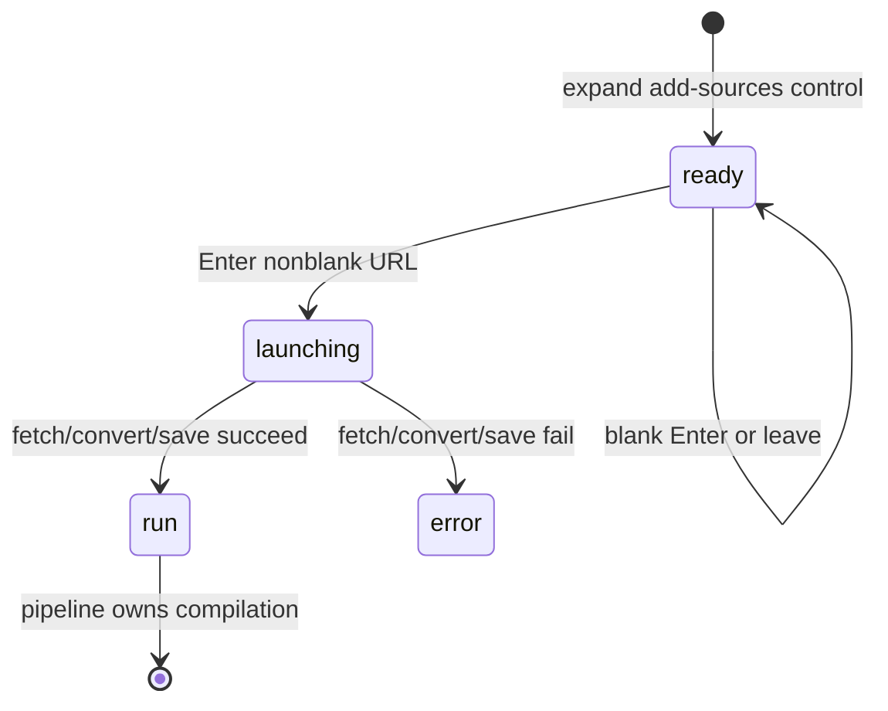

# Adding a URL

## Summary

The owner can paste a web address into the home/health ingestion control and press Enter to turn public HTML or plain text into a vault [source](../glossary.md#content-and-the-library). Great Minds creates a pipeline run before fetching, normalizes a missing scheme to HTTPS, blocks non-public network destinations, follows redirects, converts the response to Markdown, writes a deterministic `raw/docs/{path stem}.md` source, and attaches a compile intent to the run. The initiating request waits for fetch, conversion, storage, and registration before it reveals the run id, so the page shows a skeleton rather than live source-fetch progress and cannot cancel or reconnect by id during that interval.

Unlike a personal [reference](../glossary.md#content-and-the-library), URL ingest is not idempotent by normalized URL and does not preserve colliding paths. Different URLs with the same last path stem overwrite the same vault source. At the pinned commit, any vault member can call the URL-job route even though the visible ingestion control is owner-only.

## The simple case

The owner opens the dashed **+** control, pastes `https://example.org/essay` into **paste a link**, and presses Enter. The browser navigates to `/pipeline?url=…` and shows pipeline skeleton rows while one request remains open.

The server creates a durable URL run, fetches the public page, extracts its main HTML article (or accepts plain text), adds the extracted title as a Markdown heading when available, and stores `raw/docs/essay.md` with URL and host provenance. It registers the source and creates a compile intent tied to the run.

Only after those steps complete does the browser learn the run id. It replaces the launch URL with `/pipeline/runs/{id}`, clears the query parameter, and follows the compile through the ordinary pipeline. Back returns to the previous page rather than resubmitting the URL.

## The interaction, event by event

### Arrive

The URL field appears when the owner expands the same ingestion control used for [adding files](add-files.md) and no file review is active. It is an ordinary single-line text input with placeholder **paste a link**. The visible ↵ hint appears whenever the trimmed field is nonempty and its title says **Press Enter to ingest this URL**.

There is no submit button, URL input type, native pattern, scheme chooser, preview, duplicate warning, destination preview, or title field. Enter is the only explicit submission gesture. The browser trims whitespace and does nothing when the result is empty.

The control is normally available only to the active vault owner. When an active pipeline is known, choosing the collapsed circle goes to progress instead of expanding; dragging into the window can still expand the shared control. URL text is local and disappears when the control closes, files replace it, the route changes, or the page reloads.

A direct visit to `/pipeline?url={value}` also starts this task without returning to the home input. An empty `url` query value is falsy and instead makes bare pipeline resolution look for one active run.

### Leave without acting

Pressing Escape, clicking outside, switching pages, or leaving the URL blank clears the expanded control without a request. The typed address is not stored in browser storage or the home URL.

Choosing **browse** while text exists opens file selection. A resulting file/folder selection replaces the URL surface with file review; cancelling the picker leaves the URL field as it was. Dropping files likewise hides the still-local URL behind the review until the control is closed or replaced.

### Begin

Pressing Enter with nonblank trimmed text calls `/pipeline?url={encoded text}`. This is a launch route, not yet the durable run route. The pipeline component generates a random job id internally and sends the URL and id to the currently stored active vault.

The server accepts URL-job creation from any vault member, then inserts or reuses that run id with trigger `url`. It immediately marks the source-ingest phase started at **Fetching source URL** before performing the remote work. The UI does not yet know the id and therefore cannot open that run's stream.

If the text does not begin with lowercase `http://` or `https://`, Great Minds prefixes `https://`. No broader client syntax validation occurs. Uppercase/malformed schemes, spaces inside the address, and other invalid forms reach the server and fail through fetch/URL parsing.

By default, every socket connection—including redirect hops—must resolve to public-unicast addresses. Literal loopback/private/link-local addresses and DNS answers outside public unicast are refused. A private-fetch configuration exists for tests/local fixtures but is off by default.

The remote request:

- follows redirects;
- sends a desktop browser-like user agent;
- times out after 30 seconds;
- requires a successful HTTP response;
- accepts only `text/html` or `text/plain` after media-type normalization;
- reads at most 25 MiB, even when `Content-Length` is absent or inaccurate.

### While in progress

The initiating browser remains on the pipeline launch page with no job id. Its client-stage list is empty, so it shows loading skeletons. There is no **cancel** button, URL label, elapsed time, fetch stage, or progress count. The server has a durable run, but this tab cannot address it until the synchronous request returns. Another tab's active-run resolver could discover it.

For HTML, Great Minds extracts the main article, compacts excess whitespace, and prepends an H1 title when extraction found one and the Markdown did not already begin with one. Extracted author and publication date are not written into this vault source. Plain text is stored as its body without a generated title.

The source destination comes from the normalized submitted URL's pathname, not the extracted title or redirect destination:

- take the pathname's final filename stem;
- slugify it to lowercase letters/digits/hyphens;
- use `doc` when no stem remains;
- write `raw/docs/{stem}.md`.

Host, earlier path segments, query string, and fragment do not distinguish the destination. There is no suffix-on-collision logic. Storage at that path is overwritten and the existing source row is updated.

The stored frontmatter records `source_type: document`, the normalized submitted URL, and an origin host (including port when present). Although the fetch follows redirects, the current conversion/destination/provenance path continues to use the submitted normalized URL rather than the final response URL.

After conversion Great Minds regenerates numbered block anchors, writes storage, registers the source, and creates/coalesces a compile intent associated with the URL run when possible. The source-ingest progress then jumps from its started state to all URL steps completed; conversion and indexing do not emit separate intermediate snapshots on this synchronous path.

The browser request has no page-lifecycle abort controller. Navigating away destroys the visible skeleton but does not deliberately cancel the request. Its late success handler can still replace the route with the run after the owner has gone elsewhere.

### Finish

On success, the server returns the refreshed URL run with source-ingest completed. The browser invalidates the active-pipeline indicator, records the returned id, and replaces `/pipeline?url=…` with `/pipeline/runs/{id}`. This removes the launch query and makes reload/reconnect durable.

The run may be waiting for the compile reconciler or already compiling. It continues through [the vault compile](compile-the-vault.md). The saved source can appear in the library before title/author/tag enrichment or article publication.

On a remote HTTP error, blocked address, timeout, unsupported content type, oversized response, or other source failure, the server marks the already-created run failed in `source_ingest` and returns an error response. Because the browser never receives the run id, the launch page shows a resolver alert rather than that run's durable stage list. The detail is often raw response text/JSON.

The alert offers **retry** and **back to home**. **retry** requests a manual compile of sources already in the vault; it does not refetch this URL. The failed URL run remains in history, while this launch route keeps its URL query and `started` guard for the current component instance.

Reloading `/pipeline?url=…` before route replacement generates a new job id and starts a second fetch. This is true after an uncertain connection loss and while an earlier request may still be running. Successful repeats write the same deterministic destination and can create/coalesce additional run/intent state rather than reuse by URL.

## Context and state variants

| Variant | At arrival | Changed while active |
| --- | --- | --- |
| Account role and access | The visible control is owner-only, but the server URL-job operation currently accepts viewer/editor members too. Nonmembers are forbidden. | Losing membership before authorization blocks creation. Once accepted, remote work and source writes do not depend on the page remaining open. |
| Vault state | Empty, ready, or compiling vaults can receive the source. Existing destination stems may already identify unrelated URLs. | New content updates/creates a source and intent. Concurrent undispatched intents can coalesce; an existing destination is overwritten. |
| Target state | A URL can be fetchable, malformed, blocked, redirected, oversized, unsupported, or colliding. There is no exact-URL lookup first. | Remote response and redirects can change during fetch. Another tab can write the same destination before this request commits. |
| Entry context | Enter from home/health creates `/pipeline?url=…`; direct launch URL behaves the same. | Successful resolution replaces with the run route. Reload before replacement submits again with a new id. |
| Input and viewport | Keyboard Enter submits typed/pasted/autofilled text. There is no pointer submit button. | Pipeline skeleton and later stages adapt in width; viewport does not change URL normalization or target. |

## Cancel and interrupt

| Event | Before work begins | While work is in progress |
| --- | --- | --- |
| Escape, Cancel, or Stop | Escape closes/clears the expanded home control. There is no explicit URL Cancel. | Before the id returns there is no cancel. After route resolution, pipeline Cancel is cooperative and does not remove the saved source. |
| Navigation to another Great Minds page | Clears an unsubmitted URL. | Removes the skeleton but does not explicitly abort work; a late success can redirect to the run. |
| Browser Back or Forward | Leaves/returns to local home state before submission. | Back leaves `/pipeline?url`; accepted server work can finish. Forward/reentry with the launch query can submit a fresh run. |
| Page reload | Clears an unsubmitted home value. | Reloading the unresolved launch URL starts another URL job. Reloading the resolved run reconnects safely. |
| Tab or window closed | No request occurs before Enter. | Browser loses outcome; server request/run may finish. A later library/run list reveals durable effects, but no URL-specific notice appears. |
| Network lost | No effect before submit. | Browser shows a fetch/resolver error or remains uncertain; server can still save. Reload/resubmit is not exact-URL-idempotent. |
| Request failure or timeout | No effect before submit. | Run is marked failed when the server observes the source failure. Browser lacks its id and offers a misleading compile-only **retry**. |
| Authentication session expires | Submission uses normal refresh once. | Failed refresh can clear active-vault state while the initial server request may already own a run. |
| The target changes in another tab | Another tab can ingest the same or a colliding URL. No duplicate preview is shown. | Last storage write at the deterministic path wins. Tabs do not synchronize launch/run state. |
| The target changes through another member | A shared member can mutate the same destination through this overly broad route or other source work. | Source upsert/overwrite occurs without a conflict prompt. Later compile sees whichever body is current. |
| Browser autofill, paste, drop, or another input channel writes into the interaction | Paste/autofill writes the normal text field. File drop switches to file review rather than submitting the URL. | The home field is gone after navigation; no edits apply to the running request. |
| The window loses focus | Typed URL remains while mounted. | Fetch/conversion/storage continue. There is no out-of-focus completion notification. |

## Interactions with other systems

**Permissions and roles.** Owner-only presentation conflicts with member-wide server authorization. URL ingest directly mutates shared vault source content and therefore needs an explicit role decision.

**Validation and error display.** Only blank trimming occurs in the browser. Server normalization, public-network policy, HTTP status, content type, timeout, body cap, conversion, path derivation, and storage determine acceptance. The unresolved launch displays raw request error text.

**Unsaved work and history.** Home URL text is unsaved. The server creates a durable run before remote work, but the initiating route does not know its id until all source work succeeds. Source and failed-run history survive UI loss.

**Optimistic changes and rollback.** No library row is optimistic. A source write is not rolled back if a later compile fails. A failed fetch leaves a failed run but no source/intent for that run.

**Offline and reconnection.** There is no offline queue. The launch is not reconnectable by id; only successful route replacement establishes normal SSE reconnection.

**Notifications.** Skeleton, resolver alert, pipeline stages, and terminal completion are the feedback. There is no URL-fetch progress or background completion notification in the initiating tab.

**URL and navigation state.** The submitted address temporarily lives in the `url` query parameter, including potentially sensitive query/fragment data. Success replaces it with the stable run route; unresolved reload replays submission.

**Multi-tab and multi-user behavior.** URL/destination checks are not locks or dedupe keys. Shared writes can race, and member-wide authorization expands the race beyond owners.

**Accessibility and keyboard use.** The field itself is keyboard usable, but there is no labeled submit button; the decorative ↵ hint is the only submission affordance. Skeleton and late status changes need screen-reader verification.

**External side effects.** URL ingest creates a run, makes public HTTP requests, parses remote content, writes vault storage/metadata, creates/coalesces a compile intent, and triggers later model/embedding calls. Repeat launches repeat the fetch.

## Edge cases

- `example.org/a` becomes `https://example.org/a`; an uppercase `HTTP://…` does not match normalization and receives an extra `https://` prefix.
- Root URLs and trailing paths without a useful stem become `raw/docs/doc.md`, causing broad collision risk across hosts.
- `https://one.example/posts/article` and `https://two.example/other/article?version=2` both target `raw/docs/article.md`.
- Query strings/fragments are stored in URL provenance but do not distinguish destination paths. Fragments are not part of the network request body target.
- Redirects are checked at each socket, but stored URL/origin and relative-link conversion use the submitted normalized address, not necessarily the final destination.
- HTML title, author, and publication date can be extracted; only the title is reflected indirectly as a body H1. Author/date are discarded on this path.
- Plain text saves without a title. PDF and every other binary media type are rejected rather than routed through file conversion.
- All source-ingest failures are currently recorded against the **Fetching source URL** step, even when conversion, storage, or registration failed later.
- A successful repeat refetches and overwrites; there is no “already in vault” response by URL.
- A reload during the synchronous start can leave two durable URL runs associated with one eventual source path.
- If exactly one active job exists, another tab can open bare `/pipeline` and discover/cancel the hidden run while the initiating tab still shows skeletons.
- The server can create the run even when a later response is 400, so an error in the launching tab is not evidence that nothing durable happened.

## Open questions and verification

- Great Minds commit `ed55674` resolves B-12 through a persisted URL-operation outbox and `UrlIngest` workflow. Acceptance returns the pending run immediately; the browser replaces `?url=` with `/pipeline/runs/{id}` while fetch is still active. URL-stage failures offer **retry URL**, which creates a new run from the previous operation's persisted canonical URL; later compile-stage failures still retry compile.
- Post-baseline role decision: direct URL ingest is owner-only; editors contribute through proposal flows and viewers are read-only. Great Minds commit `45ac124` enforces the owner boundary in both server and launch UI.
- Great Minds commit `b588057` resolves path collisions by making source ID the document identity, canonical URL the URL-ingest idempotency key, and path a derived storage location. Post-fix hand verification retained same-stem alpha and beta sources independently and refreshed repeats in place.
- A visible 10-second fixture confirmed immediate canonical navigation and active Uploading observation before fetch completion. Reload retained the same run. Integration tests additionally hold the remote response while asserting the persisted run/outbox and recover an accepted-but-undispatched row through reconciliation.
- Verify visible handling for malformed URLs, private redirects, timeout, 25 MiB overflow, HTML conversion failure, and storage failure. They may all be mislabeled as fetch-stage failures.
- Decide whether final redirect URL, extracted author/date, and original submitted URL should all be preserved distinctly.
- Verify that putting the full source URL in browser history/query is acceptable when it contains tokens or sensitive query parameters.
- Add a visible pointer submit action and live status semantics for keyboard/screen-reader clarity.

Verified against Great Minds commit `c8c9e57`.
