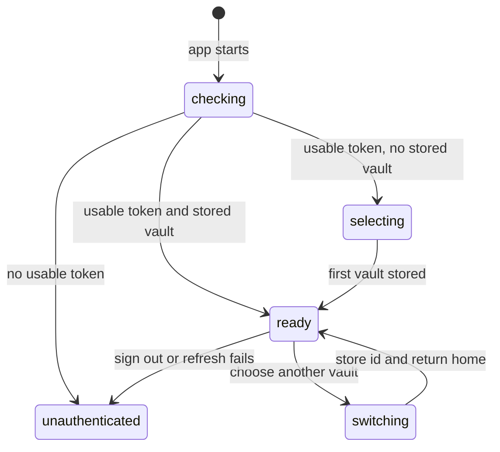

# Access and vault context

## Summary

Access and vault context determine whose private state the browser uses, which [vault](../glossary.md#the-surface) every vault-scoped request addresses, and which actions are available there. The scoped experience begins after sign-in with one account and one [active vault](../glossary.md#the-surface). Great Minds keeps authentication tokens and the active-vault identifier in browser storage, reflects changes across tabs, and enforces membership again on the server for every protected operation. The default user in these documents is the vault [owner](../glossary.md#the-surface).

## The simple case

On page startup, Great Minds reads the browser's access and refresh tokens. If either token is still valid, authenticated routes become visible. It also reads the stored active-vault identifier. If no identifier is stored, Great Minds lists the account's vaults and chooses the first returned vault, which is the newest membership in the current implementation.

The home page loads the account's vault list and finds the active vault in it. The vault name and content counts identify the current context. Every query, session, source, article, job, compile, and health request uses that vault identifier in its URL.

An owner with several vaults can open the switcher, choose another vault, and return to home. The new identifier is stored before navigation. Vault-keyed queries then load the chosen vault's content. Personal [references](../glossary.md#content-and-the-library) remain unchanged because they belong to the account rather than any vault.

Server-side access does not trust the stored identifier. A vault read requires membership. Owner-only and editor-or-owner operations perform a stronger role check. A stale or forged identifier therefore produces a forbidden response rather than exposing another vault.

## The interaction, event by event

### Arrive

The root layout initializes authentication, theme, and active-vault selection in the browser. Authenticated child routes render only after this initialization says the account has a usable access or refresh token. Public sign-in routes perform the inverse redirect for a signed-in account. The public share route is the exception: it remains visible with or without an authenticated account and is outside this description's main surface.

The browser derives the current account identifier from the access token's subject. It does not fetch a separate “current user” profile for the scoped surface. It stores three independent values: access token, refresh token, and active-vault identifier.

A normal sign-in also ensures the account has at least one vault before returning tokens. The browser then lists vaults and stores the first one. The home container has a fallback redirect to `/vaults/new` if an authenticated account nevertheless has no memberships, but first-vault onboarding is outside this description.

### Leave without acting

Closing the vault switcher without choosing an item leaves the active identifier unchanged and records nothing. Choosing the already-active vault only closes the switcher. It does not refetch, navigate, or emit a second selection change.

Leaving an authenticated page does not sign the account out. The access and refresh tokens, active-vault identifier, and query cache remain until a later action changes them, the tokens fail, or the user chooses **sign out**.

### Begin

Choosing a different vault writes its identifier to browser storage and dispatches an application-wide change event. The active-vault state updates immediately. The switcher asks the router to go to home, so a selection made from another page exits that page rather than trying to reinterpret its path in the new vault.

On a request, the browser reads the active identifier at call time and builds `/vaults/{id}/…`. It sends the access token as a bearer credential. This means the selected vault is not captured permanently at application startup: subsequent requests see a switch.

If an API request returns unauthorized, the browser serializes refresh attempts so concurrent failures share one token-refresh request. A successful refresh rotates the refresh token, stores a new token pair, and retries the original request once. A failed refresh clears all three stored values.

### While in progress

The app does not expose a global “switching vault” progress screen. Components that key their data by the active vault move into their own loading state as the identifier changes. The vault list itself remains account-scoped and can be reused.

The switcher is visible on the idle home screen. Once a research session is active, the home header replaces the idle controls and the vault switcher is no longer offered there. This prevents a visible mid-reply vault switch from the primary session surface, although another tab can still change browser storage.

A storage event from another tab updates authentication and active-vault state. The current tab does not receive server-pushed content invalidations merely because another member or tab changed data inside the same vault; those appear on the next query refetch, route transition, explicit invalidation, or failed mutation.

### Finish

A successful switch leaves the user on home with the chosen vault's name, counts, health badge, recent sessions, query scope, and owner-only ingest affordance. The previous vault remains a membership and can be selected again.

Choosing **sign out** clears the query cache, access token, refresh token, and active-vault identifier. The authenticated layout then routes to `/login`. Signing out does not cancel already-accepted ingest, compile, or reply work on the server.

If the stored vault is missing, deleted, or no longer accessible, the server rejects vault-scoped requests. There is no universal client recovery that automatically selects the next valid membership and retries. Individual pages show their own loading or error state, and the user may need to switch vaults or sign in again.

## Context and state variants

| Variant | At arrival | Changed while active |
| --- | --- | --- |
| Account role and access | The default is an owner membership. A member can read shared vault content; editor-or-owner and owner-only actions add stronger checks. A nonmember cannot use the vault identifier. | A role or membership change is authoritative on the next server request. The current UI may remain visible until a refetch or failure exposes the change. |
| Vault state | Empty and populated vaults establish context identically. Existing background work appears through vault-keyed job queries after selection. | Starting or finishing work does not change the active identifier. Deleting the vault or removing membership makes it stale. |
| Target state | A stored identifier matching a returned membership is ready. A missing stored identifier causes default selection; a stale identifier is not proactively repaired. | Selecting a different valid target stores it immediately. Concurrent deletion produces forbidden or not-found behavior on later requests. |
| Entry context | Direct authenticated routes initialize the same account and vault state as home. The switcher intentionally returns to home after a change. | Changing the vault while on another route discards that route's local state. A same-tab direct navigation without a switch keeps the current vault. |
| Input and viewport | Pointer and keyboard activation of the switcher produce the same stored identifier. On an empty membership list the control becomes **new vault** instead. | Input method has no effect on access checks. A storage change in another tab acts as an alternate input channel and updates this tab's selection. |

## Cancel and interrupt

| Event | Before work begins | While work is in progress |
| --- | --- | --- |
| Escape, Cancel, or Stop | Escape closes the open switcher through its popover behavior and leaves the selection unchanged. There is no global access Cancel or Stop. | Escape does not reverse an identifier already stored. Accepted server work is independent of signing out or switching. |
| Navigation to another Great Minds page | Authentication and active-vault state persist; the destination uses the same context. | Navigating before choosing closes the switcher. Navigation after storing a choice uses the new context. |
| Browser Back or Forward | History navigation restores the route but not an older active-vault identifier; vault selection lives outside the URL. | Back cannot undo a switch. The restored page reads the currently stored vault and may show different content than it did when first visited. |
| Page reload | Tokens and active-vault identifier are reread from storage. A valid context returns after initialization. | Local loading and menus reset. Durable server work continues and is rediscovered by vault-keyed queries. |
| Tab or window closed | Stored context remains for the next visit unless the user signed out. | Closing does not revoke credentials or stop server work. |
| Network lost | Local token and vault checks still complete, but required vault lists and page queries cannot load. | A switch can be stored locally even if the destination cannot load. The app has no offline membership cache guarantee or retry queue. |
| Request failure or timeout | A failed default-vault list can leave authentication tokens stored without a selected vault. | Individual requests surface their own errors. The global context does not roll back a recently stored vault selection. |
| Authentication session expires | A valid refresh token still counts as authenticated during initialization. | One serialized refresh and one retry occur. If refresh fails, all credentials and the vault identifier are cleared and authenticated content disappears. |
| The target changes in another tab | Browser storage changes update this tab's active identifier. Content queries then follow the new key as they rerender. | Another-tab membership or vault deletion is not broadcast through local storage unless that tab also changes selection; the next API interaction exposes it. |
| The target changes through another member | Membership and role are checked from durable server state, not the browser's cached vault list. | Removal or demotion takes effect on the next protected operation. There is no universal live banner announcing it. |
| Browser autofill, paste, drop, or another input channel writes into the interaction | These inputs do not alter vault context. A cross-tab storage event can. | No effect on an already chosen context unless browser storage itself changes. |
| The window loses focus | Open transient menus may close according to normal popover focus behavior; context is unchanged. | Server requests and durable work continue. Returning to focus does not itself refetch every vault query. |

## Interactions with other systems

**Permissions and roles.** The server recognizes owner, editor, and viewer memberships. Reads generally require membership, owner mutations require ownership, and contribution paths may accept editors. The owner surface sometimes hides controls in addition to the server check; hiding is not the security boundary.

**Validation and error display.** The browser only checks that an identifier exists before constructing many requests. UUID shape and membership are server concerns. A stale identifier therefore appears as a page or mutation error rather than a client-side selection warning.

**Unsaved work and history.** Switching vaults can discard page-local drafts, filters, selections, and open panels without an unsaved-changes prompt. Durable records already accepted remain in their original vault.

**Optimistic changes and rollback.** Vault selection is optimistic local state: it is stored before the new vault is proven loadable. There is no automatic rollback to the prior identifier when the destination fails.

**Offline and reconnection.** Authentication and selection survive offline in storage, but membership and content are not guaranteed offline. Reconnection relies on normal query retries or user navigation rather than a global resynchronization pass.

**Notifications.** A switch is communicated by changed content and vault name, not a toast. Role removal, stale selection, and refresh failure have no dedicated notification beyond page errors or redirect.

**URL and navigation state.** The active vault is deliberately absent from user-facing routes and query strings. The same `/library`, `/health`, or `/sessions/{id}` URL can resolve against different vaults on the same browser profile.

**Multi-tab and multi-user behavior.** Token and vault-selection storage changes synchronize across same-origin tabs. Vault content and membership changes do not have a universal real-time client channel.

**Accessibility and keyboard use.** The switcher trigger is named **switch vault**, the active item has a check mark, and menu choices are keyboard-operable controls. The visible name on idle home also links to the library, but it is not the switch control.

**External side effects.** Establishing context reads account memberships. Switching itself writes only browser storage and performs page reads; it does not mutate the vault or notify other members.

## Edge cases

- An expired access token with a still-valid refresh token keeps the app authenticated. The first API request performs rotation and retry.
- Concurrent unauthorized requests share one refresh operation, avoiding multiple uses of a refresh token that is rotated on success.
- A refresh failure clears the active-vault identifier as well as credentials, so the next successful sign-in must select a default again.
- The default vault is the first item in a newest-first membership list, not necessarily the last vault the user used on another device.
- Browser Back does not restore a former vault because selection is not route state.
- A direct session or document URL is not globally unique in the UI: it is interpreted inside the active vault, and the same identifier or path in another vault can fail or refer to different content.
- Personal references and account-level settings do not change when the active vault changes.
- If the active identifier is valid storage but absent from the fetched vault list, the home page cannot derive a current-vault object even though lower-level requests may still try that identifier.
- Server login normally creates a default vault before returning tokens. The web fallback for zero vaults remains for deleted, imported, or otherwise unusual account states.

## Open questions and verification

- Verify keyboard focus and screen-reader announcement when the active vault changes and the home content reloads.
- Verify the user-visible recovery path for a stored vault deleted from another tab or after membership removal; no global fallback is apparent in the client state.
- Signing in can store valid tokens and then report **Signed in, but failed to load your workspace** if the subsequent vault list fails. Verify whether this leaves the next visit unexpectedly authenticated; it may be worth treating as a bug in success-boundary copy and recovery.
- Manual compile/cancel endpoints accept any vault member, and Health's **update now** is likewise not role-gated, while source-ingest controls remain owner-only. Confirm whether viewer/editor-triggered provider work and cancellation are intentional.
- Verify whether a storage-driven vault switch in another tab should force the current tab home. Today it changes context in place, which can make a document or session route fail under the new vault.

Verified against Great Minds commit `c8c9e57`.
