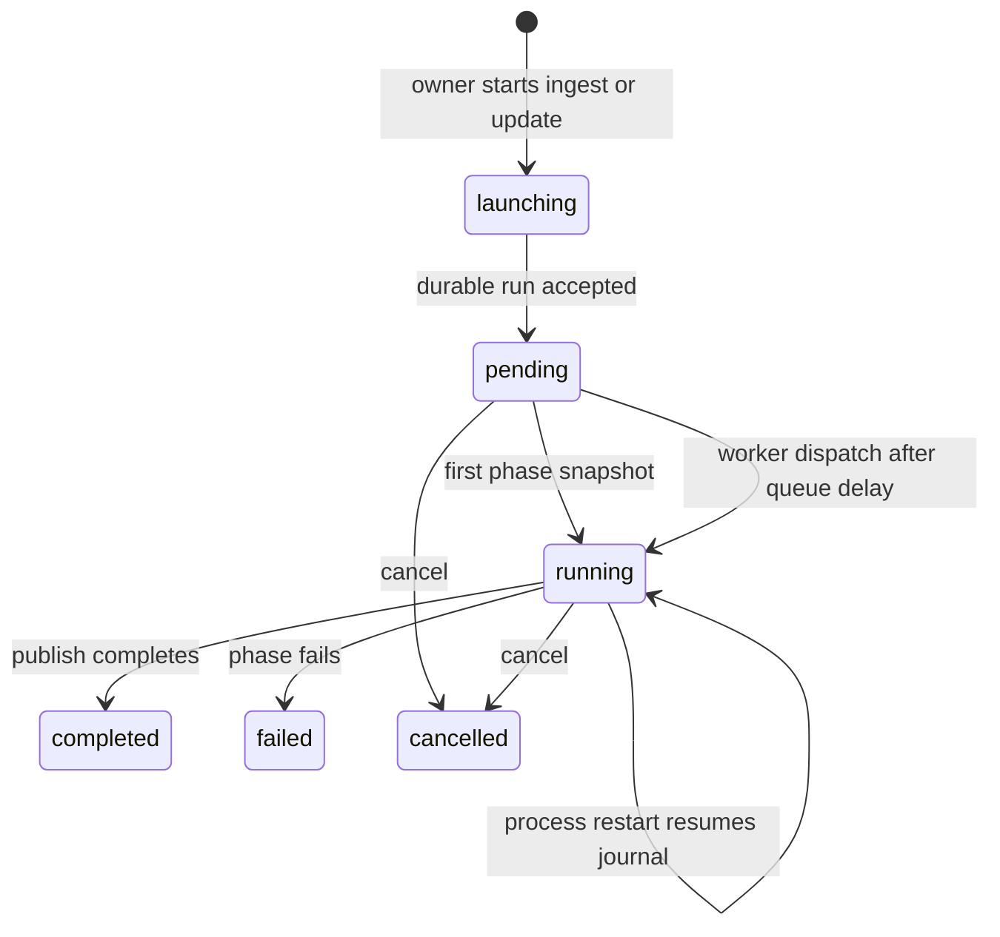

# Background work and progress

## Summary

Great Minds uses durable [pipeline runs](../glossary.md#background-work) for source ingest and vault compilation. A run is the user's stable handle for work that can outlive a request or page: it records why it began, whether it is pending, running, completed, failed, or cancelled, the current phase, ordered progress steps, error and timestamps, and a stream URL. The canonical page is `/pipeline/runs/{id}`. The browser tails replaceable snapshots, while the server's workflow journal resumes completed activity boundaries after a process restart.

## The simple case

The owner starts work from home or health. Great Minds creates or reuses a client-identified run and navigates to its pipeline page. The page shows eight user-facing stages—Uploading, Indexing, Reading, Synthesizing, Connecting, Writing, Checking, and Publishing—and expands each stage into the server's current named steps.

The run starts pending, becomes running when progress is written, and updates the same durable record throughout ingest and compile. The browser receives a snapshot whenever that record changes. Earlier stages become complete as a later phase begins; the current step supplies its detail and numeric progress when available.

When publishing completes, the run becomes completed. The page waits 300 ms before showing **Knowledge base updated**, then reports either **Already up to date — nothing changed** or the number and titles of articles written by that run. A failed or cancelled run remains reopenable at the same URL with retry and home actions, although [queued terminal runs with no phase can currently be misclassified as successful](../sources/compile-the-vault.md#edge-cases).

## The interaction, event by event

### Arrive

A run can arrive from three triggers:

- `staged_files`: direct-to-staging file uploads followed by durable file processing and compile;
- `url`: a remote URL fetch and source conversion tied to the same run before compile;
- `manual`: an explicit vault update or compile request against already stored sources.

The browser normally mints the run identifier before submission. Repeating a request with the same identifier returns the existing run. A second compile request made while the same vault still has one undispatched compile intent is coalesced onto the first run, so the caller may receive a different identifier from the one it proposed.

`/pipeline/runs/{id}` begins by connecting to that exact run. Bare `/pipeline` is a launch resolver: it can consume in-memory upload state, a `url` query parameter, or the single active run returned by the server. It replaces itself with the canonical run route once the identifier is known.

### Leave without acting

Opening and leaving a historical run performs no mutation. Bare `/pipeline` with no launch state and no single active run shows **No active job** and offers **back to home**. It does not create a placeholder run.

Before a file transfer or URL submission has reached its server boundary, leaving can discard the launch state. Once a run record exists, closing the page does not stop it. Merely opening an active run also does not restart, duplicate, or claim it.

### Begin

A manual compile inserts a pending run and a compile intent in one database transaction. The reconciler checks for undispatched intents immediately at server startup and every five seconds thereafter. It dispatches only when the vault has no active compile task and observes the configured global concurrency, which defaults to one.

A staged-file path separates browser transfer from durable processing. Before the run is available, the page can show a client-only Uploading stage. Direct-to-staging PUTs run with concurrency four. Once at least one file uploaded successfully, Great Minds submits the manifest with the stable run identifier, stores a `staged_file_ingest` task, and starts its durable workflow.

A local/direct file path uploads and indexes each file through ordinary API requests before requesting a compile. That pre-run transfer depends on navigation state and the live page; the compile becomes durable only when its run is accepted.

A URL run is created before source progress is written. The source fetch, conversion, storage, source registration, and compile-intent attachment occur on the request path. The `source_ingest` snapshot labels that handoff **Indexing source document**, while full search-chunk rebuilding occurs in the compile's later Indexing phase. The HTTP response can therefore take as long as URL ingest even though the durable run already exists.

### While in progress

The backend phases map to the visible stages as follows:

| Backend phase | Visible stage | Current step labels |
| --- | --- | --- |
| `source_ingest` | Uploading | Preparing uploaded sources; Reading uploaded files; Indexing documents—or Fetching source URL; Converting source document; Indexing source document |
| `ingest` | Indexing | Indexing for search |
| `extract` | Reading | Extracting source cards; Embedding ideas |
| `abstract` | Synthesizing | Grouping ideas; Synthesizing topics; Merging similar topics; Organizing topics; Finalizing topics |
| `derive` | Connecting | Connecting related topics |
| `render` | Writing | Planning articles; Writing articles; Indexing articles |
| `verify` | Checking | Checking references |
| `publish` | Publishing | Publishing wiki; Finalizing |

Each progress step has a stable key, label, pending/running/completed/failed state, optional done and total, and detail. The current phase's status—not merely `done === total`—owns whether the phase is complete. This matters because an extraction count can reach its document total before embedding and persistence have finished.

The run stream begins with a connected event, then sends a complete current-state snapshot whenever the durable row changes. The server checks at 100 ms intervals and sends a heartbeat about every 30 seconds. The browser reconnects network failures after 1, 2, 4, 8, then at most 10 seconds. Reopening a terminal run receives its terminal snapshot first and closes immediately.

The visible stage adapter marks all stages before the current phase complete, renders the active step's numeric progress when meaningful, and leaves later stages pending. Malformed progress messages are ignored. A non-success HTTP response when opening the stream is terminal for the page and shown as an error instead of retried as a transport drop.

> Technical note: Compile and staged-file ingest are durable workflows whose completed activities are journaled in the database. Restarting the process can resume at an incomplete activity without replaying completed side effects. A reconciler marks an old run failed only when no pending intent or matching workflow journal proves that work remains recoverable.

### Finish

Publishing completion is the normal success boundary. It sets the run to completed and records `completed_at`. If there are no validated topics, compile can finish early through a completed publish step and still be a successful run.

A phase failure sets the run and current phase to failed, preserves the most recent step snapshot, records a formatted error, and prevents later active-only updates from overwriting the terminal state. The page names the failed stage when it can, shows the stored error, and offers **retry** and **back to home**. Retry creates or coalesces a new manual compile run; it does not change the failed record.

Cancellation changes a pending or running run to cancelled, records **Update cancelled**, and interrupts the active compile or staged-ingest workflow. Repeated cancellation and cancellation of a missing or terminal run return success without changing terminal history. The page shows **Update cancelled**, **run again**, and **back to home**.

Cancellation is cooperative around ongoing activities. Great Minds marks the durable run cancelled first, interrupts the workflow, and guards the next activity/side-effect boundary against a cancelled run. The UI should not promise that bytes already uploaded, model calls already made, or a currently executing external operation are physically reversed.

After success, the page loads live articles whose render-run identifier matches this run. It shows their count and links. **browse the library** and **back to home** are explicit next steps; completion does not navigate automatically.

## Context and state variants

| Variant | At arrival | Changed while active |
| --- | --- | --- |
| Account role and access | The scoped owner can start ingest and sees the controls. Members can read run history; current compile and cancel endpoints enforce membership rather than ownership. | Losing membership blocks stream reconnect and run reads. The workflow itself continues from durable server state. |
| Vault state | A vault can have no active run, one queued/running run, or terminal history. Pending compile intents for the same vault can coalesce. | New source ingest can attach compile intent to its run. Concurrent requests do not guarantee a new independent run. |
| Target state | An explicit valid run reopens at any status. Bare `/pipeline` resolves only exactly one active run. | Terminal states are stable: progress and cancellation updates only modify pending/running records. |
| Entry context | File selection can carry non-URL navigation state; URL ingest uses `?url=`; update links and retry request manual compile; direct run links only observe. | Launch shims replace themselves with the canonical route. Leaving does not cancel accepted work. |
| Input and viewport | Pointer and keyboard activation produce the same run. File picker/drop differ before the durable boundary. | Viewport changes stage layout only. Client upload state disappears on reload; durable run state does not. |

## Cancel and interrupt

| Event | Before work begins | While work is in progress |
| --- | --- | --- |
| Escape, Cancel, or Stop | Escape has no pipeline-page navigation behavior. Before acceptance, cancelling a file review belongs to the upload feature. | The visible **cancel** control requests durable cancellation while the page considers the run active. Escape alone does not. |
| Navigation to another Great Minds page | Launch-only upload state can be lost before a run exists. A historical run is unchanged. | The SSE connection closes with the page; workflow continues. The active-job query can rediscover it later. |
| Browser Back or Forward | Back can abandon a launch shim before acceptance. Canonical run history reopens normally. | Leaving stops only observation. Because launch shims are replaced, Back does not resubmit the same URL/upload launch. |
| Page reload | Non-durable client transfer state is lost. A canonical run reconnects from its current snapshot. | Durable ingest/compile continues; reload receives current state rather than replaying every old update. |
| Tab or window closed | No effect on a saved run. A pre-run direct upload may stop. | Durable work and reconciliation continue. No background browser notification announces terminal status. |
| Network lost | A run request or pre-run upload can fail before acceptance. | The progress tail retries with bounded exponential delay. The server workflow continues if its dependencies remain available. |
| Request failure or timeout | The launch page shows a resolve error and no canonical navigation when acceptance fails. | Stream HTTP errors become page errors; transport disconnects retry. Workflow failures become durable failed snapshots. |
| Authentication session expires | No protected launch succeeds without refresh. | Stream reconnect performs normal token refresh. Failed refresh ends observation but does not cancel the workflow. |
| The target changes in another tab | Another tab can open, cancel, or retry the same run. | Terminal update wins because later progress writes are guarded to active states. Both tabs eventually observe the same snapshot. |
| The target changes through another member | Another member can currently read and call compile/cancel endpoints if still a vault member. | A member cancellation marks the shared run cancelled for everyone. Confirm whether that access is intentional. |
| Browser autofill, paste, drop, or another input channel writes into the interaction | Paste can supply a URL; drop/file picker supplies file launch state. Both use their feature's validation before the run. | Inputs cannot alter the manifest or URL of an accepted run. A new task requires another run request. |
| The window loses focus | Launch forms and progress remain. | Transfers, tailing, durable workflows, and timers continue. No pause or automatic refetch is tied only to focus. |

## Interactions with other systems

**Permissions and roles.** Owner-only controls protect file ingest in the scoped UI and server ingest service. Health's update action plus run list/get/stream, compile request, URL ingest, and cancellation require only membership, creating a wider boundary that needs a product decision.

**Validation and error display.** Client identifiers and manifests are schema-checked. URL/file conversion and provider failures become stored phase errors. The pipeline page preserves and names the last failed stage where possible.

**Unsaved work and history.** Pre-run file-transfer state can be ephemeral. Once accepted, the run is durable history with immutable terminal status. There is no user-facing deletion of run history.

**Optimistic changes and rollback.** The pipeline page can show client upload progress before a server run exists. Durable stage state is snapshot-driven, not optimistically advanced. Cancellation does not roll back completed external effects.

**Offline and reconnection.** Launch cannot queue offline. Observation reconnects from durable state. Workflow resume handles process failure at journaled boundaries, subject to required database, storage, and provider availability.

**Notifications.** Progress, terminal banners, and result links exist only on the pipeline page and active-job affordances. There is no toast, email, or OS notification after the user leaves.

**URL and navigation state.** `/pipeline/runs/{id}` is canonical and reloadable. `?url=` and browser history state are one-time launch inputs. Bare `/pipeline` is a resolver, not durable identity.

**Multi-tab and multi-user behavior.** Multiple observers can tail one run. Requests can coalesce before dispatch. Terminal state guards converge concurrent cancellation/progress writes, but no client lock prevents redundant actions.

**Accessibility and keyboard use.** Stages are rendered as ordered rows with labels, status, detail, and numeric values. Active-stage auto-scroll uses smooth movement; reduced-motion and live progress announcement require verification.

**External side effects.** Runs can upload to storage, fetch URLs, convert files, update search indexes, call embedding and language providers, write articles, publish storage snapshots, and record costs. Retry caches can make a repeat cheaper without changing its user-visible phase contract.

## Edge cases

- A second compile request while an undispatched intent exists receives the first run identifier; the caller's proposed run record is removed.
- A repeated request with the same run identifier is idempotent only within its intended vault. Run identifiers are global database keys even though reads are vault-scoped.
- Direct local file upload has a weaker reload boundary than staged upload: source files/registry rows may be saved before the durable compile run exists; search-chunk indexing still belongs to compile.
- Staged upload proceeds when at least one file succeeded. Failed transfers are carried in client progress; the durable manifest contains only successful files.
- The staged workflow processes files in batches of 50, isolates conversion failures, and can still compile successfully ingested files while reporting failed counts at the ingest boundary.
- A run can complete with zero newly written articles because content-addressed caches and unchanged topics make the vault already current.
- A later phase can be visible even if polling never observed a fast earlier phase; current snapshots, not an event-history replay, are the contract.
- Numeric progress can be absent. The UI uses a unit denominator and step label rather than inventing a percentage.
- A malformed progress frame is silently ignored. A later valid snapshot can recover the display because each frame is complete current state.
- Terminal reconnect sends one snapshot and closes; no special replay request is needed.
- Cancellation of a missing run returns success, avoiding disclosure and making repeat clicks harmless.
- Zombie recovery waits 120 seconds and exempts runs with a live pending intent or matching workflow journal; a stale run without either becomes failed with a restart-interruption message.

## Open questions and verification

- Verify cancellation latency in every phase and whether the page should change immediately on click; the cancel button has no local pending label or disabled state before the terminal snapshot arrives.
- Verify stage updates with screen readers and reduced-motion preferences. Active stages auto-scroll smoothly and dynamic rows have no explicit live-region policy.
- Post-baseline role decision: Health update, direct URL/reference ingest, compile, and cancellation are owner-only; editors use proposal flows and viewers are read-only. Great Minds commit `45ac124` applies that policy.
- Bare `/pipeline` shows **No active job** when the active list contains more than one run as well as when it contains none. Verify the intended recovery for unexpected concurrency.
- URL ingest performs remote fetch and indexing before the launch request returns, even though the run exists. Verify what the user sees if the browser request times out while the run continues and becomes discoverable later.
- Great Minds commit `8ccfc5c` makes partial staged failures terminal and explicit: any PUT failure stops before durable processing with a named list, while any read/conversion failure durably fails source ingest with per-file detail and no compile intent. A visible R2-backed recheck remains outstanding.
- Great Minds commit `663522e` routes local-filesystem and R2 file transfers through the same durable `staged_file_ingest` run and workflow; deployment changes only the temporary-storage transport. A visible local CSV run completed Uploading through preparation, reading, and indexing under one stable run URL and left no staged file. R2 transport remains source/test verified rather than visibly rechecked.
- Follow-up commit `1ab6017` replaces the text-only/provider-specific storage seam with one byte-oriented local/R2 object store and separates upload-target issuance from staged-object processing. Local abandoned-object cleanup now runs at startup and hourly rather than on the owner's upload request. A visible local Markdown run still completed under one stable URL and cleaned staging.
- Commit `ccf1b7d` moves the durable boundary ahead of byte transfer: one batch row shares identity with the pipeline run, per-file rows preserve receipt and terminal state, and committed batches act as a durable dispatch outbox. Each file also preserves its creation-time compile decision, so an activity retry does not mistake a source written just before a crash for a pre-existing duplicate and omit compile. Uploading batches are exempt from generic zombie recovery, expire through a batch-aware reaper, and use storage lifecycle cleanup only as a backstop. A visibly failed transfer and full page reload retained one canonical run, then exact-byte reselection resumed and completed it.

Verified against Great Minds commit `c8c9e57`.
