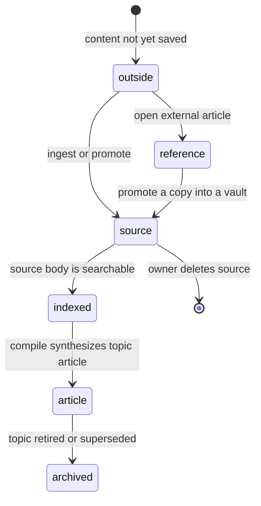

# The content model

## Summary

Great Minds presents three durable kinds of readable content: vault [sources](../glossary.md#content-and-the-library), vault [articles](../glossary.md#content-and-the-library), and personal [references](../glossary.md#content-and-the-library). A source preserves material the owner added. A compile interprets sources into topic-centered articles and links. A reference is a saved external reading copy that remains outside every vault until promoted. These distinctions control scope, search, metadata, permissions, health, paths, and what later research can use as evidence.

## The simple case

The owner adds source material to the active vault. Great Minds stores a Markdown body and a source registry row, divides the body into searchable chunks, and shows the source in the library. Some metadata can arrive with the source; title, summary, author, date, genre, tags, and other derived fields may be absent until a compile enriches it.

A compile extracts ideas from the vault's sources, groups them into topics, and writes one live article for each rendered topic. Articles appear separately in the library with a title and précis. The owner can read both sources and articles through the same full-page vault reader, while their headers and available actions differ by kind.

Separately, the owner can open an external article into the personal reading room. Its saved reference has a title, URL, origin host, author, and publication date when extraction finds them. It is not searchable by vault questions and does not influence articles until the owner promotes it into the active vault.

## The interaction, event by event

### Arrive

The [library](../glossary.md#content-and-the-library) is the primary inventory. Its **All** view combines live articles and sources from the active vault. **Articles** narrows to live articles. A source-type filter narrows to matching sources. **Reading room** replaces vault rows with the signed-in account's references.

Every readable item has a stable scope and path:

- live and archived topic articles use a vault path under `wiki/` ending in `.md`;
- sources use a vault path under `raw/` with at least one category segment and a `.md` suffix;
- personal references use an account path under `refs/` ending in `.md`.

The full reader route uses `/doc/{path}` for vault content and `/refs/{path}` for personal content. The path is interpreted inside the [active vault](access-and-vault-context.md) for `/doc/`; a reference path is interpreted inside the signed-in account for `/refs/`.

### Leave without acting

Browsing, filtering, opening a preview panel, or leaving the library without a mutation does not change the content records. The owner's search and filter choices affect which rows are requested but not the source, article, or reference itself.

Reading a document does not mark it read, change its update time, or create history. Opening an article link, source card, related item, or reference is likewise a read unless the user starts a session, renames a reference, promotes it, shares it, or removes it through a separate feature.

### Begin

A new vault source begins when ingest has a safe destination path, a converted Markdown body, and enough provenance to identify where it came from. Great Minds computes a hash for the full stored file and another for the body. File uploads can also retain the browser-computed raw-byte hash for duplicate detection. The source is scoped by both vault and path, so the same path in another vault is a different source.

A personal reference begins from a fetched external URL as described by the [pilot](../reading-room/open-an-external-article.md). It receives account-and-path identity rather than vault-and-path identity. Promotion copies its stored content into the selected vault; it does not move or delete the personal original.

An article begins from a compiled topic. Each topic has a vault-unique slug and at most one article row. The article retains the topic identity even when a later compile changes its path or title, allowing Great Minds to replace or archive the rendered form without treating every render as unrelated content.

### While in progress

Source persistence and source enrichment are distinct. A source can be saved and searchable while its display title, précis, author, publication date, genre, tags, and derived extras are still missing. The library therefore has fallbacks based on path and source type. A later compile can enrich the registry without changing the source's fundamental identity.

Searchability is represented as numbered chunks with a heading, body, lexical search vector, and optional embedding. Chunk identity is the combination of vault, path, and chunk number. Evidence cards can request a bounded range of these chunks or the full document. Personal references do not receive vault search-index chunks merely by being saved.

Articles have a title and précis as required display metadata. The ordinary library lists only non-archived articles and excludes the internal wiki index. Article search matches title or précis. Source search matches title or author. These library filters are metadata search, not the full hybrid search used by research replies.

Tag matching is case-insensitive for both sources and articles. A tag narrows each content query. Source-type facet counts remain whole-vault counts with respect to text search, but they respect the active tag. This means the count on a type chip can remain larger than the visible text-search results.

### Finish

A saved source appears in the library newest-update first and can be read immediately. It becomes an input to queries once its search chunks exist. It becomes an input to article synthesis on a later compile. “Saved,” “indexed,” and “compiled” are therefore three different boundaries.

A live article appears alphabetically by title in the ordinary library. If its topic is retired, the live list excludes it. A direct read of retained archived content can show an **archived article** notice and either link to the successor topic or state that no successor was identified.

A saved reference appears newest-first in Reading room and remains available across vault switches. Renaming changes its title metadata but not its stored Markdown body or path. The server can delete its registry row and stored file, but the current authenticated web surface exposes no delete control. Promoting leaves it in Reading room and creates an idempotent vault-scoped copy.

For a vault document to be readable, its stored file and registry row must agree. A missing file returns **Document not found**. A file with no matching source or article registry row is treated as an internal consistency failure rather than anonymous readable content.

## Context and state variants

| Variant | At arrival | Changed while active |
| --- | --- | --- |
| Account role and access | Any vault member can list and read vault content. Personal references belong only to the signed-in account. Direct source deletion is owner-only. | Removal from the vault blocks the next vault read. Personal content remains. A role change alters mutation options without changing document identity. |
| Vault state | An empty vault has no sources or articles. A newly ingested vault may have sources but no compiled articles. A ready vault can have both. | Ingest, compile, archive, and deletion change later lists. The current reader does not receive a universal live replacement signal. |
| Target state | Live sources and articles have both storage and registry entries. Archived articles may resolve through retained topic state. A missing half is an error. | Another action can delete, rename, supersede, or enrich the target. The next refetch or navigation reveals the new durable state. |
| Entry context | Library rows, evidence cards, related links, origin links, and direct URLs all resolve through scope plus path. | Maximizing a preview changes route but not identity. Promoting a reference changes scope by creating a copy and then navigates to the vault copy. |
| Input and viewport | Pointer and keyboard opening use the same reader. Wide screens can keep a preview beside the underlying page; narrow screens make the panel consume more of the surface. | Changing viewport affects presentation only. Selecting text can begin a session or BTW task but does not alter the content body. |

## Cancel and interrupt

| Event | Before work begins | While work is in progress |
| --- | --- | --- |
| Escape, Cancel, or Stop | Escape may close a preview, popover, rename field, or dialog according to that feature. It does not change the content object by itself. | A feature-specific cancel can discard local edits. There is no universal content rollback after ingest or compile has committed. |
| Navigation to another Great Minds page | No content mutation occurs merely from leaving a list or reader. | Durable ingest, compile, and accepted mutations can continue. Local selection, open panels, and unsaved title drafts are discarded. |
| Browser Back or Forward | Restores a previous route and library URL state without creating content history. | It can leave an in-progress form or reader. The durable target remains in its latest server state. |
| Page reload | Lists and readers refetch the same scope and path. | Unsaved client state disappears. Saved content and durable background work are rediscovered. |
| Tab or window closed | No effect on stored content. | Accepted server work may finish. Purely client-side drafts and previews disappear. |
| Network lost | Cached rows may remain visible, but a fresh body or list cannot be guaranteed. | Reads fail or stop updating. Durable server-side writes may complete; there is no offline content queue. |
| Request failure or timeout | The requested list or document enters its feature-specific error or not-found state. | A mutation defines its own rollback. Content already committed before a later response failure may appear on refetch. |
| Authentication session expires | Cached presentation may remain briefly, but protected reads need a successful refresh. | Failed refresh clears access and active-vault context. Stored content itself is unchanged. |
| The target changes in another tab | The current tab can show stale metadata until refetch. | Deletion makes the next body or mutation request fail. Enrichment, rename, or supersession appears on refetch. |
| The target changes through another member | Members share vault sources and articles but not personal references. | Shared content changes become visible on the next query or failure; there is no universal live merge into the open reader. |
| Browser autofill, paste, drop, or another input channel writes into the interaction | These channels affect ingest or edit forms, not a passive content row. | Feature-level validation applies. They cannot directly rewrite the rendered document body. |
| The window loses focus | No content state changes. | Reads and accepted writes continue. Focus-dependent popovers may close, but durable content is unchanged. |

## Interactions with other systems

**Permissions and roles.** Vault membership gates source and article reads. The owner can delete sources directly; editors use proposal paths for destructive or contributory changes; viewers read. References are private to the account until deliberately shared or promoted.

**Validation and error display.** Paths are constrained to `wiki/*.md`, nested `raw/*/*.md`, or `refs/*.md` for their respective readers, with absolute paths, backslashes, traversal segments, and non-Markdown paths rejected. Missing storage becomes not found; storage/registry disagreement is an internal defect.

**Unsaved work and history.** Bodies are durable files paired with database metadata. Content does not have a general user-facing edit history. Compiles can retain archived topic articles and provenance, but that is not an undo stack.

**Optimistic changes and rollback.** Lists generally refresh after successful mutation rather than inserting an optimistic durable row. Preview selection is optimistic local presentation only. Feature documents own any mutation-specific notice and rollback.

**Offline and reconnection.** The content model is server- and storage-backed. There is no promised offline library or reader, no local mutation queue, and no conflict merge after reconnection.

**Notifications.** Content arrival is usually shown by navigation, a refreshed row, pipeline progress, or inline notice. The model itself does not emit toasts or unread markers.

**URL and navigation state.** Scope plus path identifies the reader route. Library type, tag, and text filters live in the query string. The active vault remains browser state rather than a route segment.

**Multi-tab and multi-user behavior.** Vault content is shared durable state and personal references are account-scoped durable state. Neither list has a universal push subscription; refetch boundaries determine when changes appear.

**Accessibility and keyboard use.** Content identity and persistence do not depend on input method. Rows are operable controls, full readers expose semantic article content, and metadata links retain their ordinary browser behavior.

**External side effects.** Ingest can fetch or upload external material; compile can call language and embedding providers; query can read search chunks; sharing can expose a live token view and export can create point-in-time files. Merely listing or reading content performs no provider generation.

## Edge cases

- Source title, précis, author, date, genre, and tags may be null or empty before enrichment. A path-derived name remains the last display fallback.
- Two vaults can contain the same source path, hash, title, or URL without sharing identity. Duplicate detection is vault-scoped.
- A reference can have the same URL and visible title as a vault source while remaining a separate account object after promotion.
- Library text search is not full-body search: articles match title and précis; sources match title and author.
- Articles are sorted alphabetically, sources by most recent update, and references by creation time. “All” therefore consists of separate article and source sections rather than one global chronology.
- The first 50 items of each family load independently. **Load more articles**, **load more sources**, and Reading room **load more** advance different result sets.
- A tag filter can surface a matching article as a distinct **synthesis** row when the article title or slug matches the tag; it is removed from the ordinary rows to avoid duplication.
- References have no tags. Reading room intentionally shows zero rows under an active tag even though the personal-reference total is nonzero.
- An archived topic can have no successor. Its reader says so rather than redirecting automatically.
- Search chunks and the stored Markdown body can become inconsistent only through a failed or defective write path; user-facing reads do not silently reconstruct one from the other.

## Open questions and verification

- Post-baseline Great Minds commit `b588057` makes Markdown authoritative for source content, source ID the durable identity, and file path a storage location. It adds ID-based source reads/mutations and preserves source IDs in Markdown frontmatter; the path-identity prose above remains the observed `c8c9e57` baseline.
- Verify display fallbacks for newly ingested sources before their first compile, especially source rows with no title, author, or précis.
- Verify archived-article direct links both with and without a successor, including what happens when retained storage and registry paths differ.
- The server returns article tags, but the browser's full-document article schema drops them and `articleMeta` supplies an empty tag list for wiki articles. Article tags therefore filter the library but do not render as clickable header chips. This may be worth treating as a cross-surface consistency bug.
- A stored vault file with no registry row throws an internal `DocumentRegistryMismatch` rather than returning a recoverable not-found state. Verify the actual HTTP and UI result and decide whether health should expose this condition.
- Verify whether source facet counts remaining search-agnostic are sufficiently clear when a text search leaves far fewer visible rows than the chips advertise.
- Verify content created in another tab while a library page is open: no universal refetch-on-focus rule is apparent, so the row may remain absent until an explicit reload or invalidation.

Verified against Great Minds commit `c8c9e57`.
