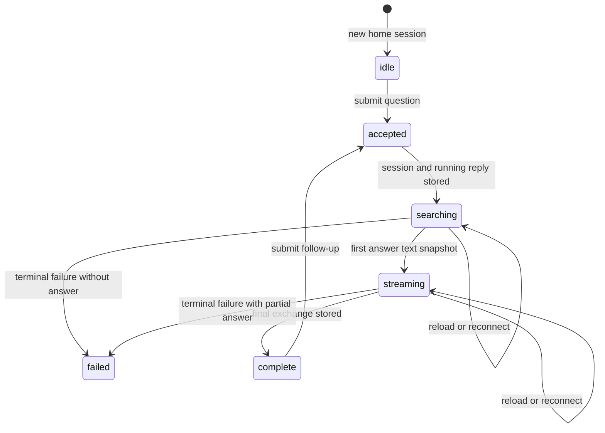

# The research session model

## Summary

A [session](../glossary.md#research-sessions) is one account's durable research conversation inside one vault. Its main line is an ordered set of [exchanges](../glossary.md#research-sessions); each exchange has one question, one durable [reply](../glossary.md#research-sessions), source evidence, an answer, and optional [BTW threads](../glossary.md#research-sessions). A session can also carry a document [origin](../glossary.md#research-sessions). Great Minds accepts and stores the pending exchange before generation continues in the background, exposes versioned reply snapshots for reconnect, and appends the final exchange state when generation ends.

## The simple case

The owner submits a question from home. Great Minds immediately creates a pending exchange and a new session, returns a session identifier and reply identifier, and changes the route to `/sessions/{id}`. The input becomes disabled while the session shows searching and evidence activity.

The server generates independently of the browser request. It repeatedly stores a complete snapshot of the answer and evidence gathered so far. The browser tails those snapshots. Once answer text exists, the visible phase changes from searching to streaming. Each newer snapshot replaces the exchange's answer and evidence rather than asking the browser to replay every token or tool event.

On completion, Great Minds appends the settled exchange—question, final evidence, and final answer—to the session, marks the reply completed, and shows the follow-up controls. Reloading the route reads the session event log, collapses the pending and final versions of each exchange into the latest version, and reconnects any exchange whose stored answer is still empty and has a reply identifier.

## The interaction, event by event

### Arrive

A fresh home session begins in `idle` with no server session identifier. A saved `/sessions/{id}` route begins by loading the caller's session events in the active vault. A loaded session with exchanges normally enters `done`; a microtask then finds pending replies and changes the phase back to `searching` while reconnecting them.

Sessions are vault-scoped for search and storage but personal for visibility. Membership in the vault is required, and then the session row must belong to the caller. Another member—including the vault owner—receives not found rather than reading someone else's session. The sessions list likewise returns only the caller's sessions in that vault.

The session origin is fixed when the first exchange creates the session. It contains a document path, `vault` or `personal` scope, and optionally highlighted text, surrounding paragraph text, and a paragraph index. The origin's display title is resolved from the current document metadata when the session is read rather than frozen into the session.

### Leave without acting

An empty question creates no exchange or session. A fresh idle home can be left without a durable research record. Selecting text for a follow-up chip or creating an empty document-thread draft is also local until the user submits a question.

Opening and leaving a completed session is a read. Great Minds does not add a viewed timestamp, unread state, or new event. There is no session delete, message edit, answer regenerate, or branch action in the scoped interface.

### Begin

Submitting the first question creates a client exchange identifier and immediately adds an optimistic empty exchange to the visible thread. The client enters `searching`, captures the completed main-line exchanges as alternating user/assistant history, and sends a create-reply request.

The first request includes a client idempotency key. The server uses it to converge repeated first-session creation in the same vault and account onto one session. It writes a metadata event and a pending exchange event containing the reply identifier and an empty answer, then creates a running reply record and starts generation detached from the request. The response returns both identifiers with an accepted status.

After the response, the browser stores the reply identifier on the optimistic exchange. If this is the first exchange, it stores the returned session identifier, replaces the current route with `/sessions/{id}`, and refreshes the recent-session query.

A follow-up in an existing session appends a pending exchange to that same session before generation. An anchored document thread uses the same session-and-exchange model: its first turn creates a separate session with a full origin anchor, and later turns append main exchanges to that anchored session.

### While in progress

The durable reply has one of three states: running, completed, or failed. While running, it owns the latest full answer string, the latest normalized evidence-card array, an incrementing version, and update time. Token activity is flushed at most every 125 ms; source-card pending, settlement, and resolution changes force their own snapshots.

The browser opens a server-sent event tail for the reply. The server checks the durable record every 100 ms, emits only a changed version, sends a heartbeat about every 30 seconds, and ends after a terminal snapshot. The browser ignores duplicate versions. A dropped network stream reconnects with exponential delay from 1 second up to 10 seconds and receives the current durable snapshot; it does not need the missing token events.

The visible phase derives from snapshots:

- running with no answer text is `searching`;
- running with answer text is `streaming`;
- completed or failed is `done`.

Evidence is accumulated into user-facing source cards. Repeated ranges for one source are merged into the same card; a full read marks the card full. Pending cards can be replaced or removed as a tool call settles. Only settled evidence is stored in the final session exchange.

Navigating away or closing the tab aborts the browser's tail, not the server reply. The detached generation continues in the process and keeps writing snapshots. Reloading the session reconnects when the latest exchange has a reply identifier and no final answer.

> Technical note: A server restart does not resume model generation. On startup, Great Minds marks pre-existing running replies failed with **interrupted by server restart**. The pending session event remains so the browser can show an interrupted exchange instead of waiting forever.

### Finish

On successful generation, Great Minds appends a second event for the same exchange identifier containing final answer and settled evidence. It rebuilds the session's Markdown sidecar and then marks the reply completed. Session reads keep the latest event for each exchange identifier, so the user sees one completed exchange even though the append-only log retains both pending and final states.

On generation failure, the durable reply is marked failed with a sanitized user-facing error and any answer/evidence already flushed. No final session exchange is appended. The pending event remains. A reload uses the reply identifier to tail the terminal failed snapshot and settle the UI.

The session's `updated_at` moves whenever a pending or final exchange or BTW event is appended. Main sessions are listed newest-update first in pages of 50. Home uses that list for up to three recent-session suggestions. The sessions page filters only the pages already loaded in the browser.

Anchored sessions—those whose origin has selected text—are excluded from the main sessions list and instead appear with their origin document as notes. Document-initiated sessions with no selected anchor remain in the main list and also appear in that document's conversation inventory.

Each append also rebuilds a downloadable Markdown representation. It renders main questions and answers in order and nests the latest version of each BTW thread beneath its owning exchange. Printing uses the browser-rendered thread and is a separate export path.

## Context and state variants

| Variant | At arrival | Changed while active |
| --- | --- | --- |
| Account role and access | Any vault member may create a personal session and query shared vault content. Only the session owner can list, read, or append that session. | Losing vault membership blocks the reply tail and session reads. Another member cannot take over the session. |
| Vault state | Empty or sparse vaults can still accept a question, but available evidence changes. An active compile does not structurally block a research reply. | A compile or source change can alter tool results during generation; the session stores the evidence actually settled for that reply. |
| Target state | A fresh session has no id. A saved session can be complete, contain a pending reply, or retain a failed pending exchange. | Each accepted turn appends durable pending state. Completion appends a latest exchange; failure leaves pending plus terminal reply state. |
| Entry context | Home creates an origin-less session. A reader can create an unanchored document conversation or an anchored note session with vault/personal scope. | The origin is fixed at session creation. Later main exchanges do not move the session to a different origin. |
| Input and viewport | Enter or the query/follow-up button submit the same text. The thread layout changes spacing and panel docking by viewport. | Main input is disabled while its reply runs. Evidence panels and scrolling remain usable; input method does not change persistence. |

## Cancel and interrupt

| Event | Before work begins | While work is in progress |
| --- | --- | --- |
| Escape, Cancel, or Stop | Escape can dismiss selection UI or clear a reader query draft. Empty main input creates nothing. | The scoped session UI has no Stop control. Escape does not cancel generation; it may only close an evidence panel or popover. |
| Navigation to another Great Minds page | A fresh unsent question is lost and no session is created. | The browser aborts its tail when the component is destroyed. The running durable reply continues; reopening `/sessions/{id}` reconnects. |
| Browser Back or Forward | Leaving idle home creates nothing. Opening a saved session is ordinary history navigation. | Because first creation replaces the launch entry, Back leaves the session rather than returning to an auto-submitting query URL. Generation continues. |
| Page reload | Fresh unsent state disappears. A saved session reloads from events. | The pending exchange is reconstructed and its reply tail resumes. Completed snapshots no longer stream. |
| Tab or window closed | No effect on already saved sessions. | Accepted reply generation continues without the page. An unacknowledged create request may still create the session. |
| Network lost | Submission cannot be accepted while fully disconnected. | A live tail reconnects with bounded exponential delay. If creation succeeded but its response was lost, client and server can temporarily disagree about the session identifier. |
| Request failure or timeout | Create failure removes the optimistic exchange and returns the client to idle. | Stream transport failures retry unless they are explicit HTTP reply errors. Durable generation failure produces terminal failed state and a sanitized message. |
| Authentication session expires | No accepted exchange without a usable credential. | Tail requests use normal one-refresh-and-retry authentication. Failed refresh stops the visible tail; the server reply can continue. |
| The target changes in another tab | The same account can open the session elsewhere; both read the same durable snapshots. | Two tabs can submit independent new exchanges without a client-side session lock. Append order follows server completion and request timing. |
| The target changes through another member | Other members cannot read or append this personal session. | Shared vault content can change underneath the query, but the session record remains private and retains settled evidence. |
| Browser autofill, paste, drop, or another input channel writes into the interaction | Paste writes ordinary question text. File drop is not an attachment mechanism for research turns. | Disabled main input rejects edits while running. Selection chips and BTW inputs are available only in their own phases. |
| The window loses focus | Draft text and loaded session remain. | The tail and generation continue. Focus loss does not pause, complete, or cancel a reply. |

## Interactions with other systems

**Permissions and roles.** Session creation requires vault membership; session access then narrows to the creating account. Saving an exchange as a source requires editor-or-owner access and is a separate feature.

**Validation and error display.** Blank questions are rejected in the client. Request schemas constrain session IDs, origin scope, reply kind, and history roles. Generation defects are sanitized before storage; provider secrets are not shown to the user.

**Unsaved work and history.** Unsent text and selection chips are client state. The pending exchange is the first durable boundary. Session history is append-only and read as latest-per-exchange/latest-per-thread, not an editable transcript.

**Optimistic changes and rollback.** The question appears optimistically before server acceptance. A create error removes that exchange entirely. After acceptance, terminal failure is retained as an interrupted exchange rather than rolled back.

**Offline and reconnection.** There is no offline submission queue. Durable reply snapshots make stream reconnection resumable while the server process is alive; a server restart converts old running replies into failed records.

**Notifications.** Progress is visible in the active thread. Completion and failure do not produce a global toast or background notification after the user leaves.

**URL and navigation state.** The durable session identifier is canonical route state. The initial `q` and `origin` parameters are launch state and are replaced after creation. Session origin itself is durable metadata.

**Multi-tab and multi-user behavior.** Same-account tabs can tail the same reply, but there is no write lock or collaborative turn ordering. Different members cannot read the session even though they share the vault.

**Accessibility and keyboard use.** Main questions and follow-ups submit with Enter. Questions and answers remain semantic text. Dynamic evidence and streaming replacement need verification for live-region announcement; no explicit live region is apparent.

**External side effects.** A reply can search vault indexes, read source/article chunks and links, use web search, call a language provider, store cost/provenance events, append session storage, and rebuild Markdown. Exact tool choice and generated wording are nondeterministic.

## Edge cases

- A first-session idempotency key reuses one session, but separate exchange identifiers can still append more than one exchange to that session on repeated accepted reply requests.
- The append-only event log contains both pending and completed versions of an exchange. Reads and Markdown deduplicate to the latest version without erasing audit history.
- A malformed JSON line truncates later event replay; an invalid typed event is skipped while later well-formed lines continue. This favors partial recovery over rejecting the whole session.
- If an old storage stream contains more than one metadata event for a reused session identifier, reads isolate the suffix beginning at the latest metadata event.
- A session database row with no JSONL file is not reconstructable from the row alone. Normal reads return not found; idempotent create replay treats this as a serious consistency defect.
- A JSONL file without a matching database row can retain limited legacy read/append behavior, but ordinary new sessions always have both.
- A failed reply can retain partial answer text and settled evidence in its terminal snapshot even though the session event remains the empty pending version.
- Evidence card order is not necessarily tool-call order: resolved raw/article cards can move after pending cards as ranges are merged and settled.
- Anchored document sessions are absent from `/sessions`, by design, and are loaded by origin in creation order. Unanchored document sessions appear in both contexts.
- There is no user-facing session deletion or rename; the first question is the session list title.

## Open questions and verification

- Post-baseline commit `ed55674` replaces detached generation plus restart-zombie failure with the `ReplyGeneration` workflow. The complete request is the persisted outbox; dispatch metadata records enqueue acknowledgement; reconciliation re-enqueues accepted rows that lost that acknowledgement. Commit `0ca82b4` then makes model attempts and individual tool calls separate durable activities with object-store transcript checkpoints and a database cursor/active-call claim. Process loss between completed activities resumes from the checkpoint. Process loss during an external call whose response was not saved does not repeat it: the reply fails with **Reply interrupted before an external response could be saved. It was not retried automatically.** Scripted-model integration coverage verifies dispatch, accepted-but-undispatched reconciliation, multi-turn cursor progression, terminal snapshots, and session materialization; a SIGKILL/restart test proves one ambiguous provider call is made exactly once.
- Verify the exact visual transition from a reloaded saved session's initial `done` state back to `searching`; the microtask recovery can briefly expose completed controls before the pending reply is detected.
- An initial create-reply failure removes the optimistic exchange and logs only to the console. There is no visible inline error explaining why the question disappeared. This appears to be a recoverability bug.
- Post-baseline B-10 fix: Great Minds `a918301` renders failed status independently of answer presence. Main and BTW replies put **reply interrupted — partial answer below may be incomplete** plus the sanitized error before retained prose, and failed partial main exchanges no longer offer **save as source**. Deterministic integration coverage retains token-before-error prose in a failed terminal snapshot; visible seeded terminal snapshots confirmed both surfaces.
- There is no Stop control even though generation is durable and potentially long-running. Decide whether “leave and let it finish” is the intended cancellation model.
- Verify duplicate behavior when the server accepts the first reply but the create response is lost and the user retries. Session creation is idempotent, but reply creation itself is not keyed by the same idempotency token.
- Verify screen-reader behavior for full answer replacement and changing evidence cards; source establishes durable snapshots but no explicit announcement policy.

Verified against Great Minds commit `c8c9e57`.
