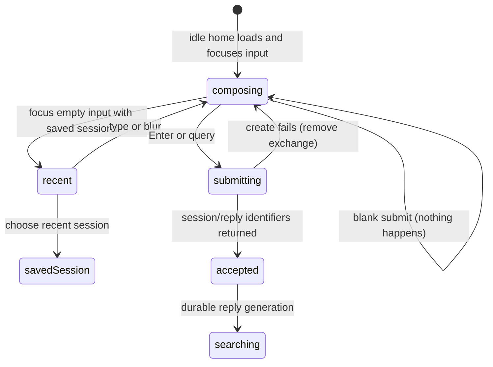

# Asking a question

## Summary

Asking a question begins the core Great Minds research turn. On idle home, the owner writes one plain-text question for the [active vault](../foundations/access-and-vault-context.md) and submits it with Enter or **query**. Great Minds immediately changes from the source-management home surface to a research thread, accepts a durable pending [exchange](../foundations/research-session-model.md), creates the first [session](../foundations/research-session-model.md) when needed, and hands the visible lifecycle to [streamed answer and evidence](streamed-answer-and-evidence.md). The question has no attachments, model picker, explicit search-scope control, or Stop option.

## The simple case

The owner arrives at home with one ready vault. The centered question field is focused and says **Ask a question across the knowledge base…**. The vault control above it names the current vault and, when counts have loaded, shows its article and source totals. Focusing an empty field can open up to three recent sessions below it.

The owner types a nonblank question and presses Enter. The recent-session dropdown disappears, the source-ingest controls fade out, and the question input moves into the thread header. It becomes disabled while the submitted question appears as a quoted line in the new exchange.

Great Minds accepts the exchange against the active vault, creates a session if this is the first turn, replaces the URL with `/sessions/{id}`, and begins researching. Evidence and answer behavior continue in [the streamed-reply document](streamed-answer-and-evidence.md).

## The interaction, event by event

### Arrive

An authenticated account with at least one vault arrives at `/`. Great Minds loads the vault list, chooses the stored active vault, and renders idle home. If the account has no vault memberships, home is replaced with first-vault creation, which is outside this description.

The question input receives focus after idle home mounts. The **query** button is disabled until the field contains a non-whitespace character. The field holds one line of ordinary text. Enter submits; there is no Shift+Enter multiline path and no attachment affordance.

Above the input, the active-vault control opens the library and the adjacent switcher changes vault. Article/source counts and the health badge are asynchronous; they can appear after the question field is already usable. Below it, source ingest is visible only when the current account is the owner and no research turn is active.

When the focused input is empty and recent sessions have loaded, Great Minds opens a dropdown with the first three newest-updated sessions. Each row shows its first question and relative update time. **all sessions** navigates to the full list. Holding the dropdown open does not create or modify a session.

A launch URL can prefill the question with `/?q={question}` and optionally `origin={document path}`. After component creation, Great Minds automatically submits that initial question without waiting for another click. Reader-launched questions use this path.

### Leave without acting

Submitting an empty or whitespace-only field does nothing. The button remains disabled, there is no exchange, and no server request is sent. Blurring the input closes the recent-session dropdown but preserves typed text while home remains mounted.

Choosing a recent session or **all sessions** leaves the draft behind. Navigating to the library, settings, health, or another vault likewise destroys the unsent question without a confirmation. The question is not written to the route while the owner types and is not restored after reload.

### Begin

Enter and **query** call the same trimmed-input guard, but the question sent to the session is the field's current string after the guard—not a separately edited preview. Great Minds changes the client session phase to searching synchronously, so the query button and ingest controls disappear before a duplicate click can submit another main exchange.

The thread adds an optimistic exchange with a new client identifier, the visible question, no evidence, an empty answer, and streaming state. The search bar crossfades into the top header, remains filled with the question, and becomes disabled. The home control appears at the left of that header.

For a fresh session, Great Minds sends:

- the active vault from browser context;
- the new exchange identifier;
- a stable first-session idempotency key for this client session object;
- the question;
- empty main-line history;
- an optional origin path and origin metadata for a reader-launched question;
- normal query mode.

The server verifies vault membership and provider configuration, writes the pending session/exchange state, creates a running durable reply, starts generation, and returns accepted identifiers. The browser then replaces the route with `/sessions/{session id}` and refreshes recent sessions.

### While in progress

This document owns only the submission handoff. After server acceptance, the question cannot be edited or resubmitted in the main field. The input is disabled, the **query** button is absent, and source-ingest controls remain hidden. The owner can navigate home, share or export once a saved session identifier exists, and interact with evidence as it appears, but there is no second main question until the reply is terminal.

By default, the research prompt directs Great Minds to orient with synthesized articles, use structured source metadata when appropriate, search the vault's indexed source and article content, inspect specific documents and chunk ranges, verify claims, and cite supporting paths. Open-web search is not enabled in the default vault query configuration; when a vault explicitly enables it, it is for external factual gaps after vault research, not the source of the vault's analysis.

A document-origin question can provide special context on the first turn. An unanchored reader query names the origin path so Great Minds can read that document. An anchored document-note question additionally composes the surrounding passage and highlighted quote for generation while storing the user's clean question in the session.

The accepted [pending exchange](../foundations/research-session-model.md#begin) is the durable boundary. Closing the page after that point does not unsend the question. Snapshot and reconnection behavior belongs to [streamed answer and evidence](streamed-answer-and-evidence.md).

### Finish

Successful submission finishes when the browser has the reply identifier and, for a first turn, the session identifier. The canonical session route is now reloadable even while generation continues. Submission success has no toast because the immediate state change and searching display are its confirmation.

If the create-reply request fails before returning identifiers, the optimistic exchange is removed, the session phase returns to idle, and the centered question surface comes back with the typed text still present. The failure is written to the browser console, but the scoped UI does not render an inline error or retry explanation.

If the server accepted the request but the response was lost, the pending session and reply can exist even though this page follows its client failure path. The first-session idempotency key can converge a retry on the same session, but reply creation itself is a separate accepted operation; exact duplicate-turn behavior needs verification.

## Context and state variants

| Variant | At arrival | Changed while active |
| --- | --- | --- |
| Account role and access | Any vault member can ask across shared vault content; the scoped owner also sees idle ingest controls. Sessions remain private to their creator. | Losing membership makes submission or later tailing fail. A role change does not edit an already accepted question. |
| Vault state | Empty, newly ingested, and compiled vaults all enable the input. Available evidence and answer quality vary with indexed content. | A concurrent ingest or compile can change what tools find while the reply runs; the accepted turn remains tied to this vault. |
| Target state | A fresh home has no session id. A `q` launch can prefill a new turn. A recent-session choice opens existing state instead of submitting. | Acceptance creates a durable session/reply. If that target is deleted or inaccessible before response handling, route or tail loading fails. |
| Entry context | Home questions have no origin. Reader queries carry `q` and `origin`; anchored document notes carry quote/paragraph metadata through their own flow. | Origin is fixed on first session creation. Navigating after acceptance does not detach it from the stored session. |
| Input and viewport | Pointer **query** and Enter submit the same one-line question. Recent rows are pointer/keyboard controls. | The field disables after submission. Viewport changes the header layout but not the request or durable session. |

## Cancel and interrupt

| Event | Before work begins | While work is in progress |
| --- | --- | --- |
| Escape, Cancel, or Stop | Escape has no query-draft clearing behavior on idle home. There is no Cancel; an empty field simply remains. | The main query surface has no Stop. Escape can close evidence UI but does not retract the accepted question. |
| Navigation to another Great Minds page | The unsent question is discarded with no record or warning. | Before acceptance completes, navigation destroys the component and aborts its controller; after acceptance, server generation continues. |
| Browser Back or Forward | Leaves idle home and discards the unsent draft. | The accepted session route replaces its launch entry. Back leaves the session rather than returning to an auto-submit URL; generation continues. |
| Page reload | The unsent draft disappears unless it came from the current `q` URL, in which case that URL launches again. | Before a session route is known, reload can repeat launch behavior. After route replacement, reload reconstructs the pending session. |
| Tab or window closed | Nothing is created if the request never reaches the server. | A request already accepted can create and continue the durable reply without visible confirmation. |
| Network lost | Submit fails and the optimistic question is removed when the rejection is observed. There is no offline queue. | If acceptance already happened, generation can continue server-side; the browser cannot learn the identifiers until a retry or later discovery. |
| Request failure or timeout | The optimistic exchange disappears, idle home returns, and the text remains. No inline error is shown. | Provider failure after acceptance belongs to the reply's terminal failed state, not the submission rollback. |
| Authentication session expires | The request attempts one refresh and retry. Failed refresh prevents acceptance and clears context. | Acceptance remains durable. Failed authentication on the tail stops observation but not generation. |
| The target changes in another tab | Another tab can switch the active vault before submission, changing the vault this field will use through shared storage. | After submission, the request captured one vault. Another tab can open the new session or submit concurrent turns after it discovers the id. |
| The target changes through another member | Shared sources may change before the question is sent. | Evidence tools can observe concurrent vault changes. Another member cannot read this private session. |
| Browser autofill, paste, drop, or another input channel writes into the interaction | Paste inserts ordinary question text. Autofill has no special question semantics. File drop belongs to source ingest, not attachments. | Disabled input rejects further writes until the reply ends. |
| The window loses focus | Draft and recent dropdown follow ordinary focus behavior; blur closes the dropdown but preserves text. | Submission and generation continue. Focus loss does not pause or cancel the turn. |

## Interactions with other systems

**Permissions and roles.** Vault membership allows querying shared content. The resulting session belongs only to the caller. Owner-only ingest visibility is separate from query permission.

**Validation and error display.** The client rejects blank text. The server validates request shape, membership, session identity, and language-provider configuration. Pre-acceptance errors are not surfaced visibly on home today.

**Unsaved work and history.** Typed text is unsaved until submission. The server's pending exchange is the first durable history entry. Browser-history replacement keeps the resulting session, not the launch shim.

**Optimistic changes and rollback.** The question appears before server acceptance. A failed create removes it entirely and restores idle home; accepted generation failure is retained as session history.

**Offline and reconnection.** Questions cannot queue offline. Accepted turns are reconnectable through their reply and session identifiers, but a lost create response creates an ambiguous discovery gap.

**Notifications.** Submission uses layout transition and searching state, not a toast. There is no background completion notification after leaving.

**URL and navigation state.** Idle drafts are not URL state. Explicit `q` and `origin` are one-time launch inputs; accepted first turns replace them with the durable session route.

**Multi-tab and multi-user behavior.** Active-vault storage can change from another tab before submission. Same-account tabs can later observe the session; different members cannot. There is no turn-submission lock across same-account tabs.

**Accessibility and keyboard use.** The idle input autofocuses, Enter submits, disabled state is native, and the recent-session controls expose readable question text. Searching/streaming announcement behavior belongs to the reply document and needs verification.

**External side effects.** Acceptance writes session and reply state and begins language-model/tool work. The default tool set can read articles, source chunks, links, metadata, and hybrid search; optional web search depends on vault configuration.

## Edge cases

- Whitespace enables neither the button nor submission; the original field string remains until a valid submit or navigation.
- The recent dropdown appears only when the input is focused, empty, session loading has finished, and at least one recent session exists.
- The dropdown shows at most three sessions even though the home query fetches a default page of up to 50.
- Mouse-down on a recent row prevents input blur long enough for the row click to navigate reliably.
- A question from `q` starts automatically. If auth/vault initialization delays the page, the question waits for the component but does not require manual confirmation.
- A saved session route initializes the disabled header field from the first exchange's question; it is a visual header, not an editable next-question input.
- The active vault can have zero articles and zero sources. Great Minds still accepts the question and must express thin evidence through the generated result rather than disabling the field.
- Provider configuration missing produces a service-unavailable response before a reply is created.
- The same client session object retains one idempotency key across a failed first-session retry, but each attempted exchange receives a new client exchange identifier.
- Reader-launched `origin` is applied only to the first exchange. Main follow-ups use history rather than repeatedly forcing the origin path.

## Open questions and verification

- Verify focus movement and announcement during the centered-input-to-header crossfade, especially for keyboard and screen-reader users.
- Pre-acceptance errors remove the visible question without an inline explanation. This should likely be treated as a bug; verify provider-missing, 403, network, and 500 cases.
- Verify a lost create response followed by retry: session idempotency is explicit, but duplicate reply/exchange behavior can still surprise the user.
- Reader-launched personal references currently provide an `origin` path without preserving personal scope in the home launch. This is the navigation-foundation bug and can make the question search for a `refs/…` path in vault storage.
- Verify whether web search is exposed or configurable anywhere in the scoped owner surface. The server default is off and the current visible query bar gives no scope signal.
- There is no Stop or draft-persistence affordance. Confirm that the intended contract is “submission is durable; leave the page if you no longer want to watch.”

Verified against Great Minds commit `c8c9e57`.
