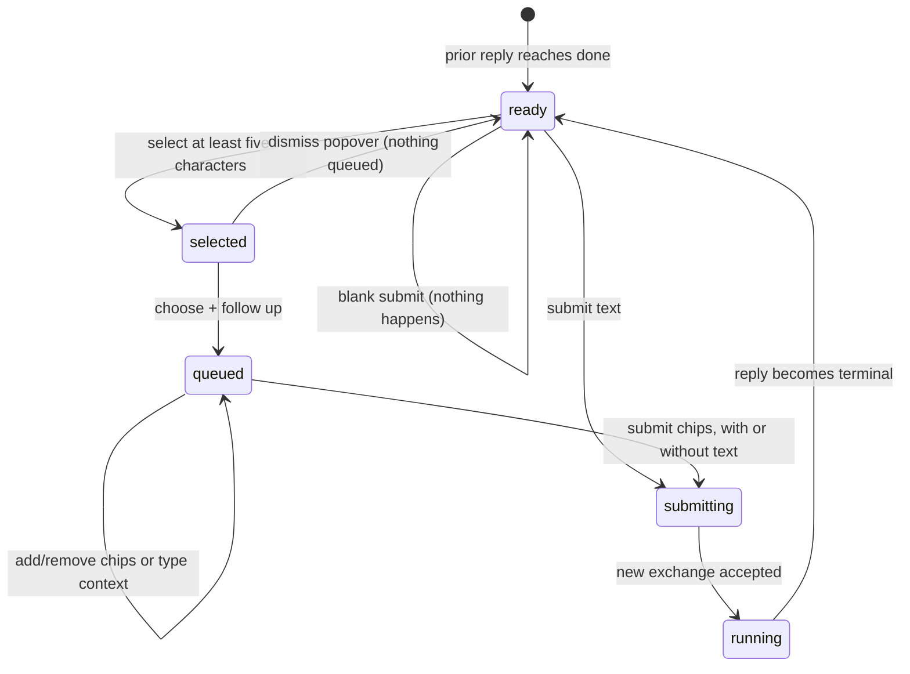

# Following up

## Summary

A follow-up adds another main-line [exchange](../foundations/research-session-model.md) to a completed [session](../foundations/research-session-model.md). The owner can type a new one-line question, select one or more excerpts from any completed main answer, or combine both. Selected excerpts become removable [selection chips](../glossary.md#research-sessions); submission turns each full excerpt into explicit `re: "…"` text and joins it with the typed context. The new exchange receives the complete prior main-line history and then follows the same durable reply and streaming lifecycle as the first question.

## The simple case

After an answer completes, a bar appears at the bottom of the session with **follow up…** and a **FOLLOW UP** button. The owner types a question and presses Enter. The bar disappears, a separator and quoted question appear below the prior exchange, and Great Minds starts another source-grounded reply in the same session.

For a passage-specific follow-up, the owner selects at least five characters inside one rendered answer block. A popover appears above the selection with **+ follow up** and **btw**. Choosing **+ follow up** creates a chip showing the selected excerpt and clears the browser selection. The owner can add more excerpts, optionally type extra context, and submit.

Great Minds constructs one visible question from the chips and text, appends it to the same session, and includes every completed main question and answer as conversation history. When the new reply finishes, the follow-up bar returns for another turn.

## The interaction, event by event

### Arrive

The follow-up bar renders only when the client session phase is `done`. It appears after a completed reply, a failed reply, or a client-side tail interruption that set the phase done. It does not appear while the main reply is searching or streaming.

The input is a single line. With no chips it says **follow up…**. With one or more chips it says **add context or submit selections…**. The button stays disabled until the trimmed input is nonempty or at least one chip exists. The component does not autofocus the field.

Every completed main answer can generate a selection. Great Minds handles selection per top-level rendered block—paragraph, heading, list, quote, or other rendered node—and requires the selection's common content to remain inside that block. It trims the selected string and ignores a quote shorter than five characters.

The selection popover is positioned just above the browser selection. Scrolling any ancestor, clicking outside it, or collapsing the selection dismisses the popover. Clicking a popover action prevents the ordinary mouse-down blur long enough to preserve the selection.

### Leave without acting

Leaving the follow-up input blank and selecting no chips records nothing. Pressing Enter or the disabled button has no effect.

Dismissing a selection popover without choosing an action does not create a chip or thread. The native text selection can remain until it collapses or another action clears it. A selection during streaming never opens this popover.

Typed follow-up text and queued chips are [client state](../glossary.md#page-and-interface-state). Navigating away, reloading, changing vaults, or closing the tab discards them without an unsaved-changes warning.

### Begin

Choosing **+ follow up** appends the full selected quote to the session's chip array. It closes the popover and removes all browser selection ranges. The chip displays at most the first 42 characters followed by `...`, but submission retains the complete quote. Multiple chips keep selection order and can repeat the same text.

Each chip has a button named **remove selection**. Removing one deletes that chip by its current position and leaves the typed context and other chips unchanged.

Submission is allowed in three forms:

- text only;
- one or more chips only;
- chips plus text.

Great Minds turns each chip into `re: "{full quote}"`, appends the trimmed typed text when present, removes empty parts, and joins the parts with ` — `. That composed string is both the visible question and the question stored in session history; the selections are not hidden metadata on a main follow-up.

The bar clears its text immediately. The session clears all chips immediately. It then creates an optimistic exchange and enters searching. The follow-up bar disappears because the session is no longer done.

### While in progress

The new exchange receives alternating user/assistant history built from every main exchange already in the thread. It does not include BTW side-thread turns in main history. The origin path is not forced again after the first exchange; the prior conversation and explicit `re:` excerpts carry context forward.

While the reply runs, no second follow-up bar is available. The owner can inspect evidence and earlier answers, navigate away, or close panels, but cannot queue another main follow-up in this component until the current reply reaches a terminal state.

The thread does not explicitly auto-scroll to the newly appended exchange or follow streamed text. Depending on current scroll position and viewport, the owner may need to scroll down to see the follow-up question and answer.

Submission and reply persistence use the same pending/final event model described in [the research session foundation](../foundations/research-session-model.md). Evidence and Markdown behavior use [streamed answer and evidence](streamed-answer-and-evidence.md).

### Finish

On accepted submission, the same durable session receives a pending exchange and reply identifier. The route stays `/sessions/{same id}`; no browser-history entry is added. Completion appends the final exchange and makes the follow-up bar available again.

If create-reply fails before acceptance, the optimistic exchange is removed and the session returns to done. However, the bar already cleared its input and the session already cleared its chips. The user gets no inline error and loses the composed follow-up draft.

If generation fails after acceptance, the exchange remains as an interrupted turn. The follow-up bar returns because failed is terminal. A new follow-up can therefore continue after a failed turn, but the history builder includes that failed main exchange's current answer—an empty string when no answer was stored, or partial text when the client retained it.

Selecting excerpts remains available after the new reply finishes. Chips that were submitted do not remain queued; the owner must select again for another turn.

## Context and state variants

| Variant | At arrival | Changed while active |
| --- | --- | --- |
| Account role and access | The session owner and vault member can append a follow-up. Other members cannot see or append the session. | Losing membership makes submission or tailing fail; local chips remain only until the component is destroyed or submission clears them. |
| Vault state | Follow-up is available regardless of concurrent compile state. Existing vault content and prior history shape the reply. | Shared sources can change before or during the new reply; the session still retains the composed question and settled evidence. |
| Target state | A completed, failed, or client-interrupted session phase shows the bar. A running phase hides it. | Submitting changes the same session from done to searching; terminal reply changes it back to done. |
| Entry context | Home-born and document-origin sessions share the same main follow-up bar. Origin is shown above the thread but not reattached as a first-turn path. | Selecting text from any completed main answer can add a chip. BTW answer selection does not feed this main follow-up control. |
| Input and viewport | Pointer selection plus **+ follow up**, keyboard text plus Enter, and pointer **FOLLOW UP** converge on one composed question. | Chips wrap and truncate visually on narrow viewports but keep full values. Input disables indirectly when the bar disappears during running. |

## Cancel and interrupt

| Event | Before work begins | While work is in progress |
| --- | --- | --- |
| Escape, Cancel, or Stop | Escape does not clear the follow-up input or chips. It can dismiss the selection popover indirectly through selection/focus changes. There is no Cancel button. | There is no Stop for the accepted follow-up. Escape closes evidence UI only. |
| Navigation to another Great Minds page | Unsent text and chips are discarded without warning. | The pending exchange remains; generation continues and the session can reconnect later. |
| Browser Back or Forward | Leaves the session and loses the unsent draft. Returning reloads durable exchanges but not chips or text. | Leaves observation. The accepted follow-up remains in the same session route and continues. |
| Page reload | Clears text, chips, selection, and popover. | Replays the pending exchange and reconnects the running reply. Submitted chip text survives because it is part of the stored question. |
| Tab or window closed | Unsent follow-up state is lost. | Accepted generation continues without notification. |
| Network lost | A submit that cannot be accepted removes the optimistic exchange and loses the already-cleared draft. | The reply tail retries if acceptance succeeded. A terminal generation failure returns the bar. |
| Request failure or timeout | No inline error; text and chips are already cleared. The owner must reconstruct the follow-up. | Durable failed state remains and permits another follow-up. |
| Authentication session expires | Submit attempts normal refresh; failure loses access. Unsent local state lasts only while the page remains. | Failed tail refresh stops observation but not accepted generation. |
| The target changes in another tab | Same-account tabs can append to the same session independently. This tab does not merge another tab's new exchanges live. | Concurrent appends can produce server-timing order. Reload reads the durable event order. |
| The target changes through another member | Other members cannot change this private session, though they can change vault sources. | New evidence can reflect shared content changes; prior question text is unchanged. |
| Browser autofill, paste, drop, or another input channel writes into the interaction | Paste and autofill write ordinary text. Browser selection creates chips only through the explicit popover action. | The bar is absent while running, so no writes are accepted there. |
| The window loses focus | Text and chips remain. The fixed selection popover may lose its valid selection/focus and dismiss. | Accepted reply continues; returning does not auto-scroll to its latest text. |

## Interactions with other systems

**Permissions and roles.** Follow-up requires membership plus ownership of the session. It does not require vault ownership and does not mutate source content.

**Validation and error display.** Blank text with no chips is blocked. Selection must be at least five trimmed characters and stay within one rendered block. Pre-acceptance failures currently have no visible error.

**Unsaved work and history.** Text, chips, and popover are unsaved. On submission, the composed question—not a separate chip structure—becomes durable history. The next reply follows the session's append-only latest-exchange model.

**Optimistic changes and rollback.** The optimistic exchange rolls back on create failure, but the draft does not. This asymmetry loses recoverable user work.

**Offline and reconnection.** There is no offline follow-up queue. Accepted replies reconnect from durable snapshots; unsent text and chips do not persist.

**Notifications.** The bar disappearing and new exchange appearing signal submission. Completion brings the bar back. No toast announces either transition.

**URL and navigation state.** Follow-up stays on the same session URL. Text, chips, selection, and scroll are not route state.

**Multi-tab and multi-user behavior.** Same-account tabs can race follow-ups with no client lock or live merge. Other vault members cannot access the session.

**Accessibility and keyboard use.** Enter submits the one-line input; chip remove controls are named. Selection popover actions are buttons, but opening that pointer-positioned popover and returning focus after action require hand verification.

**External side effects.** Accepted follow-ups call the same vault research tools and provider as the first turn, append session/reply state, and record costs. Selecting and queuing chips has no server side effect.

## Edge cases

- A four-character quote does not open the Great Minds selection popover even though the browser selection remains visible.
- A selection crossing two top-level answer blocks is ignored because it does not belong wholly to the block whose mouse-up handler ran.
- Leading and trailing whitespace is removed from both selected quotes and typed context.
- A chip can contain more than 42 characters; only its visual label is shortened.
- Multiple chips are not deduplicated. Selecting the same passage twice produces two `re:` clauses.
- Chips-only submission is valid. The placeholder explicitly invites the owner to submit selections without extra context.
- Text-only submission does not add a `re:` prefix.
- The composed question uses an em-dash separator. That exact composed text appears as the user's quoted exchange in the thread and in exports.
- Clicking outside a selection popover clears the popover but does not clear queued chips from earlier selections.
- Scrolling dismisses only the popover; chips and input remain.
- A failed previous exchange with no answer is included in main history as a user question followed by an empty assistant message when the owner follows up.
- The onboarding tip is browser-global. Once dismissed in any first completed session, it does not reappear for later sessions in that browser storage.

## Open questions and verification

- Losing the input and every chip on pre-acceptance failure appears to be a high-impact recoverability bug. The bar should retain or restore the composed draft when the optimistic exchange rolls back.
- Verify keyboard-only creation of a selection chip. Native text selection is possible, but the fixed popover's discovery and focus path may be pointer-dependent.
- Verify scroll placement after appending a follow-up and while its answer grows. There is no explicit scroll-to-new-exchange or jump-to-latest behavior.
- Verify concurrent same-account follow-ups from two tabs. The append-only session can preserve both, but ordering and each tab's stale local thread may confuse the user.
- Decide whether chips should remain structured hidden context rather than becoming literal `re: "…"` text in the visible question and export.
- Verify follow-up after a failed no-answer turn; sending an empty assistant history message may be worth filtering or explicitly explaining to the model.

Verified against Great Minds commit `c8c9e57`.
