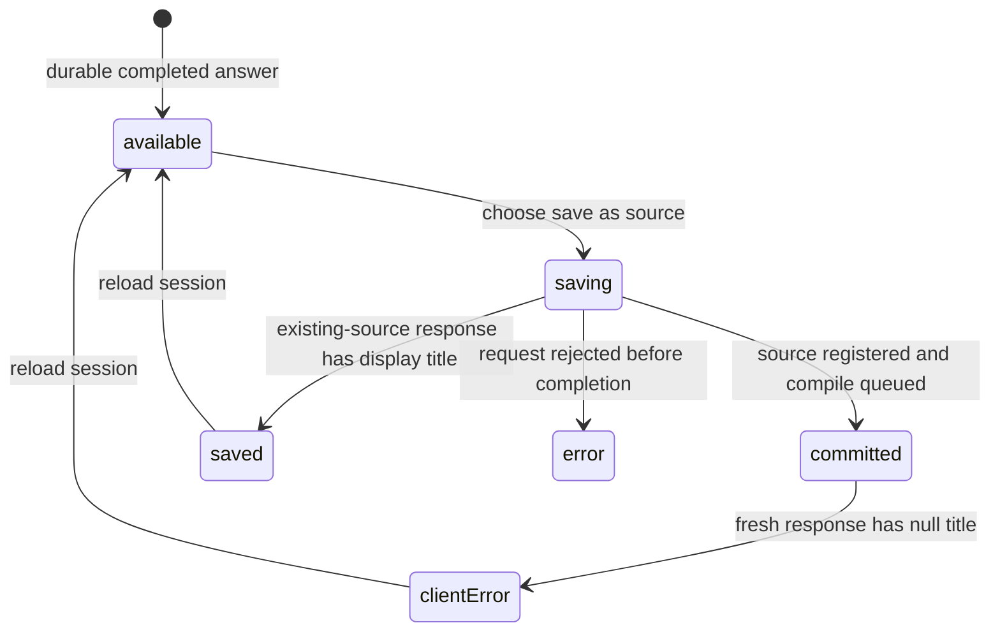

# Saving an answer as a source

## Summary

**save as source** copies one completed main [exchange](../foundations/research-session-model.md) answer into the active [vault](../glossary.md#content-and-the-library) as a `session`-type [source](../glossary.md#content-and-the-library). The copy preserves session, exchange, question, and document-origin provenance; gives the answer numbered block anchors; stores it at `raw/sessions/{exchange id}.md`; registers it as source material; and queues a compile. It does not alter or remove the session. Repeating the action for the same destination returns the existing source instead of rewriting it or queuing another compile.

At the pinned source commit, the first successful save has a response-contract defect: the server returns a null title after committing the source, while the browser requires a string. The owner therefore sees a response-validation error even though the source and compile intent were created. Reloading and choosing **save as source** again reaches the idempotent existing-source branch and can then display success.

## The simple case

A completed answer has **save as source** beside its quoted question. The owner chooses it; the label becomes **saving…** and disables. There is no confirmation dialog.

The server copies only the answer body into a new vault source. It adds provenance for the session, exchange, visible question, and any document where the session began. It removes old block markers and numbers the answer's non-heading blocks so later research can cite exact passages. It registers the source and creates or coalesces a compile intent.

The intended final label is **saved as “{title}”**. On a brand-new source, however, title enrichment has not run and the server returns null. The current browser rejects that successful response and replaces the button with a red technical validation message. The source can already appear in the library and a compile can begin. After page reload, the button returns; repeating it finds the existing source, returns its title or exchange-id fallback, and displays the success label.

## The interaction, event by event

### Arrive

The action appears for every main exchange when all of these are true:

- the session has a durable session identifier;
- the exchange's answer string is nonempty;
- that exchange is not currently streaming.

It appears beside the exchange question and is excluded from printing. It does not appear for BTW answers. The component does not ask whether this exchange has already been saved; a reload always restores the button's idle presentation.

A normal completed exchange has a final session event containing its answer. A failed reply with partial local text also satisfies the browser's visibility conditions, even though failure did not append that partial text as the final session exchange. In that case the button appears but the server finds the durable empty pending answer and rejects promotion.

The destination is deterministic: `raw/sessions/{exchange id}.md`. Each main exchange has its own action and destination. Matching answer text in two different exchanges creates two different source identities; repeated promotion of one exchange reuses one identity.

### Leave without acting

Leaving a completed answer unsaved does not change the session, vault sources, compile intents, or pipeline runs. The action has no hover preview, confirmation, draft, or timeout.

Navigating away before choosing it leaves nothing to recover. A previously saved source remains independent of whether the owner later leaves, exports, shares, or deletes the session.

### Begin

Choosing **save as source** immediately changes the button to disabled **saving…**. The browser sends one request for the current active vault, session id, and exchange id. It sends no editable title, destination, tags, source type, or body because the server derives all of those from durable session history.

The server requires editor-or-owner contribution access. In the scoped owner case, it first checks whether a source already exists at the deterministic destination. If it does, the request finishes idempotently without reading or rewriting the session and without creating another compile intent.

For a new destination, the server loads the session's append-only events, resolves the latest version of the requested exchange, and rejects a missing session, missing exchange, or answer that is blank after trimming. It then builds a source from the answer with this provenance:

- source type `session`;
- origin `session-exchange`;
- parent session id;
- parent exchange id;
- the selected exchange's visible question;
- the parent session's origin document path, selected anchor, and paragraph index when present.

The full origin paragraph, evidence cards, model thinking, citations as separate records, other main exchanges, and BTW threads are not copied. Markdown links already written into the answer remain part of the body.

For every nonempty answer block, Great Minds strips an existing trailing `^pN` marker and generates a sequential one. A heading-only block receives no number. The resulting file is written to vault storage and registered as a source.

### While in progress

The save request owns no progress panel, modal, toast, or route. The disabled label is its only in-place progress state. The owner remains on `/sessions/{id}` and cannot click the same component again while its request is pending.

After storage and source registration, Great Minds inserts a compile intent. If the vault already has one undispatched intent, the request coalesces with it. Otherwise the background reconciler can create a compile run, normally on its next startup/5-second reconciliation pass. The save response does not identify or navigate to that run.

The source and compile are separate durable boundaries. A stored and registered source can be readable in the library before the compile enriches its title, metadata, search representation, or contribution to articles. The compile follows [background-work](../foundations/background-work.md) rules and continues independently of this component.

Navigation does not explicitly abort the request. If the browser connection disappears after the server commits but before the response arrives, the UI can report failure or vanish while the source remains saved. The deterministic destination makes a later repeat converge on the existing source.

For an editor rather than the scoped owner, the same action creates a pending rendered-source proposal at the destination and does not write a vault source or queue a compile yet. A viewer sees the role-agnostic button but receives forbidden. These branches are variants, not the scoped journey.

### Finish

The owner branch returns **ingested**. For a previously existing source, it returns the source's current title, falling back to the exchange id when title is empty. The browser then permanently replaces this component instance with **saved as “{title}”**.

For a brand-new source, the server currently returns `title: null`, `document_id: null`, and a successful created response. The browser schema requires `title` to be a string. Parsing throws after all server side effects have completed, and the component permanently replaces the button with the thrown validation message in red. There is no in-place retry control or link to the source.

Reloading resets the local component to **save as source**. A second request sees the existing source and usually returns the exchange id as its title fallback, allowing **saved as “{exchange id}”** to appear. If compile enrichment has already supplied a title, that title is returned instead. This repeat does not rewrite the source or queue another compile.

A successful editor proposal is intended to replace the button with **submitted for review**, but the fresh proposal response also carries a null title and hits the same browser parsing defect before the UI can show that state. Repeating after reload finds the existing pending proposal and can succeed with an exchange-id fallback.

HTTP 400 for a durable blank answer becomes **Exchange has no answer yet**. HTTP 404 becomes **Exchange not found** even when the missing object is the session. Other rejected statuses become **Failed to promote: {status}**. Any error state replaces the button, so retry requires remounting the component by reload or navigation.

The session itself gains no event saying the answer was promoted. Its answer, evidence, recency, URL, and BTW threads remain unchanged. Deleting or managing the new source is a separate [content-management](../library/manage-content.md) task.

## Context and state variants

| Variant | At arrival | Changed while active |
| --- | --- | --- |
| Account role and access | The scoped owner sees the action and ingests directly. Editors propose; viewers also see the control but are denied. | Losing editor/owner access before authorization makes the request forbidden. A committed owner source remains shared vault content. |
| Vault state | The destination may be new, already registered, deleted after prior save, or represented by a pending editor proposal. A compile may already be queued/running. | New save stores/registers and creates or coalesces a compile intent. Existing destination returns without another compile. |
| Target state | A completed durable answer is promotable. Empty, missing, or pending-only durable answers are rejected; failed partial client text can misleadingly expose the button. | A concurrent save can create the destination first, turning this request into the same idempotent result or a same-path race. |
| Entry context | Home-born and document-origin sessions expose the same action. Origin metadata is copied from the parent session for every exchange. | Navigation destroys only local button state. Server work and the resulting source survive. |
| Input and viewport | One pointer/keyboard button performs the action; there are no editable fields. The small inline label may wrap on narrow layouts. | Viewport changes presentation only. Printing omits the action and status. |

## Cancel and interrupt

| Event | Before work begins | While work is in progress |
| --- | --- | --- |
| Escape, Cancel, or Stop | No confirmation opens, so there is nothing for Escape to cancel. | There is no Cancel/Stop. Escape affects other page UI, not the save request or queued compile. |
| Navigation to another Great Minds page | No effect before selection. | Destroys visible state but does not explicitly abort the request. A committed source/intent remains. |
| Browser Back or Forward | Leaves/reopens the session with idle buttons. | Can hide the outcome. Returning does not remember local success/error; repeating is idempotent by destination. |
| Page reload | Restores **save as source** even for an existing saved source. | Interrupts observation. If commit occurred, the next click finds existing content; otherwise it attempts creation again. |
| Tab or window closed | No effect before selection. | Connection closes, but accepted server writes may finish. The compile proceeds independently. |
| Network lost | The action cannot begin offline. | UI can end in a fetch error despite a committed source. Reconnect/reload and repeat converges on destination state. |
| Request failure or timeout | No source is guaranteed. The red message replaces the action and offers no retry. | Storage, registry, and compile-intent writes are sequential rather than a single visible transaction, so a late failure can leave committed effects to discover on reload. |
| Authentication session expires | The request attempts the standard one refresh and retry. | Refresh failure clears credentials/active vault; a first server request might already have committed before a lost response. |
| The target changes in another tab | Another tab may already have saved or deleted the deterministic source. | Concurrent repeats converge on the same vault path. This tab does not receive the other tab's success state. |
| The target changes through another member | Another authorized contributor may create a proposal or source at the same destination. | Existing-path checks can make this request return that object rather than rewrite it. No live conflict notice appears. |
| Browser autofill, paste, drop, or another input channel writes into the interaction | No input accepts content; these channels have no effect. | No effect. The durable session answer is the only body source. |
| The window loses focus | No effect. | Request and compile continue. Completion changes inline state without a separate notification. |

## Interactions with other systems

**Permissions and roles.** Direct ingestion requires owner; editor contribution becomes a proposal; viewer is forbidden. The server promotion path does not currently enforce parent session ownership before loading storage, which conflicts with personal-session access rules.

**Validation and error display.** Server validation rejects missing/blank exchanges. Client response validation incorrectly rejects the null title returned by every fresh owner ingest/proposal, turning a successful mutation into a technical error.

**Unsaved work and history.** The source is a durable copy of the latest persisted exchange answer. The session receives no promotion marker, and local button status is not durable.

**Optimistic changes and rollback.** The UI only optimistically changes to **saving…**. There is no rollback of storage, source registration, or compile intent when response parsing fails; the apparent error can represent success.

**Offline and reconnection.** There is no offline queue. Deterministic paths and existing-object checks provide retry convergence after uncertain network outcomes.

**Notifications.** Inline saving/success/error text is the only direct feedback. The later compile can surface through pipeline UI, but the save does not link to it or announce source/library arrival.

**URL and navigation state.** The action stays on the session route and does not navigate to `/doc/raw/sessions/{exchange id}.md`. Its state is not encoded in URL/history.

**Multi-tab and multi-user behavior.** Same-path saves are idempotent in ordinary repeats, and compile intents can coalesce. Tabs do not synchronize local result labels.

**Accessibility and keyboard use.** The action is a button and its disabled label communicates pending visually. Success/error text has no explicit status/live-region semantics and needs verification.

**External side effects.** A new owner save writes vault storage, upserts source metadata, creates/coalesces a compile intent, and can trigger model/embedding work through the compile. Existing-source repeats have no compile side effect.

## Edge cases

- A failed reply with partial text can show **save as source**, then receive **Exchange has no answer yet** because only the empty pending exchange is durable.
- Whitespace-only answer text is truthy enough to show the browser action but is rejected after server trimming.
- The first successful owner response is currently rendered as an error because title is null; the mutation is not rolled back.
- Reload always forgets **saved as…** and shows the button again. The server, not the button, provides idempotency.
- A source deleted after promotion can be recreated from the retained session by choosing the action again, creating a new source row and compile intent.
- If an existing source occupies `raw/sessions/{exchange id}.md`, repeat returns it without proving its body/provenance still matches this session exchange.
- Promotion destination is based only on client-generated exchange id. A rare cross-session id collision in one vault aliases the same source path.
- Two exchanges with byte-identical answers but different ids become separate sources and can both influence a later compile.
- The saved body excludes the question, but `session_query` preserves it in metadata. It also excludes evidence and BTW threads.
- Every promoted exchange from a document-origin session receives the session's original path/anchor provenance, including later follow-ups whose immediate subject may have moved elsewhere.
- Origin path is preserved but origin scope is not written to the source frontmatter. A personal-reference path can therefore lose the information that it was account-scoped.
- Anchor regeneration treats heading-only blocks as unnumbered and numbers other nonempty blocks sequentially from zero.
- Internal/external Markdown links in the model answer remain links in the new raw source; promotion does not freeze the cited documents.

## Open questions and verification

- Fix the fresh-response contract: either accept nullable title and display a path/exchange fallback in the browser, or make the server always return a display title. This is a P1 trust defect because success is reported as failure after durable side effects.
- Add a durable saved/proposed state or an existing-source check on render so reload does not invite a redundant action.
- Verify the exact first-click Zod error presentation in the running browser and whether a long technical message damages exchange layout.
- The promotion service skips the session-creator check used by session read/append. Verify that an editor who knows another creator's session and exchange ids can promote its private answer, then treat it as a privacy/security bug.
- Existing-destination idempotency does not verify provenance or content. Decide whether a collision should return success, conflict, or compare the parent session/exchange ids.
- Verify when the new source becomes available to full-text/hybrid research relative to the queued compile; storage/registry commit and search indexing may be observable at different times.
- Verify screen-reader announcement of **saving…**, success, and error because the replacement text has no explicit live status semantics.
- Decide whether a successful save should link to the new source and the compile run instead of leaving the owner on an error-prone status label.

Verified against Great Minds commit `c8c9e57`.
