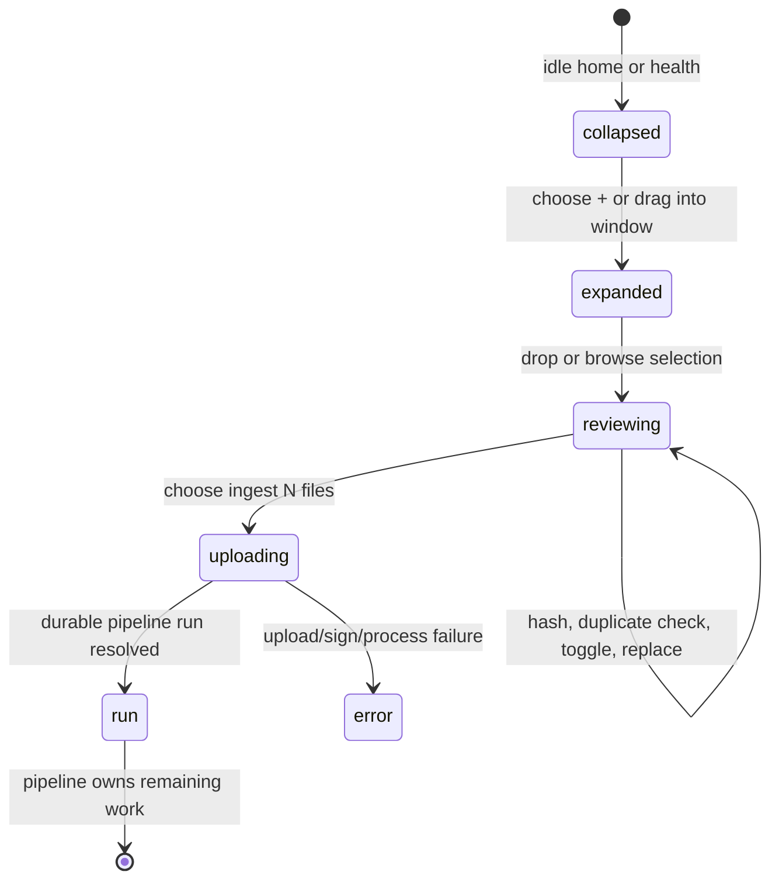

# Adding files

## Summary

The owner can add a batch of local files from the home or health page by dropping files/folders or choosing **browse**, reviewing hashes and duplicate hints, selecting which rows to include, and handing the batch to the pipeline page. In the default local-storage configuration, Great Minds uploads selected files to the server one at a time, stores each converted source, then requests a compile run. With R2 storage, it uploads unique bytes directly to staging in parallel, creates a durable staged-ingest run, converts/registers sources in a resumable workflow, and then queues the compile on that same run.

The review's format and duplicate labels are advisory rather than a complete acceptance check. Several file types shown as recognized cannot be converted by the default direct-upload backend, and direct uploads do not retain the client hash used by duplicate preflight. Directory paths are displayed during review but are not preserved by either upload handoff.

## The simple case

On idle home, the owner chooses the dashed **+** circle. It expands into **paste a link** with **browse**. The owner drops Markdown files or chooses a directory. A review list opens; each recognized file says **checking…**, then **unique**, **duplicate in batch**, or **already in vault**. Duplicate rows are deselected automatically. The owner can toggle rows and chooses **ingest N files** once hashing finishes.

Great Minds navigates to the pipeline page and shows **Uploading files…**. In the default local configuration, selected files upload sequentially. Markdown/plain-text content is decoded as UTF-8; HTML is extracted into Markdown; each source is stored under `raw/docs/` and creates/coalesces a compile intent. After every upload succeeds, the browser requests a compile run with the stable batch id and replaces the launch route with `/pipeline/runs/{id}`.

The run then proceeds through indexing, reading, synthesis, connection, writing, checking, and publishing as described in [compiling the vault](compile-the-vault.md). The source batch is durable before article compilation completes.

## The interaction, event by event

### Arrive

The ingestion control appears only for the active vault's owner. On idle home it sits below the question field; the health page can show the same control. Editors and viewers do not receive this owner control.

When there is no active pipeline, the collapsed dashed circle is named **add sources**. Enter, Space, or pointer activation expands it. When Great Minds knows one pipeline is active, the circle is named **view active pipeline**, carries a pulsing gold dot, and activation goes to `/pipeline` instead of opening file selection. A separate **pipeline active · view progress →** link appears below it.

Dragging anywhere into the browser window expands the control even when the active-pipeline click path would have opened progress. Once expanded, its drop zone accepts browser file entries. Directory drops are traversed recursively and retain a relative path only in the review display. If browser directory-entry APIs are unavailable, Great Minds falls back to the flat dropped file list.

**browse** creates a multiple-selection directory picker. On supporting browsers it sets directory mode, so the native dialog may ask for a folder rather than arbitrary individual files. Cancelling the native dialog leaves the existing review unchanged.

The review recognizes extensionless names and these visible extensions:

`.md`, `.markdown`, `.txt`, `.text`, `.pdf`, `.docx`, `.doc`, `.pptx`, `.ppt`, `.xlsx`, `.xls`, `.csv`, `.json`, `.xml`, `.html`, `.htm`, `.epub`, `.rtf`, and `.odt`.

“Recognized” means only that the browser will hash the row. It does not prove that the configured server conversion path accepts it.

### Leave without acting

Pressing Escape or clicking outside the expanded control closes it, clears the URL field and every file row, and invalidates the current hash run. There is no confirmation or draft recovery.

Cancelling **browse** removes the temporary native input and keeps the expanded control and prior rows. A drop or completed replacement selection replaces the entire current batch; there is no append-to-batch action.

Closing while hashing does not abort an in-progress `File.arrayBuffer()` or duplicate request, but run identity prevents its later result from repainting the cleared/new batch. No file bytes have reached Great Minds before **ingest N files**.

### Begin

Every dropped/picked row starts selected. The extension determines initial state:

- recognized rows enter **checking…**;
- unrecognized rows immediately show **unrecognised format** but remain selected;
- hash failures show **error** and retain their selected state until **deselect duplicates** or manual toggle changes it.

Great Minds reads each recognized file's full bytes in the browser and computes raw SHA-256, with up to four hash workers. For the same hash in one batch, whichever row resolves after a matching row becomes **duplicate in batch** and is deselected. The earlier row remains selected.

After all recognized rows finish hashing, Great Minds asks the active vault which hashes already exist. Matching rows become **already in vault** and are deselected. Failure of this duplicate request is deliberately silent and treats every hash as unknown so the batch is not blocked.

The summary shows selected rows over total rows, total size for all rows (including deselected ones), current hashing count, and duplicate/unrecognized counts. The list shows checkbox, displayed relative path, byte size, extension, and status. Status error detail is available in the row title/tooltip.

The owner can toggle any checkbox, including duplicates, unrecognized rows, checking rows, and errors. **deselect duplicates** actually resets selection to true for unique, checking, and unrecognized rows and false for duplicate and error rows. **replace** opens the directory picker and replaces the batch only after a selection returns.

### While in progress

**ingest N files** is disabled while any row in the batch is still hashing, even if that row is unchecked. It is also disabled when the selected-row count is zero. There is no separate “checking vault” state: once local hashing reaches zero, the button can become enabled while the remote duplicate request is still pending.

Confirmation includes only rows that are selected, have a computed hash, and are not in error. The visible selected count does not apply that same filter. Consequently:

- an unrecognized row can count as selected but is silently omitted because it was never hashed;
- a hash-error row can count as selected but is silently omitted;
- if those are the only selected rows, clicking the enabled-looking action does nothing;
- mixed batches can say **ingest N files** while handing fewer files to the pipeline.

For a nonempty handoff, Great Minds creates a stable random run id, navigates to `/pipeline`, and puts the `File` objects, hashes, run id, and upload mode in browser history state. It immediately clears the review rows. The durable target does not yet exist, so reload at this launch point loses the file handoff.

The pipeline page shows a client-only **Uploading files…** stage before it has a job id. During this stage there is no **cancel** button.

#### Default local/direct uploads

The default server reports `staged_uploads: false`, so the browser uploads selected files sequentially as multipart requests. It sends each base filename but does not send the displayed relative path or precomputed hash.

Direct conversion accepts:

- `.md`, `.markdown`, `.txt`, and `.text` as valid UTF-8;
- `.html`/`.htm` (or HTML MIME type) through article extraction.

Every other extension—including PDF, office files, CSV, JSON, XML, RTF, EPUB, and extensionless files—is rejected by the direct converter despite many being shown as recognized in review. A direct destination is the slugified base filename under `raw/docs/` with a `.md` suffix. Directory hierarchy is lost. Two selected files with the same base name can silently target and overwrite the same source row.

Each successful direct file is stored, registered, and creates/coalesces a compile intent immediately. After the entire sequence succeeds, the browser requests a compile using the stable batch id. If earlier per-file intents already exist, that request can return their associated run rather than the proposed id. The route replaces itself with the returned durable run.

#### R2/staged uploads

When the vault reports staged uploads, the browser defensively keeps one file per selected hash, requests one-hour presigned URLs, and PUTs unique files directly to R2 with up to four workers. Uploaded progress counts attempts in `finally`, not confirmed successes. If every PUT fails, the launch errors. If at least one succeeds, Great Minds silently omits failed files from the process request and creates the run from only successful uploads.

The durable staged-ingest workflow reads and converts up to four files concurrently. It accepts UTF-8 text (`md`, `txt`, `text`, `markdown`, `csv`, `json`, `xml`), HTML, and binary `.docx`, `.pptx`, `.xlsx`, `.odt`, `.odp`, `.ods`, and `.pdf`. The review does not recognize `.odp` or `.ods`, while it does recognize several formats this converter rejects.

Accepted staged sources use `raw/docs/{first 12 hash characters}.md`; original folders and filenames are not source paths or provenance fields. Conversion failures are counted. At least one newly ingested source allows compilation to continue even when other files failed, but the current pipeline presentation does not expose the per-file failure list. If all conversions fail, the uploading/source-ingest stage fails. If every source is already current, the run completes early as already up to date.

The workflow batches source registration, stores the client hash for future duplicate checks, queues compile on the same run when at least one source was ingested, and best-effort deletes converted staged objects. Unprocessed staging objects expire after one day; upload URLs expire after one hour.

### Finish

File addition hands off successfully when a durable run id is known and the browser replaces the launch entry with `/pipeline/runs/{id}`. The upload state is removed from the replacement route, so reload now reconnects from durable run state instead of resubmitting file bytes.

Direct uploads have already stored every file before this handoff. Staged uploads have merely created the durable source-ingest workflow; the **Uploading** stage then owns conversion and registration. In both cases, the same run/intent continues into vault compile when new source content exists.

If a pre-run direct upload fails, previously uploaded files remain stored and have compile intents, while later files were never attempted. The page shows **Something went wrong during processing**, the raw request message, **retry**, and **back to home**. Here **retry** requests a compile; it does not retry the failed file or resume the remaining batch.

The same mismatch applies to sign/all-upload/process failure before a staged run exists: **retry** starts a manual compile of whatever is already in the vault rather than redoing the file upload. The original page-state files remain in memory only for that route instance, but `started` prevents automatic resubmission.

Once a run exists, terminal success, failure, cancellation, completion articles, and **run again** are owned by [compiling the vault](compile-the-vault.md).

## Context and state variants

| Variant | At arrival | Changed while active |
| --- | --- | --- |
| Account role and access | Only the active vault owner sees the home/health ingestion control; server file/sign/process routes also require owner. | Losing ownership or switching to a vault where the user is not owner makes later calls forbidden; earlier accepted files remain in their target vault. |
| Vault state | Empty and ready vaults can accept files. An active pipeline turns normal **+** activation into progress navigation, though drag-enter can still expand ingestion. | New direct files create/coalesce intents; staged new files attach compile to their run. Existing hash hints can deselect staged duplicates. |
| Target state | Rows can be checking, unique, duplicate in batch/vault, unrecognized, or error. Existing destination paths can be overwritten in direct mode. | Hash and duplicate results change selection automatically. Another ingest can make a preflight result stale before upload. |
| Entry context | Idle home and health expose the same control. Pipeline route history state carries a confirmed batch. | Direct navigation/reload to bare `/pipeline` has no files and resolves an active run or **No active job** instead. |
| Input and viewport | Enter/Space opens the collapsed control; pointer drop/browse supplies files. Native folder APIs/browser picker behavior vary. | The 640-pixel review list scrolls vertically; narrow view compresses fixed status columns and may be difficult to inspect. |

## Cancel and interrupt

| Event | Before work begins | While work is in progress |
| --- | --- | --- |
| Escape, Cancel, or Stop | Escape closes and clears expanded review. Native picker cancel keeps prior rows. | No cancel exists before a job id. Once a run exists, pipeline cancel is cooperative and does not undo stored files. |
| Navigation to another Great Minds page | Clicking outside or navigating discards review state. | The upload async work is not explicitly aborted on component destruction and can continue requests; a late `goto` can redirect after the owner left. |
| Browser Back or Forward | Review is not URL state and is lost when home unmounts. | Back leaves the launch/progress page. Forward may retain history-state `File` objects, but reload-safe recovery begins only after a run exists. |
| Page reload | Clears expanded review, native files, hashes, and selection. | Before run creation, loses the handoff and bare `/pipeline` resolves whatever active run exists. After run creation, reconnects by id. |
| Tab or window closed | Discards all unconfirmed files. | Browser uploads stop; already committed direct files and accepted durable workflows/intents continue. Unprocessed R2 objects expire later. |
| Network lost | Hashing remains local; vault duplicate check soft-fails as no matches. | Direct request/sign/PUT/process can fail. Partial commits/uploads are not rolled back, and **retry** does not resend files. |
| Request failure or timeout | Duplicate preflight failure is hidden. No source has been sent yet. | First hard upload failure ends the resolver; earlier direct files remain. Partial staged PUT failures are hidden if at least one succeeds. |
| Authentication session expires | Duplicate check uses normal refresh; failure can clear active-vault state while local rows remain until navigation. | API steps refresh/retry individually. Direct-to-R2 PUTs use signed URLs, but process still needs valid auth. |
| The target changes in another tab | Active-vault browser storage can change while review still names the old vault. | Each API call resolves the current stored vault at call time, so a multi-request direct batch can split across vaults; staged sign/process can likewise disagree. |
| The target changes through another member | Only owner actions can ingest, but shared source state may change duplicate/destination results. | Concurrent destination writes are last-write/upsert behavior; no conflict UI is shown. |
| Browser autofill, paste, drop, or another input channel writes into the interaction | Drop triggers recursive file collection; browse uses native files. Paste goes to the URL field, not file bytes. | No extra files can be appended after confirmation; a new review replaces rather than merges. |
| The window loses focus | Native picker may own focus; its cancel/change outcome controls the temporary input. Existing review remains. | Browser work and server workflows continue. No completion notification is sent outside the pipeline page. |

## Interactions with other systems

**Permissions and roles.** Owner-only UI and owner-only file endpoints align. Manual compile itself is member-permitted, but the scoped owner reaches it only after file persistence.

**Validation and error display.** Browser extension recognition, raw-byte hashing, server direct conversion, and staged conversion are different checks. Their mismatched format sets and selected-count filter produce misleading acceptance and errors.

**Unsaved work and history.** Review rows, checkboxes, hashes, `File` objects, and pre-run upload progress are unsaved. Stored sources, compile intents, staged workflow state, and pipeline runs are durable.

**Optimistic changes and rollback.** Duplicate deselection is optimistic advice and can be overridden. Confirm clears the review before durable acceptance. There is no batch rollback after one direct file succeeds.

**Offline and reconnection.** Hashing works offline, but duplicate check/upload does not. Only a resolved job route is reconnectable; the pre-run client upload has no durable browser recovery.

**Notifications.** Row glyphs, counts, upload stage, progress stages, and terminal pipeline panels are the feedback. Partial staged upload/conversion failures are not surfaced when some files continue.

**URL and navigation state.** The batch uses transient history state at `/pipeline`; the stable run uses `/pipeline/runs/{id}` and route replacement. Folder paths are presentation-only and never become route/content identity.

**Multi-tab and multi-user behavior.** Duplicate checks are snapshots, not locks. Active-vault storage drift can retarget later requests, and tabs receive no live merge of source or upload state.

**Accessibility and keyboard use.** The collapsed shell has button semantics and keyboard activation; file checkboxes are named by include/exclude action. Drag-only discovery, status conveyed by glyph/color, fixed-width columns, and native directory selection need manual verification.

**External side effects.** Confirmation can read full files into browser memory, upload bytes to the server or R2, convert documents, write vault storage and source rows, create tasks/intents/runs, invoke later model/embedding work, and delete/expire staging objects.

## Edge cases

- Total displayed size includes deselected files; **ingest N files** counts selected rows that may not actually be uploadable.
- **deselect duplicates** reselects unrecognized and still-checking rows while deselecting hash errors.
- The remote duplicate check begins only after all hashes finish, but the confirmation button can enable before that response returns.
- Default direct uploads never persist `client_hash`, so adding the same direct-uploaded bytes later is not found by the hash preflight.
- Manually reselected duplicates are sent in direct mode. Staged mode silently keeps only the first selected file for each hash.
- Direct upload discards directory paths and slugifies only the base name. Same-named files from different folders can overwrite one another.
- Staged upload also discards folders and uses a hash-derived source path, so original filename is unavailable as a pre-enrichment path/title fallback.
- `.pdf`, `.docx`, and other rows look recognized in the default local configuration but fail direct conversion after confirmation.
- `.odp` and `.ods` can be converted by staged processing but are marked unrecognized and never hashed by the review UI.
- Extensionless files are recognized in review and accepted as text by staged conversion, but rejected by direct conversion.
- Partial direct failure leaves earlier files saved and later files untouched. The error panel's **retry** compiles only what is already saved.
- Partial staged PUT or conversion failure can produce a successful compile with fewer sources than the owner selected and no visible per-file warning.
- A direct file with a changed body but the same slugified filename silently updates the existing path; a changed filename creates another source.
- During client uploading, the stage's numeric progress represents completed direct requests or attempted staged PUTs; it is not yet the backend source-ingest phase.

## Open questions and verification

- Great Minds commit `8ccfc5c` aligns review with the active direct/staged converter. Unsupported rows are unavailable before confirmation; a direct-mode PDF recheck showed **0 / 1 ready** and a disabled action.
- Commit `8ccfc5c` also makes the ready count, enabled rows, and handed-off batch identical. Mixed unsupported and forced-hash-error checks exposed one ready file and disabled the omitted row instead of claiming both were selected.
- Great Minds commit `b588057` makes source ID the uploaded-document identity and uses ID-derived paths, eliminating same-base replacement even though neither upload mode retains folder hierarchy. Post-fix hand verification kept distinct `report.md` and `report.txt` bodies as separate sources. Decide whether review should explicitly label relative folders as review-only provenance or preserve them separately.
- Commit `8ccfc5c` blocks confirmation while the vault duplicate check is pending. Commit `a60f54e` computes SHA-256 from the received multipart bytes at the direct server boundary and persists it as `client_hash`; an exact repeat then showed **already in vault** with **0 / 1 ready** and a disabled action. Existing pre-fix rows remain unhashed because this greenfield change includes no backfill.
- Commit `8ccfc5c` stops a staged batch before processing if any PUT fails and lists each failed file. Conversion failures now durably fail source ingest with named outcomes and no compile intent instead of continuing as success.
- Commit `8ccfc5c` removes **retry** from pre-run upload errors and labels the durable partial-ingest recovery **compile saved files**, matching its actual behavior.
- Great Minds commit `663522e` removes the separate local/direct ingestion implementation. Every deployment now prepares hash-addressed staging targets, transfers bytes either through the authenticated API to local filesystem staging or through a presigned PUT to R2, and submits the same manifest to `StagedFileIngestWorkflow`. The shared workflow verifies size and raw-byte SHA-256, converts and indexes sources with immutable source IDs, reports per-file failures, cleans attempted staged objects, and attaches compile intent to the same durable run. Stale abandoned local objects are pruned before later upload preparation; R2 lifecycle expiry remains the hosted backstop.
- A visible local-filesystem recheck against `663522e` accepted a 60-byte CSV as **1 / 1 ready**, navigated to durable run `8b018f22-2547-4874-9379-e01e4485657b`, completed the shared Uploading steps, grew the vault from 10 to 11 sources, and then classified the exact bytes as **already in vault** with **0 / 1 ready**. SQL and Markdown showed source `44b56e88-e83a-5c1a-ba73-2fe9c5083e6d`, the exact server-verified hash, ID-derived path, and body; local staging was empty afterward. A visible R2-backed transport recheck remains outstanding.
- Verify navigation during client upload. Because no abort/lifecycle guard protects the async resolver, it may continue and navigate the owner back to a run after they leave.
- Verify active-vault change in another tab during a multi-file operation and pin the vault id for the whole batch.
- Verify memory/size limits for browser hashing, multipart parsing, R2 PUT, and conversion. The product exposes no count/size limit, but underlying browser/server libraries may impose one.
- Verify keyboard and screen-reader behavior for opening the directory picker, understanding status, toggling rows, and dismissing the review.

Verified against Great Minds commit `c8c9e57`.
