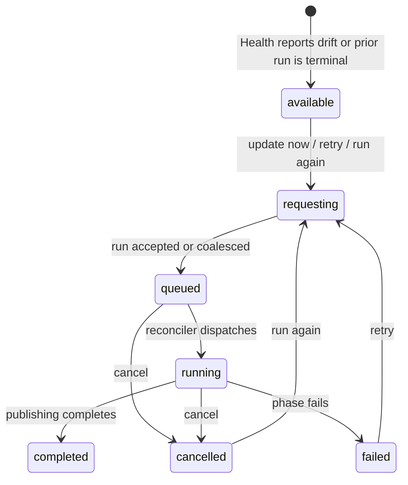

# Compiling the vault

## Summary

A compile turns the active vault's stored sources and topic state into searchable indexes, synthesized topics, connections, checked articles, and a published wiki snapshot. The owner explicitly starts one with **update now** when Health reports drift, or reaches the same work automatically after adding files, adding a URL, saving an answer, promoting a reference, or approving source material. Every accepted compile has a durable [pipeline run](../foundations/background-work.md) at `/pipeline/runs/{id}` with eight visible stages, reconnectable progress, cooperative cancellation, and terminal history.

The page is an observer and control surface, not the worker. Leaving stops its progress stream but not the compile. **retry** and **run again** create/coalesce a new manual run; they never mutate the failed/cancelled run or replay a preceding file/URL handoff.

## The simple case

Health shows **needs update** and **update now** when one or more articles have drifted from the current topic registry. The owner chooses **update now**. The button briefly says **compiling…** while the run request is accepted, then Great Minds navigates to `/pipeline/runs/{id}`.

The page lists **Uploading**, **Indexing**, **Reading**, **Synthesizing**, **Connecting**, **Writing**, **Checking**, and **Publishing**. A manual compile begins at Indexing, so Uploading is marked complete. The active stage pulses, opens to show named steps and detail/counts, and is automatically scrolled toward the center. Completed stages carry checks; later stages remain pending.

When Publishing completes, the page waits 300 milliseconds and shows **Knowledge base updated**. It reports **Already up to date — nothing changed** or the number of live articles rendered by this run, lists up to eight article links, and offers **browse the library** and **back to home**.

## The interaction, event by event

### Arrive

There are four user-visible entry families:

- Health shows **update now** only while its dirty-topic count is greater than zero.
- A confirmed file or URL ingest transitions into compile on its pipeline run.
- Source-creating actions can queue a compile intent that later appears as an active pipeline.
- A failed run offers **retry**; a cancelled run offers **run again**.

Health does not disable **update now** merely because another pipeline is active. It disables only while its own compile request is pending. If an undispatched compile intent already exists, the new request coalesces and returns that intent's run id. If a compile is already dispatched/running, a new intent can queue behind it.

The manual compile request first requires a configured language-model key. A missing key rejects the request before run creation and leaves an inline raw error under Health's drift section. The button re-enables.

The canonical run page does not show vault name, trigger, run id, creation time, cost, elapsed time, or ETA in its body/header. Identity is visible primarily in the URL. It does show a home arrow and, while the client considers a run active, **cancel**.

Direct `/pipeline/runs/{id}` observes that exact run in the active vault. Bare `/pipeline` resolves only when exactly one active run is returned. Both zero and multiple active runs produce **No active job**, even though the home active-pipeline affordance can say work is active in the multiple-run case.

### Leave without acting

Opening a pending, running, completed, failed, cancelled, missing, or historical run does not restart it. Leaving without choosing **cancel**, **retry**, or a result link mutates nothing.

A completed/failed/cancelled run remains at the same URL. Great Minds has no UI to delete pipeline history and no general run-history browser; terminal runs are normally revisited through retained URLs.

Bare `/pipeline` with no launch state and no single active run offers **back to home** and creates nothing.

### Begin

Choosing **update now** creates a random client run id and requests a manual compile. Server acceptance atomically creates the pending run and an undispatched compile intent, or returns the run already attached to a coalesced intent. Health invalidates its cached active-pipeline indicator and navigates to the returned route without a confirmation dialog.

The compile reconciler runs on server startup and every five seconds. It dispatches oldest undispatched intents while respecting one active compile task per vault and the global concurrency setting, which defaults to one. Queue time has no explicit position/ETA; the run can remain pending with all rows awaiting progress.

A manual run starts with already stored sources. File/URL runs can include a prior **Uploading** source-ingest phase. The complete trigger and durable mechanics are in [background work and progress](../foundations/background-work.md); file-specific and URL-specific pre-run behavior remains in [adding files](add-files.md) and [adding a URL](add-a-url.md).

### While in progress

The pipeline page connects to the run's durable snapshot stream. It always lays out eight stage rows in order. The backend's current phase determines which row is active; all earlier rows are visually completed and all later rows pending. The backend phase status, not a numeric total, determines completion.

An active/completed/failed stage is a disclosure and opens automatically when that status arrives. The owner can close it. Inside are stable named steps with pending/running/completed/failed symbols, detail text, and done/total counts when supplied. An active count greater than one also renders a progress bar. Stages with no observed backend work can still be inferred complete when a later phase arrives.

As the active stage changes, Great Minds smoothly scrolls its row toward the viewport center. There is no reduced-motion branch in this behavior. Dynamic progress has no explicit live-region announcement.

The stream receives full current snapshots rather than an event-history replay. Server polling is 100 milliseconds with approximately 30-second heartbeats. Ordinary transport drops leave the last stages visible and retry after 1, 2, 4, 8, then at most 10 seconds; the page shows no reconnecting label. A non-success response when opening the stream is treated as a terminal page error and is not retried, even though the server run may still be active.

Completed workflow activities are journaled. A process restart can resume at an incomplete activity boundary without replaying completed activities. An old active run is marked failed after 120 seconds only when neither a pending intent nor matching workflow journal proves recoverable work.

Choosing **cancel** sends immediately with no confirmation, pending label, disabled state, or local optimistic terminal state. The button remains available until a cancelled snapshot arrives, so repeat clicks are possible. Request errors are not rendered by the cancel handler. The server makes cancellation idempotent and marks the run terminal before interrupting active workflow work.

Cancellation is cooperative. It prevents future guarded phase side effects and interrupts durable workflow execution, but does not reverse source bytes, completed index writes, provider calls, article writes, or a currently executing external operation. The [background-work foundation](../foundations/background-work.md) owns those boundaries.

### Finish

A successful compile reaches completed Publishing. Early completion with no validated topics also uses a completed publish step and is success. The stream closes, active-pipeline caches are invalidated, all visible stages are completed, and the completion card appears after 300 milliseconds.

The page asks for live articles whose render-run id equals this run. It reports the full matching total but fetches/lists at most eight, ordered alphabetically. There is no **load more** link in the completion card. Each listed title opens the full article reader.

If the result query is still loading, the card initially shows only **Knowledge base updated** and its two navigation actions. If result loading fails, no error is shown and the count/list remain absent. A total of zero is presented as **Already up to date — nothing changed**, even though the run may have performed indexing, topic cleanup, archival, or other work without rendering a live article.

A failed phase persists the run as failed with its last step snapshot and formatted error. The page shows **Something went wrong during {stage}.**, the error, **retry**, and **back to home**, while retaining the stage rows. **retry** creates/coalesces a new manual compile with a new proposed id and replaces the route; it does not reopen the old run or retry only the failed phase.

A cancelled run shows **Update cancelled**, **run again**, and **back to home**. **run again** uses the same new-manual-run behavior. Retry/run-again buttons have no pending state or error handling, so rapid clicks or a rejected request can leave the old terminal page unchanged with an unhandled failure.

## Context and state variants

| Variant | At arrival | Changed while active |
| --- | --- | --- |
| Account role and access | The scoped owner reaches compile through owner surfaces. Run read/stream, manual compile, and cancel currently require only membership, so editors/viewers can call them too. | Losing membership blocks stream/retry/cancel; accepted durable work continues. Another member can cancel the shared run. |
| Vault state | Vault may be empty, ready, dirty, already compiling, queued, or terminal. Health exposes manual update only for dirty topics. | New source/intents can coalesce before dispatch or queue behind active work. Compile changes shared source metadata, topics, links, articles, and health. |
| Target state | Explicit run can be pending/running/completed/failed/cancelled/missing. Bare resolver distinguishes only exactly one active run. | Active-only update guards preserve the first terminal status. Another tab/member can cancel while this page watches. |
| Entry context | Health, ingest handoff, source-created intent, direct run URL, bare resolver, retry, and run-again converge on one run page. | Launch shims replace with canonical route. Retry replaces the old terminal route with the new/coalesced run. |
| Input and viewport | Pointer/keyboard buttons trigger requests; disclosures can be toggled. Wide/narrow views retain one vertical stage list. | Active-stage auto-scroll can move any viewport; numeric bars and details appear according to snapshots. |

## Cancel and interrupt

| Event | Before work begins | While work is in progress |
| --- | --- | --- |
| Escape, Cancel, or Stop | Escape has no compile-page action. **cancel** can appear as soon as an explicit job id has stage rows, even before the first snapshot. | **cancel** requests cooperative durable cancellation. Escape does nothing; repeat cancellation is harmless server-side. |
| Navigation to another Great Minds page | Leaving a historical/queued run does not alter it. | Closes observation; workflow continues. Returning to the route receives current state. |
| Browser Back or Forward | Canonical historical routes reopen without mutation. Replaced launch entries are not revisited. | Leaves/reopens the observer only. Retry replacement means Back normally does not return to the terminal retry source page. |
| Page reload | Reconnects an explicit run; bare resolver can fail when active count is not exactly one. | Durable work continues; stage state is rebuilt from one current snapshot. |
| Tab or window closed | No effect on accepted runs. | Workflow/reconciler continue. No browser/OS notification announces completion. |
| Network lost | A new compile request can fail before acceptance; Health retains inline error. | Last snapshot stays visible and transport retries. Provider/storage network loss can independently fail the workflow. |
| Request failure or timeout | Health request displays raw error and re-enables. Retry/run-again rejection has no visible handler. | Stream-opening HTTP error becomes page error and can misrepresent a still-running run; transport exceptions retry. Cancel rejection is invisible. |
| Authentication session expires | Request attempts normal refresh once. | Stream/cancel/retry use normal refresh. Failed refresh ends control/observation but not work. |
| The target changes in another tab | Same account can start/coalesce another run or open this run. | A tab can cancel/retry; durable terminal status converges, but local button pending states do not synchronize. |
| The target changes through another member | Members can currently start/cancel despite owner-oriented product surfaces. | Member cancellation ends the run for all observers. Shared source changes may be incorporated depending on phase timing. |
| Browser autofill, paste, drop, or another input channel writes into the interaction | No compile-page input accepts text/files. Preceding ingest features own those channels. | No effect on accepted manifest/run. New content requires another ingest/intent. |
| The window loses focus | No effect. | Progress stream, workflow, auto-scroll timers, and completion query continue. No focus-only pause/refetch rule applies. |

## Interactions with other systems

**Permissions and roles.** Owner UI starts source work and Health updates, but server compile/cancel/read boundaries are member-wide. This can let a viewer incur provider work or cancel an owner run.

**Validation and error display.** Run ids are validated and vault-scoped. Missing model configuration blocks manual creation; phase/provider/storage failures become durable errors. Cancel/retry request failures lack local display.

**Unsaved work and history.** A run and its terminal status are durable; stage disclosure state, scroll, connection state, and completion-query data are local. There is no deletion or annotation of run history.

**Optimistic changes and rollback.** Progress is snapshot-driven. Cancel waits for server state rather than changing optimistically. Compile output is not transactionally rolled back on later failure/cancel.

**Offline and reconnection.** Manual launch cannot queue offline. Explicit runs reconnect from current durable state; workflows resume journaled boundaries after process restart.

**Notifications.** Pulsing stage, details, terminal banners, active-pipeline dot/link, and result card are in-page feedback. No toast, email, or background notification exists.

**URL and navigation state.** `/pipeline/runs/{id}` is canonical. Bare `/pipeline`, URL query, and file history state are launch/resolver forms. Active vault remains outside the route, so the same run URL under another active vault becomes not found.

**Multi-tab and multi-user behavior.** Multiple observers tail the same snapshots. Intent coalescing reduces duplicate pending work, but rapid requests after dispatch can queue multiple runs. Terminal active-state guards prevent late progress from reviving cancelled/failed/completed runs.

**Accessibility and keyboard use.** Controls/disclosures are keyboard buttons and steps include text/symbol status. Auto-scroll, motion, changing labels, progress announcements, and error focus need manual verification.

**External side effects.** Compile reads/registers sources, creates search chunks/embeddings, calls language and embedding providers, records costs, updates topics/connections, writes/checks articles, archives/publishes wiki state, and may reuse content-addressed caches.

## Edge cases

- A manual run marks Uploading complete when its first observed backend phase is Indexing, even though no upload happened in that run.
- Health can show **update now** while another pipeline is active; a request may coalesce with pending work or queue behind a dispatched run.
- The Health label **compiling…** covers only the short creation request, not the actual compile duration.
- Bare `/pipeline` says **No active job** for two active jobs as well as none.
- **cancel** can appear briefly on a terminal run before its first terminal snapshot arrives; the server no-ops that request.
- Cancelling a queued run whose backend phase is still empty exposes a terminal parsing bug: the cancelled snapshot is ignored as an unknown phase, then the stream's `done` frame sets success, so the page can show **Knowledge base updated** for a cancelled run.
- Cancel button remains clickable while its request/snapshot is pending and has no error message.
- A fast phase can be inferred complete without ever being observed directly because snapshots carry only current state.
- Reconnect has no visible status; a frozen-looking stage may be running or waiting to reconnect.
- Malformed progress frames are ignored; a later complete snapshot repairs display.
- Completion total can exceed eight, but only eight links appear and no omission count/load-more label explains the truncation.
- Result-query failure leaves **Knowledge base updated** without count/list/error.
- Zero rendered articles is labeled **nothing changed** even when non-render work changed vault state.
- Retry/run again always starts a whole manual compile; content-addressed caches may make it cheaper, but the UI does not promise phase-only resume.
- Rapid retry clicks can propose several ids. An undispatched intent usually coalesces them, but a dispatch race can leave another queued run.
- A transient non-success opening the SSE is presented through the same error surface as durable run failure, even if backend work continues.
- Active stage movement can repeatedly smooth-scroll while the owner is inspecting an earlier stage.

## Open questions and verification

- Restrict compile/cancel to the intended role or explicitly expose member-wide controls. Viewer-triggered provider cost and cancellation are high-impact authorization/product-policy defects.
- Fix terminal handling before phase normalization. A queued cancel/failure with an empty phase is currently ignored and the later `done` frame is treated as successful completion.
- Add pending/error state to **cancel**, **retry**, and **run again**, and distinguish stream-observation errors from durable pipeline failures.
- Bare pipeline needs a chooser or deterministic redirect when multiple runs are active instead of **No active job**.
- Verify progress semantics, stage expansion, inferred fast phases, reconnect, restart resume, early no-topic completion, and cancellation latency in the running app.
- Verify screen-reader/live announcements, focus after terminal transition, reduced-motion behavior, and active-stage auto-scroll interruption.
- Completion should explain/list more than eight rendered articles and surface result-query failure.
- Reconsider **Already up to date — nothing changed** because zero run-rendered live articles does not prove the entire compile was a no-op.
- Add run context—vault, trigger, start/elapsed time, and perhaps cost—so a copied URL or multi-run situation is understandable without decoding route state.
- Verify multiple queued/active runs and intent coalescing across Health, source promotion, direct upload, staged upload, and URL ingest.

Verified against Great Minds commit `c8c9e57`.
